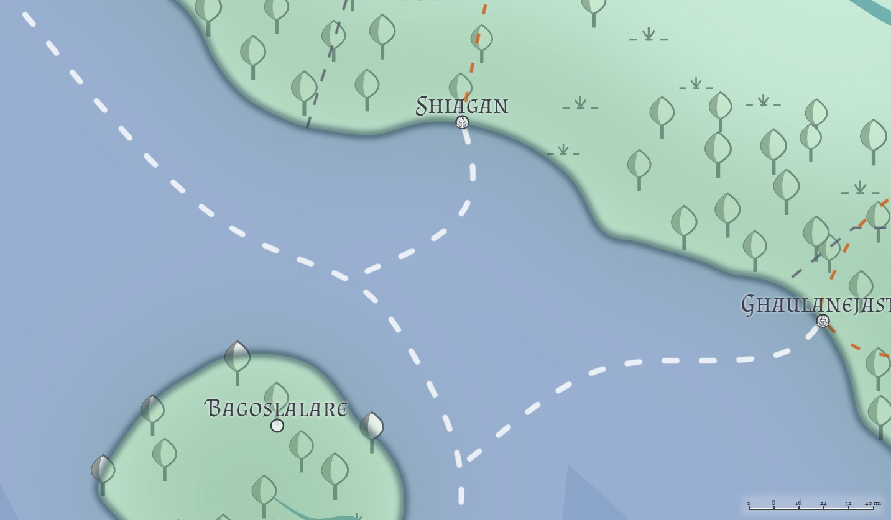
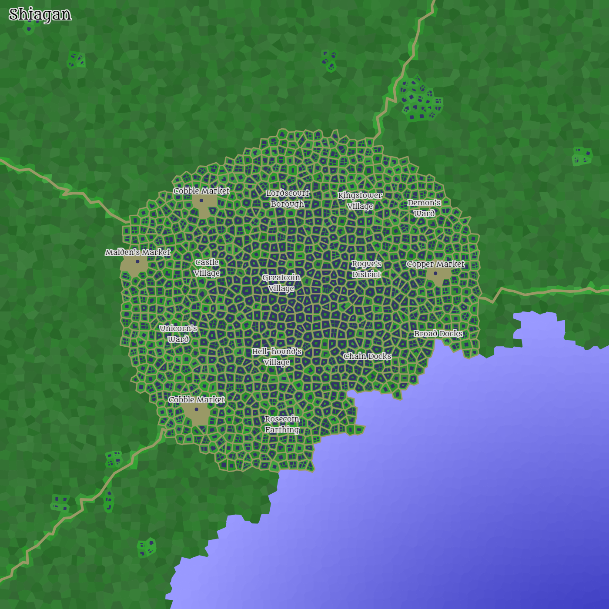

# Shiagan
*(Dheublar'ty, [Yithi](../Nations/Yithi.md))*

**Population:** 50,000  *(Humans: 12,000 | Firstborn: 12,000 | Created: 13,000 | Hordish: 13,000)*

Shiagan is Yithi's largest city on the southwestern coast, and is a major crossroads for interaction between the Yithi interior and the seagoing traffic that flows westward (into the Al'Uman lands) and southwestward (into the other Hordish lands). A major cosmopolitan society and high degree of merchant traffic mean that Shiagan is extremely diverse, as reflected in its near-even four-way split among the major population groups, and the docks are a constant source of activity--Shiagan generally prefers to ship goods by boat rather than overland routes.

Thanks to its relative distance from Zabalasan lands, Shiagan sees little of the land conflict with its western neighbor; however, because of its high maritime traffic, Shiagan is often a mustering point for naval squadrons that are in near-constant skirmish with Zabalasan corsairs, Tragekian privateers, and even Dradehalian raiders. As a result, Shiagan boasts a relatively high militant presence, with several mercenary companies under contract and numerous marine military units rotating in and out of the city.

For these same reasons, Shiagan is host to a large arcane and divine contingent, with a half-dozen major mage school campuses, and a dozen more smaller ones (including some that officially aren't supposed to exist). 

**Docks.** Shiagan boasts a bustling port for maritime shipping, which accounts for the vast majority of its economic activity.

**Citadel.** Shiagan retains a citadel for the upper ranks and guests, and much of the elite guard resides there.

**Plaza.** Shiagan's city center boasts a large plaza, called **Queenscourt Plaza**, which is a central place in the lives of many within the city.

---

## Geography
**Coordinates:** Latitude: -7.14, Longitude: 31.51

**City Elevation:** 207

### Surrounding area

### City Layout

### "Outer Ring" districts
The "Outer Ring" is the city of the merchants, commoners, and lower classes. It is here where much of the city's day-to-day activity takes place.

#### Bridge Market District
**Maagu's Folly**: A broken statue of rough-hewn stone, placed to honor a local hero named Maagu.

**The Jester's Meadhall**: A modest commoner's inn, said to be a front for the [Red Rose Guild](../Organizations/RoguesGuilds/RedRose.md).

#### Bridge Village District

#### Bright Market District

#### Charger's District

#### Iron Piers District
**The Guildhall:** A grand half-timbered building, once a minor temple. It contains a large meeting hall and several smaller rooms, and is shared amongst several local trade guilds.

**The Drowning Monument School:** This building, just inside the Outer Ring Wall, has its own pier, and often has a small ship (often a longboat or slightly larger two-decked ship) docked to it. The pier is entirely walled off from public access by the mage school building, and attempts to dock at the pier without the school's permission are often met with some measure of resistance, starting with a gentle nautical shove away from the pier.

#### Servant's Farthing

#### Demon's Borough
**The ruins of Ghiny Tower:** A broken tower, something of an eyesore in the district, it is notable that every decade or so the City Council makes plans to replace it, and yet nothing ever happens to do so.

#### Archscepter Ward

#### Citadel Village
**The Theatre of Shadows:** A large stone-walled theatre, known for its week-long elven epics and dwarven opera.

**The Astrologers Guild House:** A two-storey tower of polished marble, said to be built atop the tomb of a necromancer.

#### Lake Borough

#### Broad Market

#### Chain Docks

### "Citadel" districts
The Citadel, a collection of four districts at the heart of the city, are reserved for the upper classes--the residences and halls of the nobility and leadership, along with a few older mage schools and temples. Residence here is a sign of wealth, power, and prestige, and those who live here do so at exorbitant expense.

#### Falls Ward

#### Bell Ward

#### Crown Ward
**Chany's Clocks:** The workshop of a female human clockmaker named Chany, known for her marvelous clockwork toys.

**The Armory:** A buttressed timber and brick building, headquarters of the town guard. It is rumored to contain an arsenal of magical weapons and armor.

**The Courthouse**: An impressive timber and brick building, filled with busy magistrates and advocates.

#### Old Queenscourt Village
**The Indigo Flask:** An elegant adventurer's inn, said to be built atop the tomb of a lich.

---

## Prominent Figures
Lord Shiagan **[Rhurg Kruvlek](../People/RhurgKruvlek.md)** (male hobgoblin), Fighter 2, Chieftain of Shiagan: The latest Chieftain Shiagan is recently come to his seat, his father having perished in a freak accident last year.

Lord-Captain **[Moba Andravaeraurak](../People/MobaAndravaeraurak.md)** (male kobold), Captain of the [City Guard](#military-units): A diminutive figure in size, Lord-Captain Andravaeraurak is well aware that his size belies his skill, and often uses it to his advantage when first meeting those he wishes to study further before revealing his rank. Quiet, firm, and absolutely fearless, Moba is absolutely dedicated to the city and its inhabitants, and will unhesitatingly risk his life to preserve Shiagan against threats to its existence or residents. He is well-liked by the City Guards, and several have formed a small semiformal bodyguard unit ("the Lord-Captain's Guards") in response to several assassination attempts against him in recent years.

**TODO**, First Councilor

**TODO**, Second Councilor

**[Shragic Ironchest](../People/ShragicIronchest.md)** (male kobold), Wizard (Enchanter) 15, Third Councilor of Shiagan. Shragic recently befriended Rhurg Kruvlek, Lord Shiagan, and was anointed Third Councilor shortly thereafter. In addition to this being outside the normal practice, he has recently caused some stir among the City Council with some of the decisions he has encouraged (such as the hiring of the [Thieving Daggers](#mercenary-companies) and the decision to openly embrace a school of the [Nethermancers](#mage-schools)).

**Orlis Julu** (female bugbear), Fighter (Duelist) 12, Head of the [Lodge of the Cutlass](#dueling-colleges) dueling college

**Ueru Mekvol**, Wizard (Bladesinger) 12, Head of the [Lyceum of the Shimmering Shield](#dueling-colleges) dueling college

**TODO**, Fighter (BattleMaster) 8, Head of the [Wooden Rapier School](#dueling-colleges) dueling college

**TODO**, Ranger 10, Captain - [Hatchet Knights](#mercenary-companies)

**TODO**, Fighter 8, Captain - [Thieving Dagger](#mercenary-companies)

**TODO**, Ranger 8, Captain - [Axe Guards](#mercenary-companies)

**TODO**, Sorcerer 8, Arcane Master, [Night's Blessing](#mage-schools)

**TODO**, Wizard 9, Arcane Master, [Collared Fiend](#mage-schools)

**TODO**, Wizard 10, Arcane Master, [Glittering Eye](#mage-schools)

**TODO**, Sorcerer 9, Arcane Master, [Blue Sky](#mage-schools)

**TODO**, Wizard 8, Arcane Master, [The Navy Arch](#mage-schools)

**TODO**, Sorcerer 9, Arcane Master, [Silver Column](#mage-schools)

**TODO**, Wizard (hydromancer) 15, Arcane Master, Master of the [Drowning Monument](#mage-schools) School

**TODO**, Cleric 8, High Priest of [Al'Uma - Prophet](#religious-organizations)

**TODO**, Cleric 10, High Priest of [Al'Uma - Disciple](#religious-organizations)

**TODO**, Druid 9, High Priest of [Dail](#religious-organizations)

**TODO**, Paladin 7, High Priest of [Kaevarian Church](#religious-organizations)

**TODO**, Paladin 8, High Priest of [WeeJas](#religious-organizations)

**TODO**, Druid 10, High Priest of [Druidism](#religious-organizations)

**TODO**, Rogue 11, Guildmaster of the [Gilded Fabulous Devil](#rogues-guilds) rogues guild

**TODO**, Monk 10, Guildmaster of the [Harmonic Purple Octopus](#rogues-guilds) rogues guild

**TODO**, Rogue 12, Guildmaster of the [Contract of the Sepia Shield](#rogues-guilds) rogues guild

**TODO**, Rogue 11, Guildmaster of the [Association of the Hunter](#rogues-guilds) rogues guild

**TODO**, Ranger 10, Guildmaster of the [Miasmal Wand](#rogues-guilds) rogues guild

**TODO**, Rogue 12, Guildmaster of the [Red Rose](../Organizations/RoguesGuilds/RedRose.md) rogues guild

**TODO**, Ranger 7, Guildmaster of the [Black Masks](../Organizations/RoguesGuilds/BlackMasks.md) rogues guild

**TODO**, Rogue 10, Guildmaster of the [Contract of the Nightshade Sheep](#rogues-guilds) rogues guild

**TODO**, Ranger 11, Guildmaster of the [Traders of the Sleepy Boat](#rogues-guilds) rogues guild

Guildmaster **[Gothrash Breathtaker](../People/GothrashBreathtaker.md)** (male hobgoblin), Guildmaster of the [Compact of the Kaze Clan](../Organizations/MerchantGuilds/KazeClan.md): Despite Guildmaster Breathtaker's enormous build, he is an energetic force in the merchant guild scene in Shiagan, and is often included in discussions and councils that wouldn't seem appropriate for a merchant of foodstuffs and beverages. He moved his offices out of the [Guildhall](#iron-piers-district) a few years back into a smaller building closer to the southeastern wall (in the [Archscepter Ward](#archscepter-ward)), owing to the cheaper rent, and has actively poured the savings from the rent into renovation projects all around the Ward. In addition, he hires his help almost exclusively from the Ward, and as a result, the residents of the Ward are all fiercely loyal to the Kaze Guild, and voluntarily keep watch over Kaze property and buildings.

**TODO**, Ranger (Slayer) 15, Guildmaster of the Slayer Conclave

**TODO**, Guildmaster of the [Vekku Guild](../Organizations/MerchantGuilds/Vekku.md)

**TODO**, Guildmaster of the Lonely Tragekian Faction

**TODO**, Guildmaster of the [Kaalean Mercantile Compact](../Organizations/MerchantGuilds/KaaleanMercantileCompact.md)

**TODO**, Monk 11, Grand Sensei of the [Order of the Nefarious Consortium](#monastic-orders) monastic order

**TODO**, Monk 7, Grand Sensei of the [Order of the Beautiful Bronze Scythe](#monastic-orders) monastic order

**TODO**, Mystic 8, Grand Sensei of the [Order of the Umbral Mantis](#monastic-orders) monastic order

**TODO**, Monk 7, Grand Sensei of the [Order of the Miasmal Shield](#monastic-orders) monastic order

---

## Great Houses

---

## Military Units
**Marines.** These are typically rotated between port guard duty, tariff duty in incoming vessels, and extended patrols out into the waters around Shiagan. **TODO**

**Palace Guard.** These typically rotate between citidel guard duty and special missions as dictated by city authorities. 75xFighter 3-5, 20xWizard/Sorcerer 3-5, 30xCleric/Druid 3-5, 25xRogue 3-5.

**City Guard.** **TODO**

**Militia.** Mustered on demand. 2600xFighter1, 1075xFighter2, 430xFighter3, 172xFighter4, 43xFighter5 (Total: ~4380)

## Militant Orders

## Mercenary Companies
**[Hatchet Knights](../Organizations/MercCompanies/HatchetKnights.md)**: The Knights are deeply suspicious of Lord Shiagan's decision to hire the Daggers, and although they are not yet ready to depart, they keep their barracks on watch 24 hours a day, alert to any behavior that threatens them.

**[Thieving Daggers](../Organizations/MercCompanies/ThievingDaggers.md)**: Lord Shiagan's willingness to hire the Daggers has raised eyebrows all up and down the coast.

**[17th Axe Guards](../Organizations/MercCompanies/AxeGuards.md)**: The Axe Guards are a rarity in Yithi: not only is it a company of heavy infantry, but it's a company exclusively of dwarves. The Seventeenth is one of many Axe Guards companies, all of which have their charters dating back to the Exodus and the Reclamations, and its proud traditions are firmly in place.

## Dueling Colleges
**Lodge of the Cutlass:** One of the few dueling colleges that specializes in naval/marine combat, the Lodge of the Cutlass was formed centuries ago in response to the growing numbers of battles taking place on the seas. A long-standing tradition of the Cutlass Lodge is that their dueling tournaments are often held out on the water, in "dueling circles" that comprise of a ship, sometimes under varying conditions (movement, weather, combat damage to the ship, and so on). Some of the college's most popular exhibitions are "boarding actions", wherein one team of duelists must take control of a ship in the harbor against another team of duelists who defend it, cheered on by spectators in floating barges a safe distance away.

**Lyceum of the Shimmering Shield:** The Shimmering Shield Lyceum is a dueling college that specializes in individual martial-arcane combat. Founded three hundred years ago by an elvish Bladesinger, the Shimmering Shield holds that the best way to win a fight is to make sure you bring both sword and spell to bear. The college's members are often in high demand as guards on board merchant vessels coming and going from Shiagan, but membership is restricted to those who can demonstrate proficiency in both magical and mundane combat.

**Wooden Rapier School:** The Wooden Rapier School is rare among dueling colleges in that it caters specifically to those who would learn the skills of combat but currently lack them; in other words, it is a "beginner's fighting school", and it promises any entrant the basics of sword and shield. Many of the middle-class merchants make use of the school (for both themselves and their families) in order to learn a minimum of self-defense, and various mercenary units have been known to keep a soldier on-site to appraise new members and hire away those with more than a minimum of talent at combat.

---

## Mage Schools
**[Blue Sky](../Organizations/MageSchools/BlueSky.md)**

**[Collared Fiend](../Organizations/MageSchools/CollaredFiend.md)**

**[Drowning Monument](../Organizations/MageSchools/DrowningMonument.md)**

**[Glittering Eye](../Organizations/MageSchools/GlitteringEye.md)**

**[The Navy Arch](../Organizations/MageSchools/TheNavyArch.md)**

**[Nethermancers](../Organizations/MageSchools/Nethermancers.md)**

**[Night's Blessing](../Organizations/MageSchools/NightsBlessing.md)**

**[Silver Column](../Organizations/MageSchools/SilverColumn.md)**

## Religious Organizations
**Kaevarian Church in Shiagan.** The temple to [Kaevarian Church](../Religions/KaevarianChurch.md) has around 300 followers.

**Temple.** The temple to [Al'Uma - Prophet](../Religions/AlUma.md#alalihatian-prophecy) has around 370 followers.

**Temple.** The temple to [Al'Uma - Disciple](../Religions/AlUma.md#zalabasan-sect) has around 160 followers.

**Temple.** The temple to [Dail](../Religions/Dail.md) has around 500 followers.

**Temple.** The temple to [WeeJas](../Religions/Pantheon/WeeJas.md) has around 350 followers.

About 120 followers follow [Spiritualism](../Religions/Spirits.md).

There are about 480 followers who openly follow [Druidism](../Religions/Druidism.md), and they often have gatherings in a small copse of trees just outside the city.

## Monastic Orders
**Monastic Order: [Order of the Nefarious Consortium](../Organizations/MonasticOrders/NefariousConsortium.md).** The order currently has 49 monks.

**Monastic Order: [Order of the Beautiful Bronze Scythe](../Organizations/MonasticOrders/BeautifulBronzeScythe.md).** The order currently has 44 monks.

**Monastic Order: [Order of the Umbral Mantis](../Organizations/MonasticOrders/UmbralMantis.md).** The order currently has 48 monks.

**Monastic Order: [Order of the Miasmal Shield](../Organizations/MonasticOrders/MiasmalShield.md).** The order currently has 50 monks.

---

## Rogues' Guilds
Like any city, Shiagan has its share of crimincals and seedy activity; however, the Rogues' Guilds that prominently domainte that activity include:

**[Association of the Hunter](../Organizations/RoguesGuilds/AssociationHunter.md)**

**[Black Masks](../Organizations/RoguesGuilds/BlackMasks.md)**

**[Contract of the Nightshade Sheep](../Organizations/RoguesGuilds/ContractNightshadeSheep.md)**

**[Contract of the Sepia Shield](../Organizations/RoguesGuilds/ContractSepiaShield.md)**

**[Gilded Fabulous Devil](../Organizations/RoguesGuilds/GildedFabulousDevil.md)**

**[Harmonic Purple Octopus](../Organizations/RoguesGuilds/HarmonicPurpleOctopus.md)**

**[Miasmal Wand](../Organizations/RoguesGuilds/MiasmalWand.md)**

**[Red Rose](../Organizations/RoguesGuilds/RedRose.md)**

**[Traders of the Sleepy Boat](../Organizations/RoguesGuilds/TradersoftheSleepyBoat.md)**

