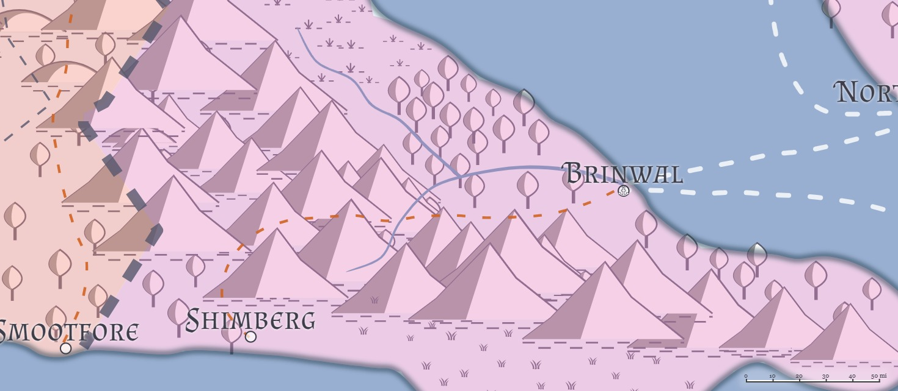

# Shimberg
**Population:** 5,500 -- 50% human, 40% Firstborn, 10% Created

**Features:** Port, Walled, Shantytown

Port facilities in Shimberg have dried up almost completely, since there is very little trade to the south (neither Dradehalia nor Chidia does much mercantile shipping), or the west (Travenia and Travesimia are almost as likely to sink a merchant ship from Liria as trade with it), and trade to the other parts of the West Liria is more easily done via cart than clipper.

Shimberg is a dying city; with little trade coming in, and no real military activity against Travenia (specifically [Smootfore](Smootfore.md)), there's just not a whole lot of reason for people to stay in Shimberg beyond sentimentality or an inability to migrate. 

## Geography

## Authority Figures

## Military Units

## Draconic Order

## Dueling Schools

## Bardic Colleges

## Great Houses

## Mage Schools

## Mercenary Companies

## Religions

## Rogues' Guilds
