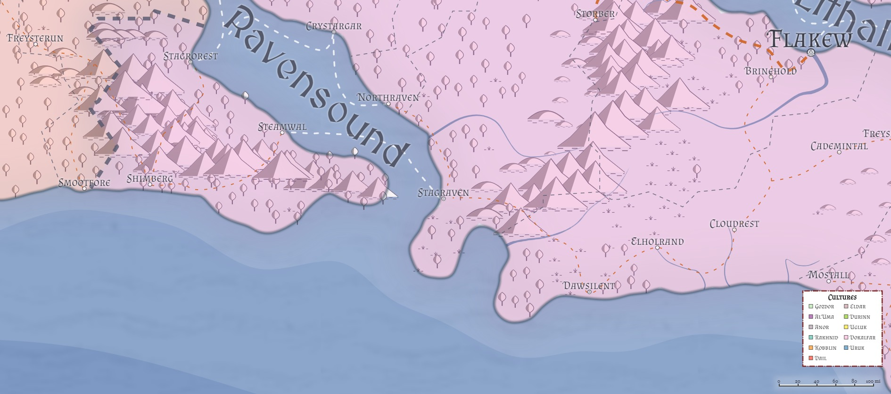

# Stagraven ([Liria](/Nations/Liria.md))
*Population: 9,000 -- 40% human, 45% Firstborn, 15% Created*

**Facilities:** Port, Citadel, Walled, Marketplace, Shantytown

Stagraven sits at an important juncture: the southern end of the Ravensound, and the southwestern point of the Daw Mountains, it also marks the southern "border" of the Ravenslands and the last point of civilization along the Ravensroad that (more or less) travels down the western coast of Liria before one crosses the Daws to get to Dawsilent.

## Geography

## Authority Figures
* *Baron Stagraven*: Lord [Torshon Ciallin](/People/TorshonCiallin.md) (Human Male Fighter (Swashbuckler) 5, LN)
* *Captain of the Guard*: 
* City Councilor Bishop [Berian Cademintal](/People/BerianCademintal.md) of the Cathedral of the Kaevarian Church
* City Councilor [Kathendrion Orrental](/People/KathendrionOrrental.md)
* City Councilor 
* City Councilor 
* City Councilor 
* Lord Martial [Nisan Sigthar](/People/NisanSigthar.md)

## Military Units
**The Raven Guard**:

**Draconic Order**:

## Great Houses

### [House Ciallin](/Organizations/Houses/Ciallin.md)
Currently in ascendence, Torshon Ciallin (Human Male Fighter (Swashbuckler) 5, LN) is Baron Stagraven. His wife, Marissa (Human Female, LG) is originaly of House Elhol, and it was a combination of her House's influence and her resolute desire to do well by her marriage that propelled Torshon into the baronial seat. They have no children as of yet, and after five years' of marriage, which after five years of marriage, is the subject of much speculation and rumor.

### [House Nerris](/Organizations/Houses/Nerris.md)
House Nerris currently stands second only to Ciallin. Thalia Nerris (Half-elf Female Sorcerer (Storm) 5, CG) currently heads the house in Stagraven after the unfortunate--and rumored non-accidental--death of her husband while he was out riding in the hills to the east. She is resolute in leading her House well in Stagraven, and while she is still in mourning, she has let it known that she is open to offers of alliance by marriage. Whomever her choice, she is resolute that it will be to the benefit of Nerris and Stagraven.

### [House Elhol](/Organizations/Houses/Elhol.md)
Thanks to Marissa Ciallin (nee Elhol)'s marriage to Torshon Ciallin, House Elhol now has several members in the City Council in Stagraven, as well as access to a port on the Ravensound, potentially allowing Elhol merchants to bypass the dock fees currently being charged them by the [Dawsilent](Dawsilent.md) City Council. Elhol is, in fact, looking for a convenient branch to the [Elholrand](Elholrand.md)-[Dawsilent](Dawsilent.md)-Stagraven road that would allow them to bypass the city altogether, but cutting across the Ravenslands is requiring some tricky negotiations with both the Ravenstribes and some villagers who are reluctant to see a drop in traffic along that road.

### [House Cademintal](/Organizations/Houses/Cademintal.md)
House Cademintal is currently a minor player in the Stagraven Game of Houses, but led by [Darrish Cademintal](/People/DarrishCademintal.md), who secretly holds rank in the [Fire Knives](/Organizations/RoguesGuilds/FireKnives.md), this is by design. House Cademintal at large is unaware of their distant cousin's affiliation with the Knives, and would be horrified and extremely quick to disown, disinvest, and disembowel Darrish, so he keeps the House's presence in Stagraven extremely small. His activities are unknown to his family, including his wife Marova (Human Female, NG) and his children.

## Draconic Order
Stagraven has a chapterhouse of the [Gold Order](/Organizations/DraconicOrder/Gold.md), which also serves as home for any of the other members of the Order; it is well known that the Coppers have a strong presence here, as do the Silver and Steel.
* Gold: Lord Martial [Nisan Sigthar](/People/NisanSigthar.md): Human Paladin (Oath of Devotion) 15, LG
* Copper: Lord [Mallin Swinleb](/People/MallinSwinleb.md)
* Steel: Lord Artificer [Thalkar Firelight](/People/ThalkarFirelight.md): Half-orc Artificer 14, LG
* Brass: Lord Archivist [Comin Daylor](/People/CominDaylor.md): Elf (High) Wizard (Scryomancer) 16, NG; visiting here for a while on his way to [Dawsilent](Dawsilent.md) to continue research into coastal weather patterns

The chapterhouse holds approximately two hundred Knights, mostly of the Gold and Copper, and their various retainers. Fifty of these are mounted cavalry.

## Rogues' Guilds

### [Fire Knives](/Organizations/RoguesGuilds/FireKnives.md)
The Fire Knives maintain a very small cell here (6 - 8 members), mostly as an access port to much of western and southern Azgaarnoth. They do take the odd job here and there, however, mostly masquerading as unaligned assassins. The current Hilt is [Darrish Cademintal](/People/DarrishCademintal.md).

### [Black Masks](/Organizations/RoguesGuilds/BlackMasks.md)
The Black Masks Guild has long had a small presence in Stagraven--small amounts of smuggling, mostly--and currently has no plans to expand their operation beyond the 20 or so current members. They have an arms' length relationship with the [Order of the Copper Dragon](/Organizations/DraconicOrder/Copper.md) through Lord Mallin Swinleb, who permits small amounts of activity in exchange for information on other Guilds in Stagraven and activities in other cities. The current Mask is Perlisa Triplefellow (Halfling ([Mark of Hospitality](/Races/Dragonmarked.md#the-mark-of-hospitality)) Rogue (Thief) 7, CN), who runs the Shy Maiden Inn as her cover for the Black Masks' activities.

### Golden Skull
A guild from [Storber](Storber.md), the Golden Skull Guild, has made a play for Stagraven, moving five high-ranking "guildmaster apprentices" of the Golden Skull into Stagraven and seeking to establish ties.

* Clieff Montan: ran the drug trade
* Jerym Glitterfang: gambling rings
* Kazyrian Tinrek: enforcement
* Bailan Ranthar: smuggling/shipping
* Anyra Lasenther: intelligence/seduction/recruitment

These five have all recently perished, and with their deaths the Golden Skull's momentum has broken.

## Mage Schools
* The [Animalists](/Organizations/MageSchools/Animalists.md) maintain a "school" here, though they tend to be out of the city most days; they are in close ties with a small, local [Circle of the Shepherd](/Classes/Druid/Shepherd.md) circle led by Kathendrion Orrental (Half-orc Druid (Shepherd) 14, NG) who often aids them in escorting large wild predators away from city limits.

* A small (10-student) chapter of the [Blue Sky](/Organizations/MageSchools/BlueSky.md) is here to help with storms that sometimes come down the Ravensound.

* [Crimson Sunrise](/Organizations/MageSchools/CrimsonSunrise.md) maintains a presence here, mostly for recruits, but 3 to 5 battle magi are available for hire if necessary.

* The [Night's Blessing](/Organizations/MageSchools/NightsBlessing.md) school has a few members who are looking to start a tower here, but currently do so out of their rooms at the Shy Maiden Inn.

* The [White Winds](/Organizations/MageSchools/WhiteWinds.md) maintain a reasonable (~25) school here for those who wish to learn the trade and/or hire a low- to mid-level mage.

## Dueling Schools
Thanks to the [Order of the Gold Dragon](/Organizations/DraconicOrder/Gold.md)'s chapterhouse here, Stagraven has two dueling schools, one run by [Thoghun Ashgut](/People/ThoghunAshgut.md) and the other run by [Bedgrumir Grimgranite](/People/BedgrumirGrimgranite.md), both former mercenaries and veterans of the wars in [Chidia](/Geography/Chidia.md). Every three years, the two schools hold a competition between them, which has in recent years grown so much that the City Council has chosen to declare the entire week a holiday. The next competition is this year. The two schools enjoy a friendly rivalry, but sometimes students from each take the matter too far; most duels do not end in fatalities, at least not the public ones.

## Religions

### Kaevarian Church
The Church maintains a medium-sized diocese (~1000 attendants) here, and has some ties to the community. This is the religion to which all four of the noble houses listed above (Ciallin, Nerris, Elhol, and Cademintal) belong openly, and their donations have allowed the Church to build a grand temple for worship. The Stagraven Diocese is led by Bishop [Berian Cademintal](/People/BerianCademintal.md) (Elf (Wood) Male Cleric (Order) 7, LN), who is a distant (and unaffiliated) son of House Cademintal. Bishop Cademintal is stern, dedicated to order, and convinced that only the worship of Kaevar is necessary. He has been leading a quiet, but civil, purge against the Dailish Heretics as a way to test his influence with the City Council; thus far he has been mostly unsuccessful, though he has managed to turn most citizens' interest away from it.

The Church has a staff of 12 clerics to aid the Bishop, and they sell some common divine magic items, including potions of healing.

### Pantheonist Churches
The Pantheon has several smaller (roughly a hundred or so each) temples/cells here.

### Dailish Heretics
There is a small temple (~50 attendants) dedicated to the [Dailish Heresy](/Religions/Dail.md) here; for the most part, they are left alone so long as they do not seek to evangelize to the rest of the city.
