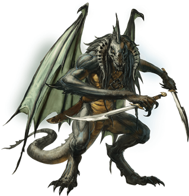
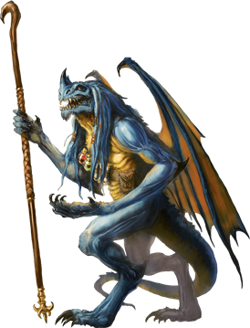
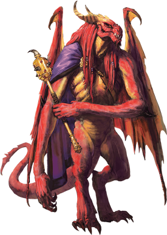
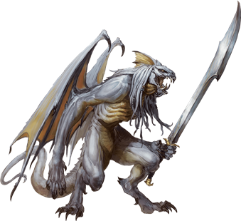

# Abishai
Each abishai was once a mortal who somehow won Tiamat’s favor before death and, as a reward, found its soul transformed into a hideous devil to serve at her pleasure in the Nine Hells.

**Emissaries of Doom.** Tiamat deploys abishais as emissaries, sending them to represent her interests in the Hells and across the multiverse. Some have simple tasks, such as delivering a message to cultists or taking charge of worshipers to carry out a sensitive mission. Others have greater responsibilities, such as leading large groups, assassinating targets, and serving in armies. In all cases, abishais are fanatically loyalty to Tiamat, ready to lay down their lives if needed.

**Outsiders in Hell.** Abishais stand outside the normal hierarchy of the Nine Hells, having their own chain of command and ultimately answering to Tiamat (and Asmodeus, when the dark lord chooses to use them). Other archdevils can command abishais to work for them, but most archdevils do so rarely, since it is never clear whether an abishai follows Tiamat’s orders or Asmodeus’s. There is inherent risk in countermanding an order given by Tiamat, but interfering with Asmodeus’s plans invites certain destruction.

## Black Abishai
*Medium fiend (devil), lawful evil*

**Armor Class** 15 (natural armor)

**Hit Points** 58 (9d8 + 18)

**Speed** 30 ft., fly 40 ft.

STR
14(+2)
DEX
17(+3)
CON
14(+2)
INT
13(+1)
WIS
16(+3)
CHA
11(+0)

**Saving Throws** Dex +6, Wis +6

**Skills** Perception +6, Stealth +6

**Damage Resistances** cold; bludgeoning, piercing, and slashing from nonmagical attacks that aren't silvered

**Damage Immunities** acid, fire, poison

**Condition Immunities** poisoned

**Senses** darkvision 120 ft., passive Perception 16

**Languages** Draconic, Infernal, telepathy 120 ft.

**Challenge** 7 (2,900 XP)

**Devil's Sight.** Magical darkness doesn’t impede the abishai’s darkvision.

**Magic Resistance.** The abishai has advantage on saving throws against spells and other magical effects.

**Magic Weapons.** The abishai’s weapon attacks are magical.

**Shadow Stealth.** While in dim light or darkness, the abishai can take the Hide action as a bonus action.

#### Actions
**Multiattack.** The abishai makes three attacks: two with its scimitar and one with its bite.

**Scimitar.** Melee Weapon Attack: +6 to hit, reach 5 ft., one target. Hit: 6 (1d6 + 3) slashing damage.

**Bite.** Melee Weapon Attack: +6 to hit, reach 5 ft., one target. Hit: 8 (1d10 + 3) piercing damage plus 9 (2d8) acid damage.

**Creeping Darkness (Recharge 6).** The abishai casts darkness at a point within 120 feet of it, requiring no components. Wisdom is its spellcasting ability for this spell. While the spell persists, the abishai can move the area of darkness up to 60 feet as a bonus action.

#### Description

Expert assassins and infiltrators, black abishais can weave shadows to mask their presence, allowing them to reach a location from where they can deliver a fatal strike to their targets.

## Blue Abishai
*Medium fiend (devil), lawful evil*

**Armor Class** 19 (natural armor)

**Hit Points** 195 (26d8 + 78)

**Speed** 30 ft., fly 50 ft.

STR
15(+2)
DEX
14(+2)
CON
17(+3)
INT
22(+6)
WIS
23(+6)
CHA
18(+4)

**Saving Throws** Int +12, Wis +12

**Skills** Arcana +12

**Damage Resistances** cold; bludgeoning, piercing, and slashing from nonmagical attacks that aren't silvered

**Damage Immunities** fire, lightning, poison

**Condition Immunities** poisoned

**Senses** darkvision 120 ft., passive Perception 16

**Languages** Draconic, Infernal, telepathy 120 ft.

**Challenge** 17 (18,000 XP)

**Devil's Sight.** Magical darkness doesn’t impede the abishai’s darkvision.

**Magic Resistance.** The abishai has advantage on saving throws against spells and other magical effects.

**Magic Weapons.** The abishai’s weapon attacks are magical.

**Spellcasting.** The abishai is a 13th-level spellcaster. Its spellcasting ability is Intelligence (spell save DC 20, +12 to hit with spell attacks). The abishai has the following wizard spells prepared:

* *Cantrips (at will)*: friends, mage hand, message, minor illusion, shocking grasp
* *1st level (4 slots)*: chromatic orb, disguise self, expeditious retreat, magic missile, charm person, thunderwave
* *2nd level (3 slots)*: darkness, mirror image, misty step
* *3rd level (3 slots)*: dispel magic, fear, lightning bolt
* *4th level (3 slots)*: dimension door, greater invisibility, ice storm
* *5th level (2 slots)*: cone of cold, wall of force
* *6th level (1 slot)*: chain lightning
* *7th level (1 slot)*: teleport

#### Actions
**Multiattack.** The abishai makes two attacks: one with its quarterstaff and one with its bite.

**Quarterstaff.** Melee Weapon Attack: +8 to hit, reach 5 ft., one target. Hit: 5 (1d6 + 2) bludgeoning damage, or 6 (1d8 + 2) bludgeoning damage if used with two hands.

**Bite.** Melee Weapon Attack: +8 to hit, reach 5 ft., one target. Hit: 13 (2d10 + 2) piercing damage plus 14 (4d6) lightning damage.

#### Description

Seekers of forgotten lore and lost relics, blue abishais are the most cunning and learned of their kind. Their research into occult subjects gleaned from tomes and grimoires plundered from across the multiverse enables them to become accomplished spellcasters. They use their magic to devastate their mistress’s enemies.

## Green Abishai
*Medium fiend (devil), lawful evil*

**Armor Class** 18 (natural armor)

**Hit Points** 187 (25d8 + 75)

**Speed** 30 ft., fly 40 ft.

STR
12(+1)
DEX
17(+3)
CON
16(+3)
INT
17(+3)
WIS
12(+1)
CHA
19(+4)

**Saving Throws** Int +8, Cha +9

**Skills** Deception + 9, Insight +6, Perception +6, Persuasion +9

**Damage Resistances** cold; bludgeoning, piercing, and slashing from nonmagical attacks that aren't silvered

**Damage Immunities** fire, poison

**Condition Immunities** poisoned

**Senses** darkvision 120 ft., passive Perception 16

**Languages** Draconic, Infernal, telepathy 120 ft.

**Challenge** 15 (13,000 XP)

**Devil's Sight.** Magical darkness doesn’t impede the abishai’s darkvision.

**Innate Spellcasting.** The abishai’s innate spellcasting ability is Charisma (spell save DC 17). It can innately cast the following spells, requiring no material components:

* *At will*: alter self, major image
* *3/day each*: charm person, detect thoughts, fear
* *1/day each*: confusion, dominate person, mass suggestion

**Magic Resistance.** The abishai has advantage on saving throws against spells and other magical effects.

**Magic Weapons.** The abishai’s weapon attacks are magical.

#### Actions
**Multiattack.** The abishai makes two attacks, one with its claws and one with its longsword, or it casts one spell from its Innate Spellcasting trait and makes one claw attack.

**Longsword.** Melee Weapon Attack: +6 to hit, reach 5 ft., one target. Hit: 5 (1d8 + 1) slashing damage, or 6 (1d10 + 1) slashing damage if used with two hands.

**Claws.** Melee Weapon Attack: +8 to hit, reach 5 ft., one target. Hit: 12 (2d8 + 3) piercing damage. If the target is a creature, it must succeed on a DC 16 Constitution saving throw or take 11 (2d10) poison damage and become poisoned for 1 minute. The poisoned target can repeat the saving throw at the end of each of its turns, ending the effect on itself on a success.

#### Description

The envoys of Tiamat’s armies, green abishais represent the god’s interests in the Nine Hells and beyond. Their keen senses make them adept at discovering secrets and other sensitive information, while their diplomatic skills and their magic ensure that they can manipulate even the shrewdest opponents.

## Red Abishai
*Medium fiend (devil), lawful evil*

**Armor Class** 22 (natural armor)

**Hit Points** 255 (30d8 + 120)

**Speed** 30 ft., fly 50 ft.

STR
23(+6)
DEX
16(+3)
CON
19(+4)
INT
14(+2)
WIS
15(+2)
CHA
19(+4)

**Saving Throws** Str +12, Con +10, Wis +8

**Skills** Intimidation +10, Perception +8

**Damage Resistances** cold; bludgeoning, piercing, and slashing from nonmagical attacks that aren't silvered

**Damage Immunities** fire, poison

**Condition Immunities** poisoned

**Senses** darkvision 120 ft., passive Perception 18

**Languages** Draconic, Infernal, telepathy 120 ft.

**Challenge** 19 (22,000 XP)

**Devil's Sight.** Magical darkness doesn’t impede the abishai’s darkvision.

**Magic Resistance.** The abishai has advantage on saving throws against spells and other magical effects.

**Magic Weapons.** The abishai’s weapon attacks are magical.

#### Actions
**Multiattack.** The abishai can use its Frightful Presence. It also makes three attacks: one with its morningstar, one with its claw, and one with its bite.

**Morningstar.** Melee Weapon Attack: +12 to hit, reach 5 ft., one target. Hit: 10 (1d8 + 6) piercing damage.

**Claw.** Melee Weapon Attack: +12 to hit, reach 5 ft., one target. Hit: 17 (2d10 + 6) slashing damage.

**Bite.** Melee Weapon Attack: +12 to hit, reach 5 ft., one target. Hit: 22 (3d10 + 6) piercing damage plus 38 (7d10) fire damage.

**Frightful Presence.** Each creature of the abishai’s choice that is within 120 feet and aware of it must succeed on a DC 18 Wisdom saving throw or become frightened of it for 1 minute. A creature can repeat the saving throw at the end of each of its turns, ending the effect on itself on a success. If a creature’s saving throw is successful or the effect ends for it, the creature is immune to the abishai’s Frightful Presence for the next 24 hours.

**Incite Fanaticism.** The abishai chooses up to four of its allies within 60 feet of it that can see it. For 1 minute, each of those allies makes attack rolls with advantage and can’t be frightened.

**Power of the Dragon Queen.** The abishai targets one dragon it can see within 120 feet of it. The dragon must make a DC 18 Charisma saving throw. A chromatic dragon makes this save with disadvantage. On a successful save, the target is immune to the abishai’s Power of the Dragon Queen for 1 hour. On a failed save, the target is charmed by the abishai for 1 hour. While charmed in this way, the target regards the abishai as a trusted friend to be heeded and protected. This effect ends if the abishai or its companions deal damage to the target.

#### Description

Red abishais have no equals among the abishais when it comes to leadership ability and raw power. They can invoke Tiamat’s authority to bend even dragons to their will. Red abishais lead other devils into battle or take charge of troublesome cults to ensure that they continue to carry out Tiamat’s commands. A red abishai cuts a fearsome figure, and that sight can be inspiring to the abishai’s allies, filling them with a fanatical willingness to fight.

## White Abishai
*Medium fiend (devil), lawful evil*

**Armor Class** 15 (natural armor)

**Hit Points** 68 (8d8 + 32)

**Speed** 30 ft., fly 40 ft.

STR
16(+3)
DEX
11(+0)
CON
18(+4)
INT
11(+0)
WIS
12(+1)
CHA
13(+1)

**Saving Throws** Str +6, Con +7

**Damage Resistances** bludgeoning, piercing, and slashing from nonmagical attacks that aren’t silvered

**Damage Immunities** cold, fire, poison

**Condition Immunities** poisoned

**Senses** darkvision 120 ft., passive Perception 11

**Languages** Draconic, Infernal, telepathy 120 ft.

**Challenge** 6 (2,300 XP)

**Devil's Sight.** Magical darkness doesn’t impede the abishai’s darkvision.

**Magic Resistance.** The abishai has advantage on saving throws against spells and other magical effects.

**Magic Weapons.** The abishai’s weapon attacks are magical.

**Reckless.** At the start of its turn, the abishai can gain advantage on all melee weapon attack rolls during that turn, but attack rolls against it have advantage until the start of its next turn.

#### Actions
**Multiattack.** The abishai makes two attacks: one with its longsword and one with its claw.

**Longsword.** Melee Weapon Attack: +6 to hit, reach 5 ft., one target. Hit: 7 (1d8 + 3) slashing damage, or 8 (1d10 + 3) slashing damage if used with two hands.

**Claw.** Melee Weapon Attack: +6 to hit, reach 5 ft., one target. Hit: 8 (1d10 + 3) slashing damage.

**Bite.** Melee Weapon Attack: +6 to hit, reach 5 ft., one target. Hit: 5 (1d4 + 3) piercing damage plus 3 (1d6) cold damage.

#### Reactions
**Vicious Reprisal.** In response to taking damage, the abishai makes a bite attack against a random creature within 5 feet of it. If no creature is within reach, the abishai moves up to half its speed toward an enemy it can see, without provoking opportunity attacks.

#### Description

Though they are the least of their kind, white abishais fight with a reckless fury, making them ideally suited for bolstering the ranks of Tiamat’s armies. White abishais fight without fear, becoming whirlwinds of destruction on the battlefield.

