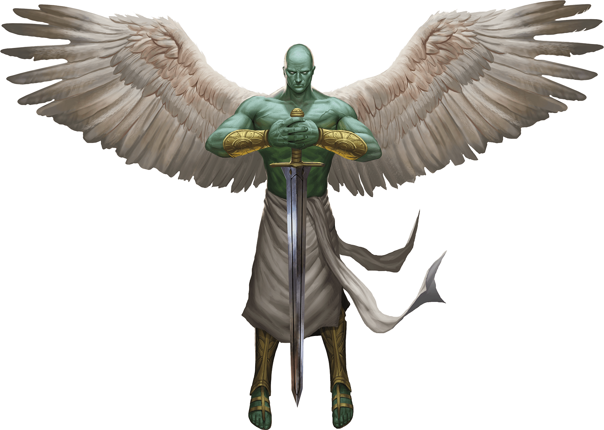
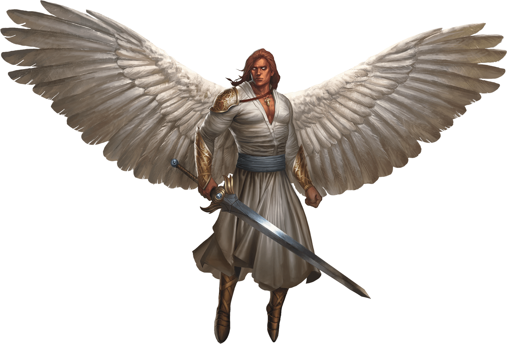

# Angels
An angel is a celestial agent sent forth into the planes to further its god's agenda for weal or woe. Its sublime beauty and presence can drive awestruck onlookers to their knees. Yet angels are destroyers too, and their appearance portends doom as often as it signals hope.

> Jump to: [Deva](#deva) | [Planetar](#planetar) | [Solar](#solar)

***Shards of the Divine.*** Angels are formed from the astral essence of benevolent gods and are thus divine beings of great power and foresight.

Angels act out the will of their gods with tireless devotion. Even chaotic good deities command lawful good angels, knowing that the angels' dedication to order best allows them to fulfill divine commands. An angel follows a single driving purpose, as decreed by its deity. However, an angel is incapable of following commands that stray from the path of law and good.

An angel slays evil creatures without remorse. As the embodiment of law and good, an angel is almost never mistaken in its judgments. This quality can create a sense of superiority in an angel, a sense that comes to the fore when an angel's task conflicts with the goals of another creature. The angel never acquiesces or gives way. When an angel is sent to aid mortals, it is sent not to serve but to command. The gods of good therefore send their angels among mortals only in response to the most dire circumstances.

***Fallen Angels.*** An angel's moral compass grants it a sense of infallibility that can sometimes spell its undoing. Angels are usually too wise to fall for a simple deception, but sometimes pride can lead one to commit an evil act. Whether intentional or accidental, such an act is a permanent stain that marks the angel as an outcast.

Fallen angels retain their power but lose their connection to the deities from which they were made. Most fallen angels take their banishment personally, rebelling against the powers they served by seeking rulership over a section of the Abyss or a place among other fallen in the hierarchy of the Nine Hells. Zariel, the ruler of the first layer of the Nine Hells, is such a creature. Rather than rebel, some fallen angels resign themselves to an isolated existence on the Material Plane, living in disguise as simple hermits. If they are redeemed, they can become powerful allies dedicated to justice and compassionate service.

***Immortal Nature.*** An angel doesn't require food, drink, or sleep.

---

## Deva

Devas are angels that act as divine messengers or agents to the Material Plane, the Shadowfell, and the Feywild and that can assume a form appropriate to the realm they are sent to.

Legend tells of angels that take mortal form for years, lending aid, hope, and courage to goodhearted folk. A deva can take any shape, although it prefers to appear to mortals as an innocuous humanoid or animal. When circumstances require that it cast off its guise, a deva is a beautiful humanoid-like creature with silvery skin. Its hair and eyes gleam with an unearthly luster, and large feathery wings unfurl from its shoulder blades.

>### Deva
>*Medium celestial, lawful good*
>___
>- **Armor Class** 17 (natural armor)
>- **Hit Points** 136 (16d8 + 64)
>- **Speed** 30 ft., fly 90 ft.
>___
>|**STR**|**DEX**|**CON**|**INT**|**WIS**|**CHA**|
>|:---:|:---:|:---:|:---:|:---:|:---:|
>|18 (+4)|18 (+4)|18 (+4)|17 (+3)|20 (+5)|20 (+5)|
>
>___
>- **Proficiency Bonus** 0
>- **Saving Throws** Wis +9,Cha +9
>- **Damage Vulnerabilities** 
>- **Damage Resistances** radiant; bludgeoning,piercing,and slashing from nonmagical attacks
>- **Damage Immunities** 
>- **Condition Immunities** charmed,exhaustion,frightened
>- **Skills** Insight +9,Perception +9
>- **Senses** darkvision 120 ft.,passive Perception 19
>- **Languages** all,telepathy 120 ft.
>- **Challenge** 10
>___
>***Angelic Weapons.*** The deva's weapon attacks are magical. When the deva hits with any weapon, the weapon deals an extra 4d8 radiant damage (included in the attack).
>
>***Innate Spellcasting.*** The deva's spellcasting ability is Charisma (spell save DC 17). The deva can innately cast the following spells, requiring only verbal components:
>
>At will: detect evil and good
>
>1/day each: commune, raise dead
>
>***Magic Resistance.*** The deva has advantage on saving throws against spells and other magical effects.
>
>#### Actions
>***Multiattack.*** The deva makes two melee attacks.
>
>***Mace.*** Melee Weapon Attack: +8 to hit, reach 5 ft., one target. Hit: 7 (1d6 + 4) bludgeoning damage plus 18 (4d8) radiant damage.
>
>***Healing Touch (3/Day).*** The deva touches another creature. The target magically regains 20 (4d8 + 2) hit points and is freed from any curse, disease, poison, blindness, or deafness.
>
>***Change Shape.*** The deva magically polymorphs into a humanoid or beast that has a challenge rating equal to or less than its own, or back into its true form. It reverts to its true form if it dies. Any equipment it is wearing or carrying is absorbed or borne by the new form (the deva's choice).
>
>In a new form, the deva retains its game statistics and ability to speak, but its AC, movement modes, Strength, Dexterity, and special senses are replaced by those of the new form, and it gains any statistics and capabilities (except class features, legendary actions, and lair actions) that the new form has but that it lacks.
>

---

## Planetar

Planetars act as the weapons of the gods they serve, presenting a tangible representation of their deities' might. A planetar can call down rain to relieve a drought, or can loose an insect plague to devour crops. A planetar's celestial ears detect every falsehood, and its radiant eyes see through every deception.

Planetars are muscular and hairless and have opalescent green skin and white-feathered wings. They tower over most humanoids, brandishing immense swords with grace. Sometimes sent to aid powerful mortals on important tasks for good, planetars are especially fond of missions that involve battling fiends.

>### Planetar
>*Large celestial, lawful good*
>___
>- **Armor Class** 19 (natural armor)
>- **Hit Points** 200 (16d10 + 112)
>- **Speed** 40 ft., fly 120 ft.
>___
>|**STR**|**DEX**|**CON**|**INT**|**WIS**|**CHA**|
>|:---:|:---:|:---:|:---:|:---:|:---:|
>|24 (+7)|20 (+5)|24 (+7)|19 (+4)|22 (+6)|25 (+7)|
>
>___
>- **Proficiency Bonus** 0
>- **Saving Throws** Con +12,Wis +11,Cha +12
>- **Damage Vulnerabilities** 
>- **Damage Resistances** radiant; bludgeoning,piercing,and slashing from nonmagical attacks
>- **Damage Immunities** 
>- **Condition Immunities** charmed,exhaustion,frightened
>- **Skills** Perception +11
>- **Senses** truesight 120 ft.,passive Perception 21
>- **Languages** all,telepathy 120 ft.
>- **Challenge** 16
>___
>***Angelic Weapons.*** The planetar's weapon attacks are magical. When the planetar hits with any weapon, the weapon deals an extra 5d8 radiant damage (included in the attack).
>
>***Divine Awareness.*** The planetar knows if it hears a lie.
>
>***Innate Spellcasting.*** The planetar's spellcasting ability is Charisma (spell save DC 20). The planetar can innately cast the following spells, requiring no material components:
>
>At will: detect evil and good, invisibility (self only)
>
>3/day each: blade barrier, dispel evil and good, flame strike, raise dead
>
>1/day each: commune, control weather, insect plague
>
>***Magic Resistance.*** The planetar has advantage on saving throws against spells and other magical effects.
>
>#### Actions
>***Multiattack.*** The planetar makes two melee attacks.
>
>***Greatsword.*** Melee Weapon Attack: +12 to hit, reach 5 ft., one target. Hit: 21 (4d6 + 7) slashing damage plus 22 (5d8) radiant damage.
>
>***Healing Touch (4/Day).*** The planetar touches another creature. The target magically regains 30 (6d8 + 3) hit points and is freed from any curse, disease, poison, blindness, or deafness.
>

---

## Solar

A solar is godlike in its glory and power. On the battlefield, the solar's sword flies into the fray on its own, and a single arrow from a solar's bow can strike a target dead on contact. So great is a solar's celestial might that even demon princes shrink at its resonant commands.

It is said that only twenty-four solars exist. The few solars that are known are stewards of specific deities. The others rest in a state of contemplation, waiting for the time when their services are needed to stave off some cosmic threat to the cause of good.

>### Solar
>*Large celestial, lawful good*
>___
>- **Armor Class** 21 (natural armor)
>- **Hit Points** 243 (18d10 + 144)
>- **Speed** 50 ft., fly 150 ft.
>___
>|**STR**|**DEX**|**CON**|**INT**|**WIS**|**CHA**|
>|:---:|:---:|:---:|:---:|:---:|:---:|
>|26 (+8)|22 (+6)|26 (+8)|25 (+7)|25 (+7)|30 (+10)|
>
>___
>- **Proficiency Bonus** 0
>- **Saving Throws** Int +14,Wis +14,Cha +17
>- **Damage Vulnerabilities** 
>- **Damage Resistances** radiant; bludgeoning,piercing,and slashing from nonmagical attacks
>- **Damage Immunities** necrotic,poison
>- **Condition Immunities** charmed,exhaustion,frightened,poisoned
>- **Skills** Perception +14
>- **Senses** truesight 120 ft.,passive Perception 24
>- **Languages** all,telepathy 120 ft.
>- **Challenge** 21
>___
>***Angelic Weapons.*** The solar's weapon attacks are magical. When the solar hits with any weapon, the weapon deals an extra 6d8 radiant damage (included in the attack).
>
>***Divine Awareness.*** The solar knows if it hears a lie.
>
>***Innate Spellcasting.*** The solar's spellcasting ability is Charisma (spell save DC 25). It can innately cast the following spells, requiring no material components:
>
>At will: detect evil and good, invisibility (self only)
>
>3/day each: blade barrier, dispel evil and good, resurrection
>
>1/day each: commune, control weather
>
>***Magic Resistance.*** The solar has advantage on saving throws against spells and other magical effects.
>
>#### Actions
>***Multiattack.*** The solar makes two greatsword attacks.
>
>***Greatsword.*** Melee Weapon Attack: +15 to hit, reach 5 ft., one target. Hit: 22 (4d6 + 8) slashing damage plus 27 (6d8) radiant damage.
>
>***Slaying Longbow.*** Ranged Weapon Attack: +13 to hit, range 150/600 ft., one target. Hit: 15 (2d8 + 6) piercing damage plus 27 (6d8) radiant damage. If the target is a creature that has 100 hit points or fewer, it must succeed on a DC 15 Constitution saving throw or die.
>
>***Flying Sword.*** The solar releases its greatsword to hover magically in an unoccupied space within 5 feet of it. If the solar can see the sword, the solar can mentally command it as a bonus action to fly up to 50 feet and either make one attack against a target or return to the solar's hands. If the hovering sword is targeted by any effect, the solar is considered to be holding it. The hovering sword falls if the solar dies.
>
>***Healing Touch (4/Day).*** The solar touches another creature. The target magically regains 40 (8d8 + 4) hit points and is freed from any curse, disease, poison, blindness, or deafness.
>
>#### Legendary Actions
>The solar can take 3 legendary actions, choosing from the options below. Only one legendary action option can be used at a time and only at the end of another creature's turn. The solar regains spent legendary actions at the start of its turn.
>
>***Teleport.*** The solar magically teleports, along with any equipment it is wearing or carrying, up to 120 feet to an unoccupied space it can see.
>
>***Searing Burst (Costs 2 Actions).*** The solar emits magical, divine energy. Each creature of its choice in a 10-foot radius must make a DC 23 Dexterity saving throw, taking 14 (4d6) fire damage plus 14 (4d6) radiant damage on a failed save, or half as much damage on a successful one.
>
>***Blinding Gaze (Costs 3 Actions).*** The solar targets one creature it can see within 30 feet of it. If the target can see it, the target must succeed on a DC 15 Constitution saving throw or be blinded until magic such as the lesser restoration spell removes the blindness.
>
