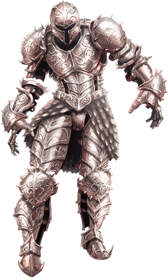
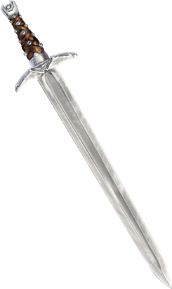
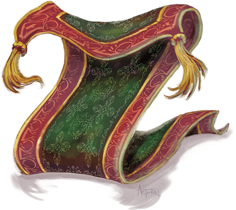

# Animated Objects
Animated objects are crafted with potent magic to follow the commands of their creators. When not commanded, they follow the last order they received to the best of their ability, and can act independently to fulfill simple instructions. Some animated objects (including many of those created in the Feywild) might converse fluently or adopt a persona, but most are simple automatons.

> Jump to: [Armor](#animated-armor) | [Flying Sword](#flying-sword) | [Rug of Smothering](#rug-of-smothering)

***Constructed Nature.*** An animated object doesn’t require air, food, drink, or sleep.

The magic that animates an object is dispelled when the construct drops to 0 hit points. An animated object reduced to 0 hit points becomes inanimate and is too damaged to be of much use or value to anyone.

---

## Animated Armor

This empty steel shell clamors as it moves, heavy plates banging and grinding against one another like the vengeful spirit of a fallen knight. Ponderous but persistent, this magical guardian is almost always a suit of plate armor.

To add to its menace, animated armor is frequently enchanted with scripted speech, so the armor can utter warnings, demand passwords, or deliver riddles. Rare suits of animated armor are able to carry on an actual conversation.

>### Animated Armor
>*Medium construct, unaligned*
>___
>- **Armor Class** 18 (natural armor)
>- **Hit Points** 33 (6d8 + 6)
>- **Speed** 25 ft.
>___
>|**STR**|**DEX**|**CON**|**INT**|**WIS**|**CHA**|
>|:---:|:---:|:---:|:---:|:---:|:---:|
>|14 (+2)|11 (+0)|13 (+1)|1 (-5)|3 (-4)|1 (-5)|
>
>___
>- **Proficiency Bonus** 0
>- **Saving Throws** 
>- **Damage Vulnerabilities** 
>- **Damage Resistances** 
>- **Damage Immunities** poison,psychic
>- **Condition Immunities** blinded,charmed,deafened,exhaustion,frightened,paralyzed,petrified,poisoned
>- **Skills** 
>- **Senses** blindsight 60 ft. (blind beyond this radius),passive Perception 6
>- **Languages** —
>- **Challenge** 1
>___
>***Antimagic Susceptibility.*** The armor is incapacitated while in the area of an antimagic field. If targeted by dispel magic, the armor must succeed on a Constitution saving throw against the caster’s spell save DC or fall unconscious for 1 minute.
>
>***False Appearance.*** While the armor remains motionless, it is indistinguishable from a normal suit of armor.
>
>#### Actions
>***Multiattack.*** The armor makes two melee attacks.
>
>***Slam.*** Melee Weapon Attack: +4 to hit, reach 5 ft., one target. Hit: 5 (1d6 + 2) bludgeoning damage.
>

---

## Flying Sword

A flying sword dances through the air, fighting with the confidence of a warrior that can’t be injured. Swords are the most common weapons animated with magic. Axes, clubs, daggers, maces, spears, and even self-loading crossbows are also known to exist in animated object form.

>### Flying Sword
>*Small construct, unaligned*
>___
>- **Armor Class** 17 (natural armor)
>- **Hit Points** 17 (5d6)
>- **Speed** 0 ft., fly 50 ft. (hover)
>___
>|**STR**|**DEX**|**CON**|**INT**|**WIS**|**CHA**|
>|:---:|:---:|:---:|:---:|:---:|:---:|
>|12 (+1)|15 (+2)|11 (+0)|1 (-5)|5 (-3)|1 (-5)|
>
>___
>- **Proficiency Bonus** 0
>- **Saving Throws** Dex +4
>- **Damage Vulnerabilities** 
>- **Damage Resistances** 
>- **Damage Immunities** poison,psychic
>- **Condition Immunities** blinded,charmed,deafened,frightened,paralyzed,petrified,poisoned
>- **Skills** 
>- **Senses** blindsight 60 ft. (blind beyond this radius),passive Perception 7
>- **Languages** —
>- **Challenge** 1/4
>___
>***Antimagic Susceptibility.*** The sword is incapacitated while in the area of an antimagic field. If targeted by dispel magic, the sword must succeed on a Constitution saving throw against the caster’s spell save DC or fall unconscious for 1 minute.
>
>***False Appearance.*** While the sword remains motionless and isn’t flying, it is indistinguishable from a normal sword.
>
>#### Actions
>***Longsword.*** Melee Weapon Attack: +3 to hit, reach 5 ft., one target. Hit: 5 (1d8 + 1) slashing damage.
>

---

## Rug of Smothering

Would-be thieves and careless heroes arrive at the doorsteps of an enemy’s abode, eyes and ears alert for traps, only to end their quest prematurely as the rugs beneath their feet animate and smother them to death.

A rug of smothering can be made in many different forms, from a finely woven carpet fit for a queen to a coarse mat in a peasant’s hovel. Creatures with the ability to sense magic detect the rug’s false magical aura.

In some cases, a rug of smothering is disguised as a carpet of flying or another beneficial magic item. However, a character who stands or sits on the rug, or who attempts to utter a word of command, is quickly trapped as the rug of smothering rolls itself tightly around its victim.

>### Rug of Smothering
>*Large construct, unaligned*
>___
>- **Armor Class** 12
>- **Hit Points** 33 (6d10)
>- **Speed** 10 ft.
>___
>|**STR**|**DEX**|**CON**|**INT**|**WIS**|**CHA**|
>|:---:|:---:|:---:|:---:|:---:|:---:|
>|17 (+3)|14 (+2)|10 (+0)|1 (-5)|3 (-4)|1 (-5)|
>
>___
>- **Proficiency Bonus** 0
>- **Saving Throws** 
>- **Damage Vulnerabilities** 
>- **Damage Resistances** 
>- **Damage Immunities** poison,psychic
>- **Condition Immunities** blinded,charmed,deafened,frightened,paralyzed,petrified,poisoned
>- **Skills** 
>- **Senses** blindsight 60 ft. (blind beyond this radius),passive Perception 6
>- **Languages** —
>- **Challenge** 2
>___
>***Antimagic Susceptibility.*** The rug is incapacitated while in the area of an antimagic field. If targeted by dispel magic, the rug must succeed on a Constitution saving throw against the caster’s spell save DC or fall unconscious for 1 minute.
>
>***Damage Transfer.*** While it is grappling a creature, the rug takes only half the damage dealt to it, and the creature grappled by the rug takes the other half.
>
>#### Actions
