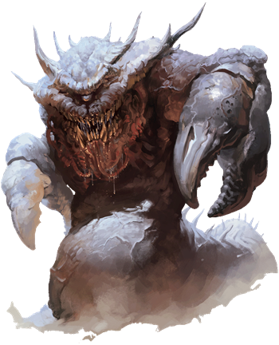

## Astral Dreadnought
Enormous and terrifying, astral dreadnoughts haunt the silvery void of the Astral Plane, causing planar travelers to shudder at the very thought of them. Dreadnoughts have been gliding through the astral mists since the dawn of the multiverse, trying to devour all other creatures they encounter.

Covered from head to tail in layers of thick, spiked plates, a dreadnought has two gnarled limbs that end in magic-enhanced pincer claws. Constellations appear to swirl in the depths of its single eye, and its serpentine tail trails off into the silvery void. Anything it swallows is deposited in a unique demiplane--an enclosed space that contains eons worth of detritus, as well as the remains of travelers. The place has gravity and breathable air, and organic matter decays there. When the dreadnought dies, its demiplane vanishes, and its contents are released into the Astral Plane.

>### Astral Dreadnought
>*Gargantuan Monstrosity (Titan), Unaligned*
>___
>- **Armor Class** 20 (natural armor)
>- **Hit Points** 297 (17d20 + 119)
>- **Speed** 15 ft., fly 80 ft. (hover)
>___
>|**STR**|**DEX**|**CON**|**INT**|**WIS**|**CHA**|
>|:---:|:---:|:---:|:---:|:---:|:---:|
>|28 (+9)|7 (-2)|25 (+7)|5 (-3)|14 (+2)|18 (+4)|
>
>___
>- **Proficiency Bonus** +7
>- **Saving Throws** Dex +5,Wis +9
>- **Damage Vulnerabilities** 
>- **Damage Resistances** bludgeoning,piercing,and slashing from nonmagical attacks
>- **Damage Immunities** 
>- **Condition Immunities** charmed,exhaustion,frightened,paralyzed,petrified,poisoned,prone,stunned
>- **Skills** Perception +9
>- **Senses** darkvision 120 ft.,passive Perception 19
>- **Languages** --
>- **Challenge** 21
>___
>***Antimagic Cone.*** The dreadnought's eye creates an area of antimagic, as in the antimagic field spell, in a 150-foot cone. At the start of each of its turns, it decides which way the cone faces. The cone doesn't function while the eye is closed or while the dreadnought is blinded.
>
>***Astral Entity.*** The dreadnought can't leave the Astral Plane, nor can it be banished or otherwise transported out of that plane.
>
>***Demiplanar Donjon.*** Anything the dreadnought swallows is transported to a demiplane that can be entered by no other means except a wish spell or the dreadnought's Bite and Donjon Visit. A creature can leave the demiplane only by using magic that enables planar travel, such as the plane shift spell. The demiplane resembles a stone cave roughly 1,000 feet in diameter with a ceiling 100 feet high. Like a stomach, it contains the remains of past meals. The dreadnought can't be harmed from within the demiplane. If the dreadnought dies, the demiplane disappears, and everything inside it appears around the dreadnought's corpse. The demiplane is otherwise indestructible.
>
>***Legendary Resistance (3/Day).*** If the dreadnought fails a saving throw, it can choose to succeed instead.
>
>***Sever Silver Cord.*** If the dreadnought scores a critical hit against a creature traveling by means of the astral projection spell, the dreadnought can cut the target's silver cord instead of dealing damage.
>
>***Unusual Nature.*** The dreadnought doesn't require air, food, drink, or sleep.
>
>#### Actions
>***Multiattack.*** The dreadnought makes one Bite attack and two Claw attacks.
>
>***Bite.*** Melee Weapon Attack: +16 to hit, reach 10 ft., one target. Hit: 36 (5d10 + 9) force damage. If the target is a Huge or smaller creature and this damage reduces it to 0 hit points or it is incapacitated, the dreadnought swallows it. The swallowed target, along with everything it is wearing and carrying, appears in an unoccupied space on the floor of the Demiplanar Donjon.
>
>***Claw.*** Melee Weapon Attack: +16 to hit, reach 20 ft., one target. Hit: 19 (3d6 + 9) force damage.
>
>#### Legendary Actions
>The dreadnought can take 3 legendary actions, choosing from the options below. Only one legendary option can be used at a time and only at the end of another creature's turn. The dreadnought regains spent legendary actions at the start of its turn.
>
>***Claw.*** The dreadnought makes one Claw attack.
>
>***Donjon Visit (Costs 2 Actions).*** One Huge or smaller creature that the dreadnought can see within 60 feet of it must succeed on a DC 19 Charisma saving throw or be teleported to an unoccupied space on the floor of the Demiplanar Donjon. At the end of the target's next turn, it reappears in the space it left or in the nearest unoccupied space if that space is occupied.
>
>Psychic Projection (Costs 3 Actions). Each creature within 60 feet of the dreadnought must make a DC 19 Wisdom saving throw, taking 26 (4d10 + 4) psychic damage on a failed save, or half as much damage on a successful one.
>
