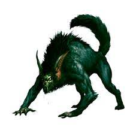

# Barghest
*Large fiend (shapechanger), neutral evil*

**Armor Class** 17 (natural armor)

**Hit Points** 90 (12d10 + 24)

**Speed** 60 ft. (30 ft. in goblin form)

**STR**|**DEX**|**CON**|**INT**|**WIS**|**CHA**
-------|-------|-------|-------|-------|-------
19 (+4)|15 (+2)|14 (+2)|13 (+1)|12 (+1)|14 (+2)

**Skills** Deception +4, Intimidation +4, Perception +5, Stealth +4

**Damage Resistances** cold, fire, lightning; bludgeoning, piercing, and slashing from nonmagical attacks

**Damage Immunities** acid, poison

**Condition Immunities** poisoned

**Senses** blindsight 60 ft., darkvision 60 ft., passive Perception 15

**Languages** Abyssal, Common, Goblin, Infernal, telepathy 60 ft.

**Challenge** 5 (1800 XP)

**Shapechanger**. The barghest can use an action to polymorph into a goblin, a wolf, or back into its true form.

While in goblin form, the barghest cannot use its natural weapons or feed action but can wield weapons and wear armor. Its statistics, other than its size, is unchanged. Anything it is wearing transforms with it, but nothing it is carrying does. It reverts to its true form if it dies.

While in wolf form, the barghest can't speak, its walking speed is 40 feet and it cannot use the claw or feed actions. In addition to its changed statistics, the barghest while in wolf form can use [pass without trace](/Magic/Spells/pass-without-trace.md) at will. Its statistics, other than its size and speed, are unchanged. Anything it is wearing transforms with it, but nothing it is carrying does. It reverts to its true form if it dies.

**Fire Banishment**. When the barghest starts its turn engulfed in flames that are at least 10 feet high or wide, it must succeed on a DC 15 Charisma saving throw or be instantly banished to Gehenna. Instantaneous bursts of flame (such as a red dragon's breath or a fireball spell) don't have this effect on the barghest.

**Keen Smell**. The barghest has advantage on Wisdom (Perception) checks that rely on smell.

**Innate Spellcasting**. The barghest's innate spellcasting ability is Charisma (spell save DC 12). The barghest can innately cast the following spells, requiring no material components:

* *At will*: [levitate](/Magic/Spells/levitate.md), [minor illusion](/Magic/Spells/minor-illusion.md), [pass without trace](/Magic/Spells/pass-without-trace.md)
* *1/day each*: [charm person](/Magic/Spells/charm-monster.md), [dimension door](/Magic/Spells/dimension-door.md), [suggestion](/Magic/Spells/suggestion.md)

#### Actions
**Multiattack**. The barghest makes one bite attack and two claw attacks. Instead of a bite attack, the barghest can use the feed action.

**Bite**. Melee Weapon Attack: +6 to hit, reach 5 ft., one creature. Hit: 7 (1d8 + 3) piercing damage.

**Claw**. Melee Weapon Attack: +6 to hit, reach 5 ft., one creature. Hit: 6 (1d6 + 3) slashing damage.

**Feed**. The barghest targets one creature with 0 hit points it can see within 5 feet of it. The target must make a Constitution saving throw against the barghet's spell DC. On failure, the target dies and cannot be resurrected by spells or spell like features until the barghest is killed.

#### Description

A barghest is a lupine fiend that can take the shape of a wolf or goblin. In its natural form, it resembles a goblin-wolf hybrid with terrible jaws and sharp claws. Barghests come into the world to feed on blood and souls to grow stronger.

As whelps, barghests are nearly indistinguishable from wolves, except for their size and claws. As they grow larger and stronger, their skin darkens to bluish-red and eventually becomes blue altogether. A full-grown barghest is about 6 feet long and weighs 180 pounds. A barghest's eyes glow orange when the creature becomes excited.
