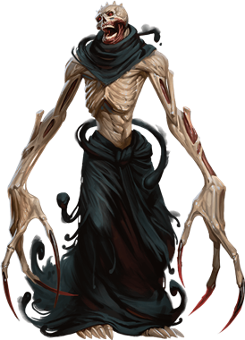

# Boneclaw
*Large undead, chaotic evil*

**Armor Class** 16 (natural armor)

**Hit Points** 127 (17d10 + 34)

**Speed** 40 ft.

**STR**|**DEX**|**CON**|**INT**|**WIS**|**CHA**
-------|-------|-------|-------|-------|-------
19(+4) |16(+3) |15(+2) |13(+1) |15(+2) |9(−1)

**Saving Throws** Dex +7, Con +6, Wis +6

**Skills** Perception +6, Stealth +7

**Damage Resistances** cold, necrotic; bludgeoning, piercing, and slashing from nonmagical attacks

**Condition Immunities** charmed, exhaustion, frightened, paralyzed, poisoned

**Senses** darkvision 60 ft., passive Perception 16

**Languages** Common plus the main language of its master

**Challenge** 12 (8,400 XP)

**Rejuvenation.** While its master lives, a destroyed boneclaw gains a new body in 1d10 hours, with all its hit points. The new body appears within 1 mile of the boneclaw’s master.

**Shadow Stealth.** While in dim light or darkness, the boneclaw can take the Hide action as a bonus action.

#### Actions
**Multiattack.** The boneclaw makes two claw attacks.

**Piercing Claw.** Melee Weapon Attack: +8 to hit, reach 15 ft., one target. Hit: 20 (3d10 + 4) piercing damage. If the target is a creature, the boneclaw can pull the target up to 10 feet toward itself, and the target is grappled (escape DC 14). The boneclaw has two claws. While a claw grapples a target, the claw can attack only that target.

**Shadow Jump.** If the boneclaw is in dim light or darkness, each creature of the boneclaw’s choice within 5 feet of it must succeed on a DC 14 Constitution saving throw or take 34 (5d12 + 2) necrotic damage. The boneclaw then magically teleports up to 60 feet to an unoccupied space it can see. It can bring one creature it’s grappling, teleporting that creature to an unoccupied space it can see within 5 feet of its destination. The destination spaces of this teleportation must be in dim light or darkness.

#### Reactions
**Deadly Reach.** In response to a visible enemy moving into its reach, the boneclaw makes one claw attack against that enemy. If the attack hits, the boneclaw can make a second claw attack against the target.

#### Description
 A wizard who tries to become a lich but fails might become a boneclaw instead. These hideous, cackling undead share a few of the lich’s attributes — but where liches are immortal masters of the arcane, boneclaws are slaves to darkness, hatred, and pain.

The most important part of the transformation ritual occurs when the soul of the aspiring lich migrates to a prepared phylactery. If the spellcaster is too physically or magically weak to compel the soul into its prison, the soul instead seeks out a new master — a humanoid within a few miles who has an unusually hate-filled heart. The soul bonds itself to the foul essence it finds in that person, and the boneclaw becomes forever enslaved to its new master’s wishes and subconscious whims. It forms near its master, sometimes appearing before that individual to receive orders and other times simply setting about the fulfillment of its master’s desires.

**Limited Immortality.** A boneclaw can’t be destroyed while its master lives. No matter what happens to a boneclaw’s body, it re-forms within hours and returns to whatever duty its master assigned.

The boneclaw can serve only evil. If its master finds redemption or sincerely turns away from the path of evil, the boneclaw is permanently destroyed.

**Cackling Slayers.** Boneclaws delight in murder, and nothing pleases them more than causing horrific pain. They lurk like spiders in shadowy recesses, waiting for victims to approach within reach of their long, bony limbs. Once speared, a creature is pulled into the darkness to be sliced apart or teleported elsewhere to be tortured to death.

**Dark Reflections.** A boneclaw’s master might not want such a servant or even know it has one. Boneclaws bind to petty criminals, bullies, and even particularly cruel children. Even if the master is unaware of its new, horrid bodyguard, its local area will be plagued by disappearances and grisly murders, tied together by the common thread of the master’s envy or hunger for revenge.

**Undead Nature.** A boneclaw doesn’t require air, food, drink, or sleep.
