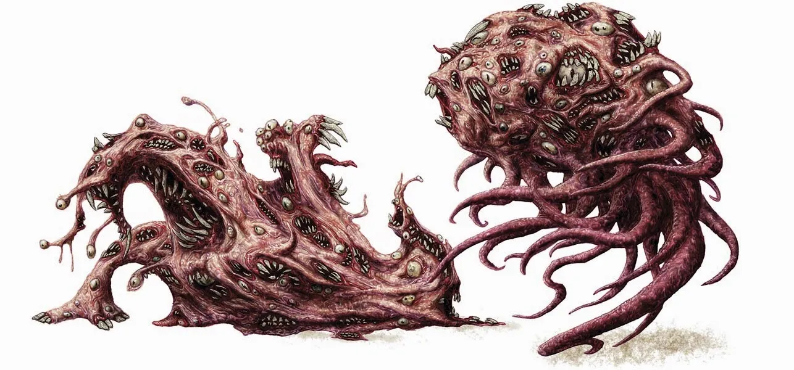

# Chaos Beasts
These horrific creatures have mutable, ever-changing forms. Their deadly touch can make opponents melt into formless goo.

> Jump to: [Chaos Beast](#chaos-beast) | [Ancient Chaos Beast](#ancient-chaos-beast)

There’s no telling what a chaos beast will look like. One moment, it might be a towering horror of hooks and fangs, all pulpy flesh and exposed veins, and the next, a slithering mass of ropy, vermillion-tipped tentacles. A moment later it may be a bulbous thing with ten eyes swimming in a viscous sac at the top of the body, in turn, surrounded by a ring of smacking mouths, then become a mighty creature, all muscle and fury. A chaos beast’s dimensions vary, but it weighs about 200 pounds.

---

## Chaos Beast

### Environment
Summoned

### Token

>### Chaos Beast
>*Medium aberration, chaotic neutral*
>___
>- **Armor Class** 16 (natural armor)
>- **Hit Points** 120 (16d8 + 48)
>- **Speed** 30 ft., climb 20 ft.
>___
>|**STR**|**DEX**|**CON**|**INT**|**WIS**|**CHA**|
>|:---:|:---:|:---:|:---:|:---:|:---:|
>|18 (+4)|15 (+2)|18 (+4)|10 (+0)|12 (+1)|10 (+0)|
>
>___
>- **Proficiency Bonus** +3
>- **Saving Throws** Con +7
>- **Damage Vulnerabilities** 
>- **Damage Resistances** acid, necrotic, slashing
>- **Damage Immunities** 
>- **Condition Immunities** blinded, charmed, deafened, exhaustion, frightened, prone
>- **Skills** Perception +7
>- **Senses** darkvision 60 ft.,passive Perception 17
>- **Languages** —
>- **Challenge** 6 (1,800 XP)
>___
>***Immutable Form.*** The chaos beast is immune to any spell or effect that would alter its form.
>
>***Magic Resistance.*** The chaos beast has advantage against spells and other magical effects.
>
>***Amorphous.*** The chaos beast can move through a space as narrow as 1 inch wide without squeezing.
>
>***Destabilize.*** A creature that touches the chaos beast or hits it with a melee attack while within 5 feet of it must make a DC 15 Constitution saving throw or be poisoned for 1 minute. A creature poisoned in this way takes 21 (6d6) necrotic damage at the start of each of its turns. It can repeat the saving throw at the end of each of its turns, ending the effect on itself on a success. If the creature’s saving throw is successful or the effect ends for it, the creature is immune to the chaos beast’s Destabilize for the next 24 hours.
>
>#### Actions
>***Multiattack.*** The chaos beast makes two Claw attacks.
>
>***Claw.*** *Melee Weapon Attack:* +6 to hit, reach 5 ft., one target. *Hit:* 10 (2d6 + 3) slashing damage plus 10 (3d6) necrotic damage. The creature must make a DC 15 Constitution saving throw or be affected by the chaos beast’s Destabilize effect.
>

---

## Ancient Chaos Beasts

Chaos beasts that live for a few centuries or more grow and evolve. These aberrant horrors not only become deadlier but hungrier for organic flesh, as well.

>### Ancient Chaos Beast
>*Large aberration, chaotic neutral*
>___
>- **Armor Class** 18 (natural armor)
>- **Hit Points** 253 (22d10 + 132)
>- **Speed** 20 ft., climb 20 ft.
>___
>|**STR**|**DEX**|**CON**|**INT**|**WIS**|**CHA**|
>|:---:|:---:|:---:|:---:|:---:|:---:|
>|22 (+6)|13 (+1)|22 (+6)|10 (+0)|10 (+0)|10 (+0)|
>
>___
>- **Proficiency Bonus** +4
>- **Saving Throws** Str +10, Dex +5, Con +10
>- **Damage Vulnerabilities** 
>- **Damage Resistances** 
>- **Damage Immunities** 
>- **Condition Immunities** prone
>- **Skills** Athletics +10, Perception +4
>- **Senses** darkvision 60 ft.,passive Perception 14
>- **Languages** —
>- **Challenge** 11 (7,200 XP)
>___
>***Corporeal Instability.*** Any creature that touches the chaos beast, is hit by the chaos beast’s claw attack, or takes damage from being engulfed by it must succeed on a DC 18 Charisma saving throw or become a spongy, amorphous mass. The affected creature is unable to hold or use any item. Clothing, armor, and equipment become useless. The creature’s speed is reduced by 10 feet. Searing pain courses along the nerves, so strong that the creature cannot act coherently; it cannot cast spells or use magic items, and it attacks blindly, unable to distinguish friend from foe. At the start of the creature’s turn, roll a d8 to determine what it does during its turn. On a 1 to 4, the creature does nothing. On a 5 or 6, the creature takes no action or bonus action and uses all its movement to move in a randomly determined direction. On a 7 or 8, the creature makes a melee attack against a randomly determined creature within its reach or does nothing if it can’t make such an attack.
>
>Each round that the creature spends in an amorphous state, its Wisdom is reduced by 1. The target becomes a chaos beast if this reduces its Wisdom to 0.
>
>A creature can repeat its saving throw at the end of each of its turns, ending the effect on itself with a success. A [greater restoration](../Magic/Spells/greater-restoration.md) spell or similar magic removes the affliction. And a separate [greater restoration](../Magic/Spells/greater-restoration.md) spell is required to restore any lost Wisdom.
>
>***Avoidance.*** If the chaos beast is subjected to an effect that allows it to make a saving throw to take only half damage, it instead takes no damage if it succeeds on the saving throw, and only half damage if it fails.
>
>***Immutable Form.*** The chaos beast is immune to any spell or effect that would alter its form.
>
>***Magic Resistance.*** The chaos beast has advantage against spells and other magical effects.
>
>#### Actions
>***Multiattack.*** The chaos beast makes two Claw attacks.
>
>***Claw.*** *Melee Weapon Attack:* +10 to hit, reach 15 ft., one target. Hit: 15 (2d8 + 6) slashing damage.
>
>***Engulf.*** The chaos beast moves up to its speed. While doing so, it can enter Large or smaller creatures’ spaces. Whenever the chaos beast enters a creature’s space, the creature must make a DC 18 Dexterity saving throw.
>
>On a successful save, the creature can choose to be pushed 5 feet back or to the side of the chaos beast. A creature that chooses not to be pushed suffers the consequences of a failed saving throw.
>
>On a failed save, the chaos beast enters the creature’s space and the creature takes 24 (4d8 + 6) piercing damage and is engulfed. The engulfed creature can’t breathe, is restrained, and takes 24 (4d8 + 6) piercing damage at the start of each of the chaos beast’s turns. When the chaos beast moves, the engulfed creature moves with it.

