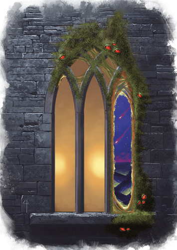

## Alkilith
An alkilith is easily mistaken for some kind of foul fungal growth that appears on doorways, windows, and other portals. These dripping infestations conceal the demonic nature of the alkilith, making what should be a dire warning appear strange but otherwise innocuous. Wherever alkiliths take root, they weaken the fabric of reality, creating a portal through which even nastier demons can invade.

The appearance of an alkilith in the world heralds a great wrongness and an imminent catastrophe. An alkilith searches for an aperture such as a window or a door around which it can take root, stretching its body around the opening and anchoring itself with a sticky secretion. If left undisturbed, the opening becomes attuned to the Abyss and eventually becomes a portal to that plane (see "Planar Portals" in the Dungeon Master's Guide).

Alkiliths spring from cast-off bits of the hideous, shuddering body of Juiblex. They gradually become self-aware and seek to find their way onto the Material Plane. Since most cultists consider them too risky to summon--they can, after all, create portals to the Abyss--alkiliths must find other escape routes out of their native plane.

>### Alkilith
>*Medium fiend (Demon), Typically Chaotic Evil*
>___
>- **Armor Class** 17 (natural armor)
>- **Hit Points** 168 (16d8 + 96)
>- **Speed** 40 ft., climb 40 ft.
>___
>|**STR**|**DEX**|**CON**|**INT**|**WIS**|**CHA**|
>|:---:|:---:|:---:|:---:|:---:|:---:|
>|12 (+1)|19 (+4)|22 (+6)|6 (-2)|11 (+0)|7 (-2)|
>
>___
>- **Proficiency Bonus** +4
>- **Saving Throws** Dex +8,Con +10
>- **Damage Vulnerabilities** 
>- **Damage Resistances** acid,cold,fire,lightning; bludgeoning,piercing,and slashing from nonmagical attacks
>- **Damage Immunities** poison
>- **Condition Immunities** charmed,frightened,poisoned
>- **Skills** Stealth +8
>- **Senses** darkvision 120 ft.,passive Perception 10
>- **Languages** understands Abyssal but can't speak
>- **Challenge** 11
>___
>***Abyssal Rift.*** If the alkilith surrounds a door, window, or similar opening continuously for 6d6 days, the opening becomes a permanent portal to a random layer of the Abyss.
>
>***Amorphous.*** The alkilith can move through a space as narrow as 1 inch wide without squeezing.
>
>***False Appearance.*** If the alkilith is motionless at the start of combat, it has advantage on its initiative roll. Moreover, if a creature hasn't observed the alkilith move or act, that creature must succeed on a DC 18 Intelligence (Investigation) check to discern that the alkilith isn't ordinary slime or fungus.
>
>***Foment Confusion.*** Any creature that isn't a demon that starts its turn within 30 feet of the alkilith must succeed on a DC 18 Wisdom saving throw, or it hears a faint buzzing in its head for a moment and has disadvantage on its next attack roll, saving throw, or ability check.
>
>If the saving throw against Foment Confusion fails by 5 or more, the creature is instead subjected to the confusion spell for 1 minute (no concentration required by the alkilith). While under the effect of that confusion, the creature is immune to Foment Confusion.
>
>***Magic Resistance.*** The alkilith has advantage on saving throws against spells and other magical effects.
>
>***Spider Climb.*** The alkilith can climb difficult surfaces, such as upside down on ceilings, without making an ability check.
>
>***Unusual Nature.*** The alkilith doesn't require air, food, drink, or sleep.
>
>#### Actions
>***Multiattack.*** The alkilith makes three Tentacle attacks.
>
>***Tentacle.*** Melee Weapon Attack: +8 to hit, reach 15 ft., one target. Hit: 18 (4d6 + 4) acid damage.
>
