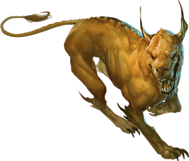
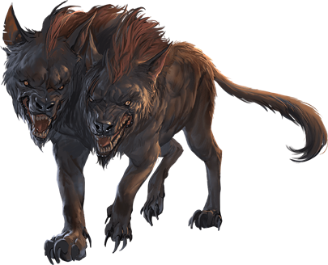
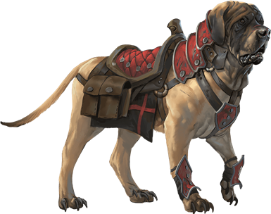

# Dog

> Jump to: [Dog](#dog) | [Blink Dog](#blink-dog) | [Death Dog](#death-dog) | [Giant Hyena]() | [Hell Hound](#hell-hound) | [Hyena](#hyena) | [Jackal]() | [Mastiff](#mastiff) | [Withered Hound](#withered-hound)

---

## Blink Dog

A blink dog takes its name from its ability to blink in and out of existence, a talent it uses to aid its attacks and to avoid harm. Blink dogs harbor a long-standing hatred for displacer beasts and attack them on sight.

>### Blink Dog
>*Medium fey, lawful good*
>___
>- **Armor Class** 13
>- **Hit Points** 22 (4d8 + 4)
>- **Speed** 40 ft.
>___
>|**STR**|**DEX**|**CON**|**INT**|**WIS**|**CHA**|
>|:---:|:---:|:---:|:---:|:---:|:---:|
>|12 (+1)|17 (+3)|12 (+1)|10 (+0)|13 (+1)|11 (+0)|
>
>___
>- **Proficiency Bonus** +0
>- **Saving Throws** 
>- **Damage Vulnerabilities** 
>- **Damage Resistances** 
>- **Damage Immunities** 
>- **Condition Immunities** 
>- **Skills** Perception +3,Stealth +5
>- **Senses** passive Perception 13
>- **Languages** Blink Dog,understands Sylvan but can't speak it
>- **Challenge** 1/4
>___
>***Keen Hearing and Smell.*** The dog has advantage on Wisdom (Perception) checks that rely on hearing or smell.
>
>***Pack Tactics.*** The blink dog has advantage on an attack roll against a creature if at least one of the blink dog's allies is within 5 feet of the creature and the ally isn't incapacitated.
>
>#### Actions
>***Bite.*** Melee Weapon Attack: +3 to hit, reach 5 ft., one target. Hit: 4 (1d6 + 1) piercing damage.
>
>***Teleport (Recharge 4–6).*** The dog magically teleports, along with any equipment it is wearing or carrying, up to 40 feet to an unoccupied space it can see. Before or after teleporting, the dog can make one bite attack.
>

---

## Death Dog

A death dog is an ugly two-headed hound that roams plains, deserts, and the Underdark. Hate burns in a death dog's heart, and a taste for humanoid flesh drives it to attack travelers and explorers. Death dog saliva carries a foul disease that causes a victim's flesh to slowly rot off the bone.

>### Death Dog
>*Medium monstrosity, neutral evil*
>___
>- **Armor Class** 12
>- **Hit Points** 39 (6d8 + 12)
>- **Speed** 40 ft.
>___
>|**STR**|**DEX**|**CON**|**INT**|**WIS**|**CHA**|
>|:---:|:---:|:---:|:---:|:---:|:---:|
>|15 (+2)|14 (+2)|14 (+2)|3 (-4)|13 (+1)|6 (-2)|
>
>___
>- **Proficiency Bonus** +0
>- **Saving Throws** 
>- **Damage Vulnerabilities** 
>- **Damage Resistances** 
>- **Damage Immunities** 
>- **Condition Immunities** 
>- **Skills** Perception +5,Stealth +4
>- **Senses** darkvision 120 ft.,passive Perception 15
>- **Languages** —
>- **Challenge** 1
>___
>***Two-Headed.*** The dog has advantage on Wisdom (Perception) checks and on saving throws against being blinded, charmed, deafened, frightened, stunned, or knocked unconscious.
>
>#### Actions
>***Multiattack.*** The dog makes two bite attacks.
>
>***Bite.*** Melee Weapon Attack: +4 to hit, reach 5 ft., one target. Hit: 5 (1d6 + 2) piercing damage. If the target is a creature, it must succeed on a DC 12 Constitution saving throw against disease or become poisoned until the disease is cured. Every 24 hours that elapse, the creature must repeat the saving throw, reducing its hit point maximum by 5 (1d10) on a failure. This reduction lasts until the disease is cured. The creature dies if the disease reduces its hit point maximum to 0.
>

---

## Dog

>### Dog
>*Small beast, unaligned*
>___
>- **Armor Class** 12
>- **Hit Points** 4 (1d6)
>- **Speed** 40 ft., climb 30 ft.
>___
>|**STR**|**DEX**|**CON**|**INT**|**WIS**|**CHA**|
>|:---:|:---:|:---:|:---:|:---:|:---:|
>|3 (-4)|15 (+2)|10 (+0)|3 (-4)|12 (+1)|7 (-2)|
>
>___
>- **Proficiency Bonus** +0
>- **Saving Throws** 
>- **Damage Vulnerabilities** 
>- **Damage Resistances** 
>- **Damage Immunities** 
>- **Condition Immunities** 
>- **Skills** Perception +3
>- **Senses** passive Perception 13
>- **Languages** —
>- **Challenge** 0
>___
>***Keen Smell.*** The dog has advantage on Wisdom (Perception) checks that rely on smell.
>
>***Pack Tactics.*** The dog has advantage on an attack roll against a creature if at least one of the dog's allies is within 5 feet of the creature and the ally isn't incapacitated.
>
>#### Actions
>***Bite.*** Melee Weapon Attack: +0 to hit, reach 5 ft., one target. Hit: 2 (1d4) piercing damage.
>

---

## Giant Hyena
The giant hyena is often the leader of a pack of normal-sized hyenas, though periodically a pride of giant hyenas have been spotted in the wild. They are fearsome hunters and fiendish packs, and their hooting calls are often heard as laughter that sets their victims' fears ablaze.

>### Giant Hyena
>*Large beast, unaligned*
>___
>- **Armor Class** 12
>- **Hit Points** 45 (6d10 + 12)
>- **Speed** 50 ft.
>___
>|**STR**|**DEX**|**CON**|**INT**|**WIS**|**CHA**|
>|:---:|:---:|:---:|:---:|:---:|:---:|
>|16 (+3)|14 (+2)|14 (+2)|2 (-4)|12 (+1)|7 (-2)|
>
>___
>- **Proficiency Bonus** +0
>- **Saving Throws** 
>- **Damage Vulnerabilities** 
>- **Damage Resistances** 
>- **Damage Immunities** 
>- **Condition Immunities** 
>- **Skills** Perception +3
>- **Senses** passive Perception 13
>- **Languages** —
>- **Challenge** 1
>___
>***Rampage.*** When the hyena reduces a creature to 0 hit points with a melee attack on its turn, the hyena can take a bonus action to move up to half its speed and make a bite attack.
>
>***Pack Tactics.*** The dog has advantage on an attack roll against a creature if at least one of the dog's allies is within 5 feet of the creature and the ally isn't incapacitated.
>
>***Hideous Laughter (Recharge 5-6).*** If three or more giant hyenas are all gathered, their calls to one another acts as a casting of the [vicious mockery](../Magic/Spells/vicious-mockery.md) spell; the spell's level is equal to the number of giant hyenas in the pack, and targets any who are within 60 feet of the center of the pack.
>
>#### Actions
>***Bite.*** Melee Weapon Attack: +5 to hit, reach 5 ft., one target. Hit: 10 (2d6 + 3) piercing damage.
>

---

## Hell Hound
Monstrous, fire-breathing fiends that take the form of powerful dogs, hell hounds are found on the battlefields of Acheron and throughout the Lower Planes. On the Material Plane, hell hounds are most commonly seen in service to devils, fire giants, and other evil creatures that use them as guard animals and companions.

***Burning Hunger.*** Hell hounds hunt in packs, feeding on any creature that appears edible. They avoid potentially dangerous foes in favor of targeting the weakest prey with their savage bite and fiery breath, demonstrating a relentless determination as they pursue that prey to the bitter end.

When hell hounds feed, the flesh they consume stokes the infernal fires that burn within them. When a hell hound dies, that fire consumes the creature's remains in a billowing eruption of smoke and blazing embers, leaving nothing behind but scorched tufts of black fur.

***Evil to the Core.*** Hell hounds are smarter than mundane beasts, and their lawful nature makes them good at following orders. However, a hell hound's evil disposition means that the creature can't be trained to be anything other than a ruthless killer. If a hell hound isn't allowed to indulge its malevolent hunger, it quickly abandons or turns against its master.

>### Hell Hound
>*Medium fiend, lawful evil*
>___
>- **Armor Class** 15 (natural armor)
>- **Hit Points** 45 (7d8 + 14)
>- **Speed** 50 ft.
>___
>|**STR**|**DEX**|**CON**|**INT**|**WIS**|**CHA**|
>|:---:|:---:|:---:|:---:|:---:|:---:|
>|17 (+3)|12 (+1)|14 (+2)|6 (-2)|13 (+1)|6 (-2)|
>
>___
>- **Proficiency Bonus** +0
>- **Saving Throws** 
>- **Damage Vulnerabilities** 
>- **Damage Resistances** 
>- **Damage Immunities** fire
>- **Condition Immunities** 
>- **Skills** Perception +5
>- **Senses** darkvision 60 ft.,passive Perception 15
>- **Languages** understands Infernal but can't speak it
>- **Challenge** 3
>___
>***Keen Hearing and Smell.*** The hound has advantage on Wisdom (Perception) checks that rely on hearing or smell.
>
>***Pack Tactics.*** The hound has advantage on an attack roll against a creature if at least one of the hound's allies is within 5 feet of the creature and the ally isn't incapacitated.
>
>#### Actions
>***Bite.*** Melee Weapon Attack: +5 to hit, reach 5 ft., one target. Hit: 7 (1d8 + 3) piercing damage plus 7 (2d6) fire damage.
>
>***Fire Breath (Recharge 5–6).*** The hound exhales fire in a 15-foot cone. Each creature in that area must make a DC 12 Dexterity saving throw, taking 21 (6d6) fire damage on a failed save, or half as much damage on a successful one.
>

---

## Hyena
Hyenas, a distant canine cousin of the domesticated dog or the wild pack-forming wolf, roam the grasslands of the [Al'Uma](../Geography/AlUma.md) and [Yithia](../Geography/Yithia.md) freely, and only slightly less often than they do the more remote areas of [Liria](../Geography/Liria.md) and [Tragekia](../Geography/Tragekia.md). Individually, they often aren't much trouble, and will not seek to attack a well-armed or numerous adversary, but when hyenas are in a pack, and they spot a lone individual away from the others, they can fiercely swarm and devour in seconds.

>### Hyena
>*Medium beast, unaligned*
>___
>- **Armor Class** 11
>- **Hit Points** 5 (1d8 + 1)
>- **Speed** 50 ft.
>___
>|**STR**|**DEX**|**CON**|**INT**|**WIS**|**CHA**|
>|:---:|:---:|:---:|:---:|:---:|:---:|
>|11 (+0)|13 (+1)|12 (+1)|2 (-4)|12 (+1)|5 (-3)|
>
>___
>- **Proficiency Bonus** +0
>- **Saving Throws** 
>- **Damage Vulnerabilities** 
>- **Damage Resistances** 
>- **Damage Immunities** 
>- **Condition Immunities** 
>- **Skills** Perception +3
>- **Senses** passive Perception 13
>- **Languages** —
>- **Challenge** 0
>___
>***Pack Tactics.*** The hyena has advantage on an attack roll against a creature if at least one of the hyena's allies is within 5 feet of the creature and the ally isn't incapacitated.
>
>#### Actions
>***Bite.*** Melee Weapon Attack: +2 to hit, reach 5 ft., one target. Hit: 3 (1d6) piercing damage.
>

---

## Jackal
Another distant canine relative, jackals are carrion-feeders, and will generally wait until a predator is done with their kill before swarming over the carcass. If attacked, they will generally flee, unless young are present, at which time they will fight to the death to protect the young.

>### Jackal
>*Small beast, unaligned*
>___
>- **Armor Class** 12
>- **Hit Points** 3 (1d6)
>- **Speed** 40 ft.
>___
>|**STR**|**DEX**|**CON**|**INT**|**WIS**|**CHA**|
>|:---:|:---:|:---:|:---:|:---:|:---:|
>|8 (-1)|15 (+2)|11 (+0)|3 (-4)|12 (+1)|6 (-2)|
>
>___
>- **Proficiency Bonus** +0
>- **Saving Throws** 
>- **Damage Vulnerabilities** 
>- **Damage Resistances** 
>- **Damage Immunities** 
>- **Condition Immunities** 
>- **Skills** Perception +3
>- **Senses** passive Perception 13
>- **Languages** —
>- **Challenge** 0
>___
>***Keen Hearing and Smell.*** The jackal has advantage on Wisdom (Perception) checks that rely on hearing or smell.
>
>***Pack Tactics.*** The jackal has advantage on an attack roll against a creature if at least one of the jackal's allies is within 5 feet of the creature and the ally isn't incapacitated.
>
>#### Actions
>***Bite.*** Melee Weapon Attack: +1 to hit, reach 5 ft., one target. Hit: 1 (1d4 – 1) piercing damage.
>

---

## Mastiff

Mastiffs are impressive hounds prized by humanoids for their loyalty and keen senses. Mastiffs can be trained as guard dogs, hunting dogs, and war dogs. Halflings and other Small humanoids ride them as mounts.

>### Mastiff
>*Medium beast, unaligned*
>___
>- **Armor Class** 12
>- **Hit Points** 5 (1d8 + 1)
>- **Speed** 40 ft.
>___
>|**STR**|**DEX**|**CON**|**INT**|**WIS**|**CHA**|
>|:---:|:---:|:---:|:---:|:---:|:---:|
>|13 (+1)|14 (+2)|12 (+1)|3 (-4)|12 (+1)|7 (-2)|
>
>___
>- **Proficiency Bonus** +0
>- **Saving Throws** 
>- **Damage Vulnerabilities** 
>- **Damage Resistances** 
>- **Damage Immunities** 
>- **Condition Immunities** 
>- **Skills** Perception +3
>- **Senses** passive Perception 13
>- **Languages** —
>- **Challenge** 1/8
>___
>***Keen Hearing and Smell.*** The mastiff has advantage on Wisdom (Perception) checks that rely on hearing or smell.
>
>***Pack Tactics.*** The mastiff has advantage on an attack roll against a creature if at least one of the mastiff's allies is within 5 feet of the creature and the ally isn't incapacitated.
>
>#### Actions
>***Bite.*** Melee Weapon Attack: +3 to hit, reach 5 ft., one target. Hit: 4 (1d6 + 1) piercing damage. If the target is a creature, it must succeed on a DC 11 Strength saving throw or be knocked prone.
>

---

## Withered Hound
The Withered Hound is an undead creation from a [Mastiff](#mastiff) or similar-sized hound. Like the creature it was spawned from, the Withered Hound has deep loyalty to its master, whether that be the necromancer that raised it or the master that cares for it now.

>### Withered Hound
>*medium undead, shares master's alignment*
>___
>- **Armor Class** 13
>- **Hit Points** 45 (6d8 + 18)
>- **Speed** 40 ft.
>___
>|**STR**|**DEX**|**CON**|**INT**|**WIS**|**CHA**|
>|:---:|:---:|:---:|:---:|:---:|:---:|
>|17 (+3)|16 (+3)|16 (+3)|6 (-2)|15 (+2)|11 (+0)|
>
>___
>- **Proficiency Bonus** +0
>- **Saving Throws** 
>- **Damage Vulnerabilities** 
>- **Damage Resistances** 
>- **Damage Immunities** necrotic,poison
>- **Condition Immunities** charmed,frightened,paralyzed,poisoned,stunned
>- **Skills** Perception +4
>- **Senses** darkvision 60 ft. passive Perception 12
>- **Languages** Understands the languages of its master but can't speak
>- **Challenge** 1/2
>___
>***Consumption.*** If the hound spends 1 minute feeding on the corpse of a creature that it has killed, it regains 10 hit points.
>
>***Keen Smell.*** The hound has advantage on Wisdom (Perception) checks that rely on smell.
>
>***Turning Defiance.*** The hound has advantage on saving throws against effects that turn undead.
>
>***Pack Tactics.*** The hound has advantage on an attack roll against a creature if at least one of the hound's allies is within 5 feet of the creature and the ally isn't incapacitated.
>
>#### Actions
>***Bite.*** Melee Weapon Attack: +5 to hit, reach 5 ft., one target. Hit: 6 (1d6 + 3) piercing damage, plus 3 (1d6) necrotic damage.
>
>***Howl of the Grave (1/Day).*** The eerie howl of a withered hound echoes throughout the night. Each creature of the hound's choosing within 30 feet of the hound and can hear it must succeed on a DC 13 Wisdom saving throw of become frightened of the hound for 1 minute. A creature can repeat the saving throw at the end of each of its turns, ending the effect on itself on a success.
>
