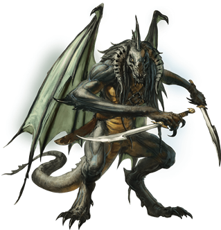
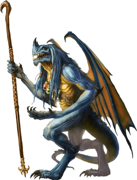
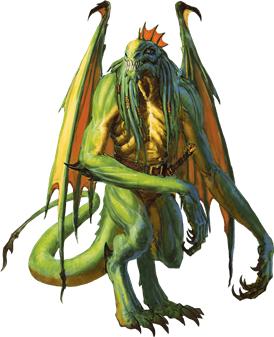
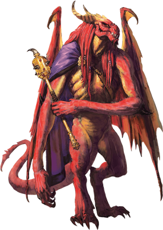
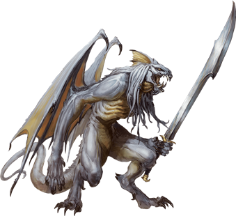

# Abishais
Each abishai was once a mortal who somehow won Tiamat's favor before death and, as a reward, found its soul transformed into a draconic devil to serve at her pleasure in the Nine Hells. Each type of abishai is associated with one of Tiamat's five dragon heads: black, blue, green, red, and white.

> Jump to: [Black Abishai](#black-abishai) | [Blue Abishai](#blue-abishai) | [Green Abishai](#green-abishai) | [Red Abishai](#red-abishai) | [White Abishai](#white-abishai)

Tiamat deploys abishais as her agents, sending them forth to represent her interests in the Hells and across the multiverse. Some have simple tasks, such as delivering a message to cultists. Others have greater responsibilities, such as leading large groups, assassinating targets, and serving in armies. In all cases, abishais are fanatically loyal to Tiamat, ready to lay down their lives if needed.

Abishais stand outside the normal hierarchy of the Nine Hells, having their own chain of command and ultimately answering to Tiamat (and Asmodeus, when he chooses to use them). Other archdevils can command abishais to work for them, but most archdevils do so rarely, since it is never clear whether an abishai follows Tiamat's orders or Asmodeus's. There is inherent risk in countermanding an order given by Tiamat, but interfering with Asmodeus's plans invites certain destruction.
---

## Black Abishai
Expert assassins and infiltrators, black abishais can weave shadows to mask their presence, allowing them to reach a location where they can deliver a fatal strike to their targets.

>### Black Abishai
>*Medium fiend (Devil), Typically Lawful Evil*
>___
>- **Armor Class** 15 (natural armor)
>- **Hit Points** 58 (9d8 + 18)
>- **Speed** 30 ft., fly 40 ft.
>___
>|**STR**|**DEX**|**CON**|**INT**|**WIS**|**CHA**|
>|:---:|:---:|:---:|:---:|:---:|:---:|
>|14 (+2)|17 (+3)|14 (+2)|13 (+1)|16 (+3)|11 (+0)|
>
>___
>- **Proficiency Bonus** +3
>- **Saving Throws** Dex +6,Wis +6
>- **Damage Vulnerabilities** 
>- **Damage Resistances** cold; bludgeoning,piercing,and slashing from nonmagical attacks that aren't silvered
>- **Damage Immunities** acid,fire,poison
>- **Condition Immunities** poisoned
>- **Skills** Perception +6,Stealth +6
>- **Senses** darkvision 120 ft.,passive Perception 16
>- **Languages** Draconic,Infernal,telepathy 120 ft.
>- **Challenge** 7
>___
>***Devil's Sight.*** Magical darkness doesn't impede the abishai's darkvision.
>
>***Magic Resistance.*** The abishai has advantage on saving throws against spells and other magical effects.
>
>#### Actions
>***Multiattack.*** The abishai makes one Bite attack and two Scimitar attacks.
>
>***Bite.*** Melee Weapon Attack: +6 to hit, reach 5 ft., one target. Hit: 8 (1d10 + 3) piercing damage plus 9 (2d8) acid damage.
>
>***Scimitar.*** Melee Weapon Attack: +6 to hit, reach 5 ft., one target. Hit: 6 (1d6 + 3) force damage.
>
>***Creeping Darkness (Recharge 6).*** The abishai casts darkness at a point within 120 feet of it, requiring no spell components or concentration. Wisdom is its spellcasting ability for this spell. While the spell persists, the abishai can move the area of darkness up to 60 feet as a bonus action.
>
>#### Bonus Actions
>***Shadow Stealth.*** While in dim light or darkness, the abishai takes the Hide action.
>

---

## Blue Abishai
Seekers of forgotten lore and lost relics, blue abishais are the most cunning and learned of their kind. Their research into occult subjects gleaned from tomes plundered from across the multiverse enables them to become accomplished spellcasters. They use their magic to devastate Tiamat's enemies.

>### Blue Abishai
>*Medium fiend (Devil, Wizard), Typically Lawful Evil*
>___
>- **Armor Class** 19 (natural armor)
>- **Hit Points** 202 (27d8 + 81)
>- **Speed** 30 ft., fly 50 ft.
>___
>|**STR**|**DEX**|**CON**|**INT**|**WIS**|**CHA**|
>|:---:|:---:|:---:|:---:|:---:|:---:|
>|15 (+2)|14 (+2)|17 (+3)|22 (+6)|23 (+6)|18 (+4)|
>
>___
>- **Proficiency Bonus** +6
>- **Saving Throws** Int +12,Wis +12
>- **Damage Vulnerabilities** 
>- **Damage Resistances** cold; bludgeoning,piercing,and slashing from nonmagical attacks that aren't silvered
>- **Damage Immunities** fire,lightning,poison
>- **Condition Immunities** poisoned
>- **Skills** Arcana +12
>- **Senses** darkvision 120 ft.,passive Perception 16
>- **Languages** Draconic,Infernal,telepathy 120 ft.
>- **Challenge** 17
>___
>***Devil's Sight.*** Magical darkness doesn't impede the abishai's darkvision.
>
>***Magic Resistance.*** The abishai has advantage on saving throws against spells and other magical effects.
>
>#### Actions
>***Multiattack.*** The abishai makes three Bite or Lightning Strike attacks.
>
>***Bite.*** Melee Weapon Attack: +8 to hit, reach 5 ft., one target. Hit: 13 (2d10 + 2) piercing damage plus 14 (4d6) lightning damage.
>
>***Lightning Strike.*** Ranged Spell Attack: +12 to hit, range 120 ft., one target. Hit: 36 (8d8) lightning damage.
>
>***Spellcasting.*** The abishai casts one of the following spells, using Intelligence as the spellcasting ability (spell save DC 20):
>
>At will: disguise self, mage hand, minor illusion
>
>2/day each: charm person, dispel magic, greater invisibility, wall of force
>
>#### Bonus Actions
>***Teleport.*** The abishai teleports, along with any equipment it is wearing or carrying, up to 30 feet to an unoccupied space that it can see.
>

---

## Green Abishai
Green abishais are adept at discovering secrets and other sensitive information, while their diplomatic skills and their magic ensure they can manipulate even the shrewdest opponents.

>### Green Abishai
>*Medium fiend (Devil), Typically Lawful Evil*
>___
>- **Armor Class** 18 (natural armor)
>- **Hit Points** 195 (26d8 + 78)
>- **Speed** 30 ft., fly 40 ft.
>___
>|**STR**|**DEX**|**CON**|**INT**|**WIS**|**CHA**|
>|:---:|:---:|:---:|:---:|:---:|:---:|
>|12 (+1)|17 (+3)|16 (+3)|17 (+3)|12 (+1)|19 (+4)|
>
>___
>- **Proficiency Bonus** +5
>- **Saving Throws** Int +8,Cha +9
>- **Damage Vulnerabilities** 
>- **Damage Resistances** cold; bludgeoning,piercing,and slashing from nonmagical attacks that aren't silvered
>- **Damage Immunities** fire,poison
>- **Condition Immunities** poisoned
>- **Skills** Deception +9,Insight +6,Perception +6,Persuasion +9
>- **Senses** darkvision 120 ft.,passive Perception 16
>- **Languages** Draconic,Infernal,telepathy 120 ft.
>- **Challenge** 15
>___
>***Devil's Sight.*** Magical darkness doesn't impede the abishai's darkvision.
>
>***Magic Resistance.*** The abishai has advantage on saving throws against spells and other magical effects.
>
>#### Actions
>***Multiattack.*** The abishai makes two Fiendish Claw attacks, or it makes one Fiendish Claw attack and uses Spellcasting.
>
>***Fiendish Claw.*** Melee Weapon Attack: +8 to hit, reach 5 ft., one target. Hit: 12 (2d8 + 3) force damage. If the target is a creature, it must succeed on a DC 16 Constitution saving throw or take 16 (3d10) poison damage and become poisoned for 1 minute. The poisoned target can repeat the saving throw at the end of each of its turns, ending the effect on itself on a success.
>
>***Spellcasting.*** The abishai casts one of the following spells, requiring no material components and using Charisma as the spellcasting ability (spell save DC 17):
>
>At will: alter self, major image
>
>3/day each: charm person, detect thoughts, fear
>
>1/day each: confusion, dominate person, mass suggestion
>

---

## Red Abishai
Red abishais have no equals among the abishais when it comes to leadership ability and raw power. Red abishais lead other devils into battle or take charge of troublesome cults to ensure that they continue to carry out Tiamat's commands. A red abishai cuts a fearsome figure, and that sight can be inspiring to the abishai's allies, filling them with a fanatical willingness to fight.

>### Red Abishai
>*Medium fiend (Devil), Typically Lawful Evil*
>___
>- **Armor Class** 22 (natural armor)
>- **Hit Points** 289 (34d8 + 136)
>- **Speed** 30 ft., fly 50 ft.
>___
>|**STR**|**DEX**|**CON**|**INT**|**WIS**|**CHA**|
>|:---:|:---:|:---:|:---:|:---:|:---:|
>|23 (+6)|16 (+3)|19 (+4)|14 (+2)|15 (+2)|19 (+4)|
>
>___
>- **Proficiency Bonus** +6
>- **Saving Throws** Str +12,Con +10,Wis +8
>- **Damage Vulnerabilities** 
>- **Damage Resistances** cold; bludgeoning,piercing,and slashing from nonmagical attacks that aren't silvered
>- **Damage Immunities** fire,poison
>- **Condition Immunities** frightened,poisoned
>- **Skills** Intimidation +10,Perception +8
>- **Senses** darkvision 120 ft.,passive Perception 18
>- **Languages** Draconic,Infernal,telepathy 120 ft.
>- **Challenge** 19
>___
>***Devil's Sight.*** Magical darkness doesn't impede the abishai's darkvision.
>
>***Magic Resistance.*** The abishai has advantage on saving throws against spells and other magical effects.
>
>#### Actions
>***Multiattack.*** The abishai makes one Bite attack and one Claw attack, and it can use Frightful Presence or Incite Fanaticism.
>
>***Bite.*** Melee Weapon Attack: +12 to hit, reach 5 ft., one target. Hit: 22 (3d10 + 6) piercing damage plus 38 (7d10) fire damage.
>
>***Claw.*** Melee Weapon Attack: +12 to hit, reach 5 ft., one target. Hit: 17 (2d10 + 6) force damage plus 11 (2d10) fire damage.
>
>***Frightful Presence.*** Each creature of the abishai's choice that is within 120 feet and aware of the abishai must succeed on a DC 18 Wisdom saving throw or become frightened of it for 1 minute. A creature can repeat the saving throw at the end of each of its turns, ending the effect on itself on a success. If a creature's saving throw is successful or the effect ends for it, the creature is immune to the abishai's Frightful Presence for the next 24 hours.
>
>***Incite Fanaticism.*** The abishai chooses up to four other creatures within 60 feet of it that can see it. Until the start of the abishai's next turn, each of those creatures makes attack rolls with advantage and can't be frightened.
>
>***Power of the Dragon Queen.*** The abishai targets one Dragon it can see within 120 feet of it. The Dragon must make a DC 18 Charisma saving throw. A chromatic dragon makes this save with disadvantage. On a successful save, the target is immune to the abishai's Power of the Dragon Queen for 1 hour. On a failed save, the target is charmed by the abishai for 1 hour. While charmed in this way, the target regards the abishai as a trusted friend to be heeded and protected. This effect ends if the abishai or its companions deal damage to the target.
>

---

## White Abishai
White abishais fight with a reckless fury, making them ideally suited for bolstering the ranks of Tiamat's armies. White abishais fight without fear, becoming whirlwinds of destruction on the battlefield.

>### White Abishai
>*Medium fiend (Devil), Typically Lawful Evil*
>___
>- **Armor Class** 15 (natural armor)
>- **Hit Points** 68 (8d8 + 32)
>- **Speed** 30 ft., fly 40 ft.
>___
>|**STR**|**DEX**|**CON**|**INT**|**WIS**|**CHA**|
>|:---:|:---:|:---:|:---:|:---:|:---:|
>|16 (+3)|11 (+0)|18 (+4)|11 (+0)|12 (+1)|13 (+1)|
>
>___
>- **Proficiency Bonus** +3
>- **Saving Throws** Str +6,Con +7
>- **Damage Vulnerabilities** 
>- **Damage Resistances** bludgeoning,piercing,and slashing from nonmagical attacks that aren't silvered
>- **Damage Immunities** cold,fire,poison
>- **Condition Immunities** poisoned
>- **Skills** 
>- **Senses** darkvision 120 ft.,passive Perception 11
>- **Languages** Draconic,Infernal,telepathy 120 ft.
>- **Challenge** 6
>___
>***Devil's Sight.*** Magical darkness doesn't impede the abishai's darkvision.
>
>***Magic Resistance.*** The abishai has advantage on saving throws against spells and other magical effects.
>
>***Reckless.*** At the start of its turn, the abishai can gain advantage on all melee weapon attack rolls during that turn, but attack rolls against it have advantage until the start of its next turn.
>
>#### Actions
>***Multiattack.*** The abishai makes one Bite attack, one Claw attack, and one Longsword attack.
>
>***Bite.*** Melee Weapon Attack: +6 to hit, reach 5 ft., one target. Hit: 5 (1d4 + 3) piercing damage plus 3 (1d6) cold damage.
>
>***Claw.*** Melee Weapon Attack: +6 to hit, reach 5 ft., one target. Hit: 8 (1d10 + 3) slashing damage.
>
>***Longsword.*** Melee Weapon Attack: +6 to hit, reach 5 ft., one target. Hit: 7 (1d8 + 3) force damage, or 8 (1d10 + 3) force damage if used with two hands.
>
>#### Reactions
>***Vicious Reprisal.*** In response to taking damage, the abishai makes one Bite attack against a random creature within 5 feet of it. If no creature is within reach, the abishai moves up to half its speed toward an enemy it can see, without provoking opportunity attacks.
>

