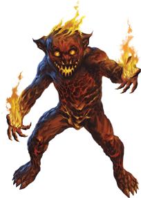
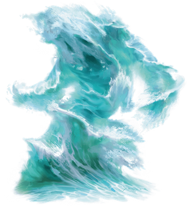

# Elemental
Elementals are incarnations of the elements that make up the universe: air, earth, fire, and water. Though little more than animated energy on their own planes of existence, they can be called on by spellcasters and powerful beings, binding elemental essence into a discrete form, to take shape and perform tasks. As the essence spends time in that shape, it may develop personality and individual characteristics.

***Living Elements.*** Each elemental plane is a place of purest elemental energy--what is known to scholars as elemental *essence*. This essence is often what's drawn during certain spells to power certain effects (such as drawing just the tiniest amount of essence of fire to project flame during a [burning hands](../Magic/Spells/burning-hands.md) spell, for example). On its own, essence has no identity, personality, memory, or individual characteristics.

When essence is drawn and poured into a discrete shape--what casters call "summoning an elemental"--the essence can, over time, develop identity. These elementals begin their existence as a dim consciousness, often following only the will of the caster. Over time, however, elementals can develop a sense of identity and self, and often take on names. In some quiet corners of scholarly discourse, it is even believed that elementals can form hierarchies or societies.

Some elementals desire only to return to their native plane and "rejoin" the planar essence, essentially losing all sense of identity and memory. Others enjoy their existence, and resist being returned.

***Conjured by Magic.*** Certain spells and magic items can conjure an elemental, summoning it from the Inner Planes to the Material Plane. By its very nature, elemental essence is a wild force outside of its native plane, and requires the magic and determination to shape it. A creature that summons an elemental must assert force of will to control it.

***Elemental Nature.*** An elemental doesn’t require air, food, drink, or sleep.

> Jump to: [Air](#air) | [Earth](#earth) | [Fire](#fire) | [Water](#water)

The elemental planes of water, earth, fire, and air align on planar borders; where elemental essences of each of two planes combine, they sometimes combine in interesting ways, which if they remain combined over time, give rise to individual elementals made of the combined element.

> Jump to: [Ice](#ice) | [Magma](#magma)

***Bound and Shaped.*** Powerful magic can bind an elemental spirit into a material template that defines a specific use and function. Invisible stalkers are air elementals bound to a specific form, in the same way that water elementals can be shaped into water weirds.

The strength of the magic and materials that bind an elemental determines how well the elemental functions in a bound form. Golems are elemental spirits bound to physical forms, but weaker materials such as flesh and clay can’t bind elemental power sufficiently. Durable materials such as stone and iron require stronger magic, which consequently binds an elemental more securely.

> Jump to: [Invisible Stalker](#invisible-stalker) | [Magmin](#magmin) | [Sand Assassin](#sand-assassin)

---

## Air Elemental

---

## Earth Elemental

---

## Fire Elemental

---

## Ice Elemental
 | An ice elemental appears as a large chunk of jagged ice often formed into a vaguely humanoid shape. It floats through icy water in frosted landscapes or rests inside tranquil snowbanks, creaking as it moves its frozen body.

Anything that touches an ice elemental is magically chilled by an icy cold that seeps into the bones. They are also capable of expelling a frigid blast of icy wind from small cracks in their bodies. Ice elementals are wary of fire, and screech like dry ice when burned.

>## Ice Elemental
>*Large elemental (water/air), neutral*
>___
>- **Armor Class** 15 (natural armor)
>- **Hit Points** 127 (15d10 + 45)
>- **Speed** 30 ft., swim 30 ft., burrow 15ft.
>___
>|STR|DEX|CON|INT|WIS|CHA|
>|:---:|:---:|:---:|:---:|:---:|:---:|
>|18 (+4)|9 (-1)|17 (+3)|6 (-2)|10 (+0)|7 (-2)|
>
>___
>- **Damage Vulnerabilities** fire, thunder
>- **Damage Immunities** cold, poison
>- **Damage Resistances** acid; piercing, and slashing from nonmagical attacks
>- **Condition Immunities** exhaustion, paralyzed, petrified, poisoned, unconscious
>- **Senses** darkvision 60 ft., passive Perception 10
>- **Languages** Aquan, Auran
>- **Challenge** 6 (2,300 XP)
>___
>***Chilling.*** A creature that touches the elemental or hits it with a melee attack while within 5 feet of it takes 3 (1 d6) cold damage, and if the creature doesn't have resistance or immunity to cold damage, it has disadvantage on the next weapon attack roll it makes before the end of its next turn.
>
>***Ice Glide.*** The elemental can burrow through ice and snow at a burrowing speed of 15 feet. While doing so, the elemental doesn't disturb the material it moves through.
>
>### Actions
>***Multiattack.*** The elemental makes two Slam attacks. 
>
>***Slam.*** Melee Weapon Attack: +7 to hit, reach 1Oft., one target. Hit: 13 (2d8 + 4) bludgeoning damage plus 3 (1d6) cold damage.
>
>***Ice Breath (Recharge 4-6).*** The elemental releases a blast of freezing ice and snow in a 30-foot cone. Each creature in the area must make a DC 15 Constitution saving throw. On a failed save, a creature takes 18 (4d8) cold damage and its speed is reduced by 20 feet until the end of its next turn.

---

## Invisible Stalker
An invisible stalker is an air elemental that has been summoned from its native plane and transformed by powerful magic. Its sole purpose is to hunt down creatures and retrieve objects for its summoner. When it is defeated or the magic that binds it expires, an invisible stalker vanishes in a gust of wind.

***Directed Hunter.*** When an invisible stalker is created, it stays at its summoner’s side until it is given a task to perform. If an assignment doesn’t involve hunting down and slaying a specific creature or recovering an object, the magic that created the invisible stalker ends and the elemental is released. Otherwise, it completes the task, then returns to its summoner for more commands, forced to serve until the magic that binds it expires. If its summoner dies in the interim, the invisible stalker vanishes after completing its task.

Most invisible stalkers are an unwilling servant at best, and resent any undertaking assigned. A mission that requires significant time might drive the invisible stalker to pervert the intent of a command unless it is worded carefully. Rumors persist of some invisible stalkers that enjoy the hunt, and choose to remain on the Prime Material Plane even after their task is finished, listening for additional calls (summoning spells) to answer. Such stalkers tend to develop an alignment other than neutral, depending on their feelings about the hunt.

***Unseen Threat.*** Invisible stalkers are composed of air and are naturally invisible. A creature might hear and feel an invisible stalker in passing, but the elemental remains invisible even when it attacks. A spell that allows someone to see the invisible reveals only the invisible stalker’s vague outline.

>## Invisible Stalker
>*Medium elemental, neutral*
>___
>- **Armor Class** 14 (natural armor)
>- **Hit Points** 104 (16d8 + 32)
>- **Speed** 50 ft., fly 50 ft. (hover)
>___
>|STR|DEX|CON|INT|WIS|CHA|
>|:---:|:---:|:---:|:---:|:---:|:---:|
>|16 (+3) | 19 (+4) | 14 (+2) | 10 (+0) | 15 (+2) | 11 (+0)|
>
>___
>- **Damage Resistances** bludgeoning, piercing, and slashing from nonmagical attacks
>- **Damage Immunities** poison
>- **Condition Immunities** exhaustion, grappled, paralyzed, petrified, poisoned, prone, restrained, unconscious
>- **Skills** Perception +8, Stealth +10
>- **Senses** darkvision 60 ft., passive Perception 18
>- **Languages** Auran, understands Common but doesn’t speak it
>- **Challenge** 6 (2,300 XP)
>___
>***Invisibility.*** The stalker is invisible.
>
>***Faultless Tracker.*** The stalker is given a quarry by its summoner. The stalker knows the direction and distance to its quarry as long as the two of them are on the same plane of existence. The stalker also knows the location of its summoner.
>
>### Actions
>***Multiattack.*** The stalker makes two Slam attacks.
>
>***Slam.*** Melee Weapon Attack: +6 to hit, reach 5 ft., one target. Hit: 10 (2d6 + 3) bludgeoning damage.

---

## Magma Elemental
A magma elemental, composed of earth and fire, appears as a large, vaguely humanoid-shaped pile of magma. If unmoving, it will easily pass as a strangely-shaped pile of lava, and while moving, burbling sounds emanate from its body, typically along with the hiss of steam and smoke as it moves across the ground.

Anything that touches an magma elemental is magically scalded by an intense burn that feels like it sets the whole soul on fire. They are also capable of expelling a blast of meteoric chunks, primarily from a central opening near the top of the humanoid shape--from its "mouth", as it were. Magma elementals are wary of water, and howl like banshees when doused.

>## Magma Elemental
>*Huge elemental (earth/fire), neutral*
>___
>- **Armor Class** 16 (natural armor)
>- **Hit Points** 228 (24d12 + 72)
>- **Speed** 40ft, burrow 40 ft.
>___
>|STR|DEX|CON|INT|WIS|CHA|
>|:---:|:---:|:---:|:---:|:---:|:---:|
>|23(+6)|11(+0)|17(+3)|4(-3)|10(+0)|9(-1)|
>
>___
>- **Saving Throws** Str + 11, Con +8
>- **Damage Vulnerabilities** 
>- **Damage Resistances** bludgeoning, piercing, and slashing from nonmagical weapons
>- **Damage Immunities** fire, poison
>- **Condition Immunities** exhaustion, paralyzed, petrified, poisoned, unconscious
>- **Skills** 
>- **Senses** darkvision 60 ft., tremorsense 60 ft., passive Perception 10
>- **Languages** Ignan, Terran
>- **Challenge** 13 (10,000 XP)
>___
>***Lava Form.*** A creature or object that touches the elemental or hits it with a melee attack while within 5 feet of it takes 10 (3d6) fire damage. A creature that ends its turn within 5 feet of the elemental takes 5 (1d10) fire damage. At the end of the elemental's turn, it ignites any flammable objects within 5 feet of it that aren't being worn or carried.
>
>***Cooled Lava.*** If the elemental takes cold damage, it partially cools to stone; its speed is reduced by 20 feet until the end of its next turn, and its Lava Form trait doesn't function for that duration.
>
>***False Appearance.*** While the elemental remains motionless, it can choose to suppress its Lava Form trait, causing it to be indistinguishable from a normal (albeit huge) boulder.
>
>***Illumination.*** The elemental sheds bright light in a 30- foot radius and dim light in an additional 30 feet while its Lava Form trait is functioning.
>
>***Molten Tunnels.*** When it burrows, the elemental leaves a tunnel in its wake. The sides of this tunnel remain burning hot for 10 minutes, after which the tunnel collapses. When a creature enters the tunnel for the first time on a turn or starts its turn inside the tunnel, it takes 11 (2d10) fire damage.
>
>***Siege Monster.*** The elemental deals double damage to objects and structures.
>
>***Water Susceptibility.*** For every 5 feet the elemental moves in water, or for every gallon of water splashed on it, it takes 1 cold damage.
>
>### Actions
>***Multiattack.*** The elemental makes two Smash attacks.
>
>***Smash.*** Melee Weapon Attack: +8 to hit, reach 10ft., one creature. Hit: 16 (2d 10 + 5) bludgeoning damage plus 21 (6d6) fire damage, and the target must succeed on a DC 16 Strength saving throw or be knocked prone. If the target is not flying, on a hit or a miss, the area of ground in a 15-foot diameter circle centered beneath the target becomes filled with lava. The area is difficult terrain for the next 10 minutes, and any creature who enters the area or ends its turn there takes 21 (6d6) fire damage.
>
>***Meteor Breath.*** The elemental spews tiny chunks of burning stone. Each creature in a 10-foot radius sphere centered on a point within 60 feet of the elemental must make a DC 16 Dexterity saving throw. On a failure, a target takes 10 (3d6) bludgeoning damage plus 10 (3d6) fire damage, or half as much damage on a success. Each object within the area that isn't being held or carried also takes full damage, and is ignited if it is flammable.

---

## Magmin
A grinning, mischievous magmin resembles a stumpy humanoid sculpted from a black shell of magma. Even when it isn’t ablaze and radiating heat like a bonfire, small jets of flame erupt from its porous skin.

***Summoned Pyromaniacs.*** Magmins are fire elemental essence bound into physical form by magic, and they appear in the Material Plane only when summoned. It takes little time for them to develop personalities, and those personalities tend to be pyromaniacal. They view flammable objects as kindling for a grand conflagration, and only the magical control exerted by their summoners keeps them from setting everything they touch ablaze. Their propensity for fire and havoc makes them ideal for spreading chaos and destruction. A mob of magmins summoned inside a castle can reduce it to a burning shell within minutes.

***Fiery Destruction.*** Although its flame is potent, the magmin’s hard magma shell prevents it from instantly igniting everything it comes into contact with. However, like the fires inside them, magmins are capricious and unpredictable. Moreover, as simple elemental creations, they are oblivious to the harm their native element causes creatures of the Material Plane.

If it has the opportunity while in service to its master, a magmin seeks out areas of great heat, such as forest fires or the bubbling magma of an active volcano. At other times, a magmin compulsively looses fire from its fingertips, delighting in setting objects ablaze.

>## Magmin
>*Small elemental, chaotic neutral*
>___
>- **Armor Class** 14 (natural armor)
>- **Hit Points** 9 (2d6 + 2)
>- **Speed** 30 ft.
>___
>|STR|DEX|CON|INT|WIS|CHA|
>|:---:|:---:|:---:|:---:|:---:|:---:|
>|7 (−2) | 15 (+2) | 12 (+1) | 8 (−1) | 11 (+0) | 10 (+0)|
>
>___
>- **Damage Resistances** bludgeoning, piercing, and slashing from nonmagical attacks
>- **Damage Immunities** fire
>- **Senses** darkvision 60 ft., passive Perception 10
>- **Languages** Ignan
>- **Challenge** 1/2 (100 XP)
>___
>***Feature.***   
>
>***Death Burst.*** When the magmin dies, it explodes in a burst of fire and magma. Each creature within 10 feet of it must make a DC 11 Dexterity saving throw, taking 7 (2d6) fire damage on a failed save, or half as much damage on a successful one. Flammable objects that aren’t being worn or carried in that area are ignited.
>
>***Ignited Illumination.*** As a bonus action, the magmin can set itself ablaze or extinguish its flames. While ablaze, the magmin sheds bright light in a 10-foot radius and dim light for an additional 10 feet.
>
>### Actions
>***Touch.*** Melee Weapon Attack: +4 to hit, reach 5 ft., one target. Hit: 7 (2d6) fire damage. If the target is a creature or a flammable object, it ignites. Until a creature takes an action to douse the fire, the creature takes 3 (1d6) fire damage at the end of each of its turns.

---

## Sand Assassin
When a mage or other summoner binds air and earth elemental essence into a guardian and charges it to guard a particular place, often a sand assassin is what forms. Sand assassins then are bound to guard a stretch of land for eternity, hunting down and slaying all those who trespass upon their charge. These elementals sometimes come to decide that a particular place is worthy of protection for inscrutable reasons of their own, but usually they are bound by the one who summoned them, often someone long-dead such as a long-forgotten resident of ancient ruins buried in a canyon or stretch of desert that the elemental still guards.

A sand assassin resembles an athletic human made entirely of sand usually with more sand shaped into cords or rags wrapping around it. With just a bit of dust or sand about, this unusually lawful elemental is easily mistaken from afar for a normal desert traveler, but a good look at its head reveals that it has no face, save for the one hollow eye in its forehead.

**Loyal Sentinels.** Often the elemental doesn't recall what it was in the location that it required protection, and rarely do they care to remember, either. For the sand assassin, the task is all that matters. Those that are slain by sand assassins are usually mistaken for victims of a sandstorm, and even those lucky few that escape the reaches of the elemental almost never know what it was, hidden beneath the sands, that they were warded away from.

**Ruthless Hunters.** Sand assassins detest being seen by those who have not yet trespassed and prefer to hide from such beings. In combat, this elemental tries to sneak up on its victims, hiding as a dust cloud or among a real sandstorm to approach its targets, then blinding them with its Sand Form trait before attacking them with surprise. It usually prefers to strike those that are alone so it can deal bonus damage. If it is in melee range with a target that isn't alone, the elemental will seek a target in the fight that is more alone, blinding those that threaten opportunity attacks and flying or burrowing to reach its next lonely victim. If its enemies stay grouped together to avoid the bonus damage, the sand assassin attempts to blind many targets at once instead.

>## Sand Assassin
>*Medium elemental (air/earth), lawful neutral*
>___
>- **Armor Class** 15 (natural armor)
>- **Hit Points** 117 (18d8 + 36)
>- **Speed** 60 ft., burrow 30 ft., fly 30 ft. (hover)
>___
>|STR|DEX|CON|INT|WIS|CHA|
>|:---:|:---:|:---:|:---:|:---:|:---:|
>|10 (+0)|20 (+5)|15 (+2)|9 (-2) |14 (+2)|12(+1)|
>
>___
>- **Saving Throws** Dex +9 
>- **Damage Resistances** lightning; bludgeoning, piercing, and slashing from nonmagical weapons 
>- **Damage Immunities** poison 
>- **Condition Immunities** exhaustion, grappled, paralyzed, petrified, poisoned, prone, restrained, unconscious 
>- **Skills** Perception +6, Stealth +9 
>- **Senses** darkvision 60 ft., tremorsense 60 ft., passive Perception 10 
>- **Languages** Auran, Terran 
>- **Challenge** 9 (5,000 XP) 
>___
>***Sand Form.*** The sand assassin can move through a space as narrow as 1 inch wide without squeezing. In addition, the sand assassin can enter a hostile creature's space and stop there. The first time it enters a creature's space on a turn, that creature must succeed on a DC 14 Constitution saving throw. A creature that ends its turn inside the sand assassin's space must also make the saving throw. On a failed saving throw, a creature is blinded for 1 minute. A creature repeats the saving throw at the end of each of its turns, ending the blindness on a success.
>
>***Dispersal.*** As a bonus action, the sand assassin can disperse or end its dispersal. While dispersed, the sand assassin is Gargantuan, its space is lightly obscured, enemies have disadvantage on attack rolls against it, and it is indistinguishable from a cloud of dust, but it cannot make attacks and it automatically fails all Strength saving throws and ability checks.
>
>***Glass.*** If the sand assassin takes more than 15 fire damage at once, it partially glasses; its speed is reduced by 5 feet for 1 minute.
>
>***Undetectable in Sandstorms.*** While the sand assassin is heavily obscured by sand or dust, it is invisible and it can't be sensed by blindsight or tremorsense.
>
>### Actions
>***Multiattack.*** The sand assassin makes two Sand Claw attacks.
>
>***Sand Claw.*** Melee Weapon Attack: +9 to hit, reach 5ft., one target. Hit: 18 (3d8 + 5) slashing damage. If the target does not have any allies within 5 feet of it, the sand swirls around it and the attack deals 9 (2d8) bonus slashing damage.

---

## Water Elemental
 | A water elemental is a cresting wave that rolls across the ground, becoming nearly invisible at it courses through a larger body of water. It engulfs creatures that stand against it, filling their mouths and lungs as easily as it smothers flame.

>## Water Elemental
>*Large elemental, neutral*
>___
>- **Armor Class** 14 (natural armor)
>- **Hit Points** 114 (12d10 + 48)
>- **Speed** 30 ft., swim 90 ft.
>___
>|STR|DEX|CON|INT|WIS|CHA|
>|:---:|:---:|:---:|:---:|:---:|:---:|
>|18 (+4)|14 (+2)|18 (+4)|5 (−3)|10 (+0)|8 (−1)|
>
>___
>- **Damage Resistances** acid; bludgeoning, piercing, and slashing from nonmagical attacks
>- **Damage Immunities** poison
>- **Condition Immunities** exhaustion, grappled, paralyzed, petrified, poisoned, prone, restrained, unconscious
>- **Senses** darkvision 60 ft., passive Perception 10
>- **Languages** Aquan
>- **Challenge** 5 (1,800 XP)
>___
>***Water Form.*** The elemental can enter a hostile creature’s space and stop there. It can move through a space as narrow as 1 inch wide without squeezing.
>
>***Freeze.*** If the elemental takes cold damage, it partially freezes; its speed is reduced by 20 feet until the end of its next turn.
>
>***Undetectable in Water.*** While the water elemental is entirely immersed within water of any kind, it is invisible and it can't be sensed by blindsight.
>
>### Actions
>***Multiattack.*** The elemental makes two Slam attacks.
>
>***Slam.*** Melee Weapon Attack: +7 to hit, reach 5 ft., one target. Hit: 13 (2d8 + 4) bludgeoning damage.
>
>***Whelm (Recharge 4–6).*** Each creature in the elemental’s space must make a DC 15 Strength saving throw. On a failure, a target takes 13 (2d8 + 4) bludgeoning damage. If it is Large or smaller, it is also grappled (escape DC 14). Until this grapple ends, the target is restrained and unable to breathe unless it can breathe water. If the saving throw is successful, the target is pushed out of the elemental’s space.
>
>The elemental can grapple one Large creature or up to two Medium or smaller creatures at one time. At the start of each of the elemental’s turns, each target grappled by it takes 13 (2d8 + 4) bludgeoning damage. A creature within 5 feet of the elemental can pull a creature or object out of it by taking an action to make a DC 14 Strength check and succeeding.
