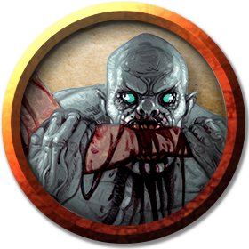
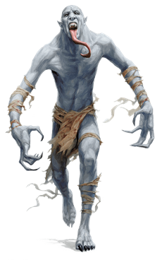

# Ghouls
Ghouls roam the night in packs, driven by an insatiable hunger for humanoid flesh.

> Jump to: [Ghoul](Ghouls.md#ghoul) | [Aquatic Ghoul](Ghouls.md#aquatic-ghoul) | [Ghast](Ghouls.md#ghast) | [Aquatic Ghast](Ghouls.md#aquatic-ghast)

---

## Ghoul
***Devourers of Flesh.*** Like maggots or carrion beetles, ghouls thrive in places rank with decay and death. A ghoul haunts a place where it can gorge on dead flesh and decomposing organs. When it can't feed on the dead, it pursues living creatures and attempts to make corpses of them. Though they gain no nourishment from the corpses they devour, ghouls are driven by an unending hunger that compels them to consume. A ghoul's undead flesh never rots, and this monster can persist in a crypt or tomb for untold ages without feeding.

***Abyssal Origins.*** Ghouls trace their origins to the Abyss. Doresain, the first of their kind, was an elf worshiper of Orcus. Turning against his own people, he feasted on humanoid flesh to honor the Demon Prince of Undeath. As a reward for his service, Orcus transformed Doresain into the first ghoul. Doresain served Orcus faithfully in the Abyss, creating ghouls from the demon lord's other servants until an incursion by Yeenoghu, the demonic Gnoll Lord, robbed Doresain of his abyssal domain. When Orcus would not intervene on his behalf, Doresain turned to the elf gods for salvation, and they took pity on him and helped him escape certain destruction. Since then, elves have been immune to the ghouls' paralytic touch.

### Environment
Extraplanar, Ruins, Urban, Underdark

### Token

>### Ghoul
>*Medium undead, chaotic evil*
>___
>- **Armor Class** 12
>- **Hit Points** 22 (5d8)
>- **Speed** 30 ft.
>___
>|**STR**|**DEX**|**CON**|**INT**|**WIS**|**CHA**|
>|:---:|:---:|:---:|:---:|:---:|:---:|
>|13 (+1)|15 (+2)|10 (+0)|7 (-2)|10 (+0)|6 (-2)|
>
>___
>- **Proficiency Bonus** +2
>- **Saving Throws** 
>- **Damage Vulnerabilities** 
>- **Damage Resistances** 
>- **Damage Immunities** poison
>- **Condition Immunities** charmed,exhaustion,poisoned
>- **Skills** 
>- **Senses** darkvision 60 ft.,passive Perception 10
>- **Languages** Common
>- **Challenge** 1
>___
>#### Actions
>***Bite.*** Melee Weapon Attack: +2 to hit, reach 5 ft., one creature. Hit: 9 (2d6 + 2) piercing damage.
>
>***Claws.*** Melee Weapon Attack: +4 to hit, reach 5 ft., one target. Hit: 7 (2d4 + 2) slashing damage. If the target is a creature other than an elf or undead, it must succeed on a DC 10 Constitution saving throw or be paralyzed for 1 minute. The target can repeat the saving throw at the end of each of its turns, ending the effect on itself on a success.
>

---

## Aquatic Ghoul
Some say the aquatic ghouls were always part of Orcus' original design, others say the they are the result of an Undersea denizen turned to a ghoul upon death. Regardless of their origin, the aquatic ghoul (and its slower and dimmer cousin, the [aquatic ghast](#aquatic-ghast)) are the stuff of many a sailor's nightmares.

***Devourers of Flesh.*** Like maggots or carrion beetles, ghouls thrive in places rank with decay and death under, in, or near the water. A ghoul haunts a place where it can gorge on dead flesh and decomposing organs, and the aquatic variety particularly love places where they can feast on the many corpses of a shipwreck. When it can't feed on the dead, it pursues living creatures and attempts to make corpses of them. Though they gain no nourishment from the corpses they devour, ghouls are driven by an unending hunger that compels them to consume. A ghoul's undead flesh never rots, and this monster can persist in a watery grave for untold ages without feeding.

***Underwater Foes.*** Aquatic ghouls' powerful limbs make them fearsome predators in the water, capable of fearsome speeds compared to what they can achieve on land. Sailors tell horror stories at night of these horrific creatures leaping out of the water onto ships' decks, from which they can take sentries by surprise and feast on entire crews without warning.

### Environment
Coastal, Ocean, Undersea

### Token

>### Ghoul
>*Medium undead, chaotic evil*
>___
>- **Armor Class** 12
>- **Hit Points** 22 (5d8)
>- **Speed** 30 ft., swimming 50ft.
>___
>|**STR**|**DEX**|**CON**|**INT**|**WIS**|**CHA**|
>|:---:|:---:|:---:|:---:|:---:|:---:|
>|13 (+1)|15 (+2)|10 (+0)|7 (-2)|10 (+0)|6 (-2)|
>
>___
>- **Proficiency Bonus** +2
>- **Saving Throws** 
>- **Damage Vulnerabilities** 
>- **Damage Resistances** 
>- **Damage Immunities** poison
>- **Condition Immunities** charmed,exhaustion,poisoned
>- **Skills** 
>- **Senses** darkvision 60 ft.,passive Perception 10
>- **Languages** Common
>- **Challenge** 1
>___
>***Amphibious.*** The ghoul can breathe air and water.
>
>***Surface Leap.*** If the ghoul is permitted to Dash underwater towards the surface, it can leap out of the water and onto a boat or a barge provided there is movement enough in the Dash to clear any height differential between the water's surface and an available flat surface on which to land. The ghoul must be able to move in a straight line towards the surface, and it must have at least half its Dash movement (50 ft) underwater before clearing the surface.
>
>#### Actions
>***Bite.*** Melee Weapon Attack: +2 to hit, reach 5 ft., one creature. Hit: 9 (2d6 + 2) piercing damage.
>
>***Claws.*** Melee Weapon Attack: +4 to hit, reach 5 ft., one target. Hit: 7 (2d4 + 2) slashing damage. If the target is a creature other than an elf or undead, it must succeed on a DC 10 Constitution saving throw or be paralyzed for 1 minute. The target can repeat the saving throw at the end of each of its turns, ending the effect on itself on a success.
>

---

## Ghast
Orcus (or a necromancer or pale master) sometimes infuses a ghoul with a stronger dose of abyssal energy, making a ghast. Whereas ghouls are little more than savage beasts, a ghast is cunning and can inspire a pack of ghouls to follow its commands.

### Environment
Extraplanar, Ruins, Urban, Underdark

### Token

>### Ghast
>*Medium undead, chaotic evil*
>___
>- **Armor Class** 13
>- **Hit Points** 36 (8d8)
>- **Speed** 30 ft.
>___
>|**STR**|**DEX**|**CON**|**INT**|**WIS**|**CHA**|
>|:---:|:---:|:---:|:---:|:---:|:---:|
>|16 (+3)|17 (+3)|10 (+0)|11 (+0)|10 (+0)|8 (-1)|
>
>___
>- **Proficiency Bonus** +2
>- **Saving Throws** 
>- **Damage Vulnerabilities** 
>- **Damage Resistances** necrotic
>- **Damage Immunities** poison
>- **Condition Immunities** charmed,exhaustion,poisoned
>- **Skills** 
>- **Senses** darkvision 60 ft.,passive Perception 10
>- **Languages** Common
>- **Challenge** 2
>___
>***Stench.*** Any creature that starts its turn within 5 feet of the ghast must succeed on a DC 10 Constitution saving throw or be poisoned until the start of its next turn. On a successful saving throw, the creature is immune to the ghast's Stench for 24 hours.
>
>***Turning Defiance.*** The ghast and any ghouls within 30 feet of it have advantage on saving throws against effects that turn undead.
>
>#### Actions
>***Bite.*** Melee Weapon Attack: +3 to hit, reach 5 ft., one creature. Hit: 12 (2d8 + 3) piercing damage.
>
>***Claws.*** Melee Weapon Attack: +5 to hit, reach 5 ft., one target. Hit: 10 (2d6 + 3) slashing damage. If the target is a creature other than an undead, it must succeed on a DC 10 Constitution saving throw or be paralyzed for 1 minute. The target can repeat the saving throw at the end of each of its turns, ending the effect on itself on a success.
>

---

## Aquatic Ghast
This is a ghast, but with the ability to swim and operate underwater.

Some say the aquatic ghasts were always part of Orcus' original design, others say the aquatic ghast is the result of an Undersea race turned to a ghast when slain. Regardless of their origin, the aquatic ghast (and its slower and dimmer cousin, the [aquatic ghoul](#aquatic-ghoul)) are the stuff of many a sailor's nightmares.

### Environment
Coastal, Ocean, Undersea

### Token

>### Ghast
>*Medium undead, chaotic evil*
>___
>- **Armor Class** 13
>- **Hit Points** 36 (8d8)
>- **Speed** 30 ft.
>___
>|**STR**|**DEX**|**CON**|**INT**|**WIS**|**CHA**|
>|:---:|:---:|:---:|:---:|:---:|:---:|
>|16 (+3)|17 (+3)|10 (+0)|11 (+0)|10 (+0)|8 (-1)|
>
>___
>- **Proficiency Bonus** +2
>- **Saving Throws** 
>- **Damage Vulnerabilities** 
>- **Damage Resistances** necrotic
>- **Damage Immunities** poison
>- **Condition Immunities** charmed,exhaustion,poisoned
>- **Skills** 
>- **Senses** darkvision 60 ft.,passive Perception 10
>- **Languages** Common
>- **Challenge** 2
>___
>***Stench.*** Any creature that starts its turn within 5 feet of the ghast must succeed on a DC 10 Constitution saving throw or be poisoned until the start of its next turn. On a successful saving throw, the creature is immune to the ghast's Stench for 24 hours.
>
>***Turning Defiance.*** The ghast and any ghouls within 30 feet of it have advantage on saving throws against effects that turn undead.
>
>#### Actions
>***Bite.*** Melee Weapon Attack: +3 to hit, reach 5 ft., one creature. Hit: 12 (2d8 + 3) piercing damage.
>
>***Claws.*** Melee Weapon Attack: +5 to hit, reach 5 ft., one target. Hit: 10 (2d6 + 3) slashing damage. If the target is a creature other than an undead, it must succeed on a DC 10 Constitution saving throw or be paralyzed for 1 minute. The target can repeat the saving throw at the end of each of its turns, ending the effect on itself on a success.
>
