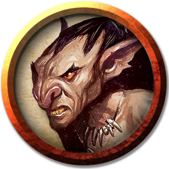

# Goblins
Goblins are small, black-hearted, selfish humanoids that lair in caves, abandoned mines, despoiled dungeons, and other dismal settings. Individually weak, goblins gather in large — sometimes overwhelming — numbers. They crave power and regularly abuse whatever authority they obtain.

> Jump to: [Goblin](Goblins.md#goblin) | [Goblin Boss](Goblins.md#goblin-boss) | [Worg Rider](Goblins.md#worg-rider) | [Goblin Elite Warrior](Goblins.md#goblin-elite-warrior) | [Nilbog](Goblins.md#nilbog)

***Goblinoids.*** Goblins belong to a family of creatures called goblinoids. Their larger cousins, hobgoblins and bugbears, like to bully goblins into submission. Goblins are lazy and undisciplined, making them poor servants, laborers, and guards.

***Malicious Glee.*** Motivated by greed and malice, goblins can't help but celebrate the few times they have the upper hand. They dance, caper with sheer joy when victory is theirs. Once their revels have ended, goblins delight in the torment of other creatures and embrace all manner of wickedness.

***Leaders and Followers.*** Goblins are ruled by the strongest or smartest among them. A goblin boss might command a single lair, while a goblin king or queen (who is nothing more than a glorified goblin boss) rules hundreds of goblins, spread out among multiple lairs to ensure the tribe's survival. Goblin bosses are easily ousted, and many goblin tribes are taken over by hobgoblin warlords or bugbear chiefs.

***Challenging Lairs.*** Goblins festoon their lairs with alarms designed to signal the arrival of intruders. Those lairs are also riddled with narrow tunnels and bolt-holes that human-sized creatures can't navigate, but which goblins can crawl through with ease, allowing them to flee or to circle around and surprise their enemies.

***Rat Keepers and Wolf Riders.*** Goblins have an affinity for rats and wolves, raising them to serve as companions and mounts, respectively. Like rats, goblins shun sunlight and sleep underground during the day. Like wolves, they are pack hunters, made bolder by their numbers. When they hunt from the backs of wolves, goblins use hit-and-run attacks.

***Worshipers of Maglubiyet.*** Maglubiyet the Mighty One, the Lord of Depths and Darkness, is the greater god of goblinoids. Envisioned by most goblins as an eleven-foot-tall battle-scarred goblin with black skin and fire erupting from his eyes, he is worshiped not out of adoration but fear. Goblins believe that when they die in battle, their spirits join the ranks of Maglubiyet's army on the plane of Acheron. This is a "privilege" that most goblins dread, fearing the Mighty One's eternal tyranny even more than death.

---

## Goblin
(No description given)

### Environment
(FIXME)

### Token

>### Goblin
>*Small humanoid (goblinoid), neutral evil*
>___
>- **Armor Class** 15 (leather armor, shield)
>- **Hit Points** 7 (2d6)
>- **Speed** 30 ft.
>___
>|**STR**|**DEX**|**CON**|**INT**|**WIS**|**CHA**|
>|:---:|:---:|:---:|:---:|:---:|:---:|
>|8 (-1)|14 (+2)|10 (+0)|10 (+0)|8 (-1)|8 (-1)|
>
>___
>- **Proficiency Bonus** +2
>- **Saving Throws** 
>- **Damage Vulnerabilities** 
>- **Damage Resistances** 
>- **Damage Immunities** 
>- **Condition Immunities** 
>- **Skills** Stealth +6
>- **Senses** darkvision 60 ft.,passive Perception 9
>- **Languages** Common,Goblin
>- **Challenge** 1/4
>___
>***Nimble Escape.*** The goblin can take the Disengage or Hide action as a bonus action on each of its turns.
>
>#### Actions
>***Scimitar.*** Melee Weapon Attack: +4 to hit, reach 5 ft., one target. Hit: 5 (1d6 + 2) slashing damage.
>
>***Shortbow.*** Ranged Weapon Attack: +4 to hit, range 80/320 ft., one target. Hit: 5 (1d6 + 2) piercing damage.
>

---

## Goblin Boss
(No description given)

### Environment
(FIXME)

### Token

>### Goblin Boss
>*Small humanoid (goblinoid), neutral evil*
>___
>- **Armor Class** 17 (chain shirt, shield)
>- **Hit Points** 21 (6d6)
>- **Speed** 30 ft.
>___
>|**STR**|**DEX**|**CON**|**INT**|**WIS**|**CHA**|
>|:---:|:---:|:---:|:---:|:---:|:---:|
>|10 (+0)|14 (+2)|10 (+0)|10 (+0)|8 (-1)|10 (+0)|
>
>___
>- **Proficiency Bonus** +2
>- **Saving Throws** 
>- **Damage Vulnerabilities** 
>- **Damage Resistances** 
>- **Damage Immunities** 
>- **Condition Immunities** 
>- **Skills** Stealth +6
>- **Senses** darkvision 60 ft.,passive Perception 9
>- **Languages** Common,Goblin
>- **Challenge** 1
>___
>***Nimble Escape.*** The goblin can take the Disengage or Hide action as a bonus action on each of its turns.
>
>#### Actions
>***Multiattack.*** The goblin makes two attacks with its scimitar. The second attack has disadvantage.
>
>***Scimitar.*** Melee Weapon Attack: +4 to hit, reach 5 ft., one target. Hit: 5 (1d6 + 2) slashing damage.
>
>***Javelin.*** Melee or Ranged Weapon Attack: +2 to hit, reach 5 ft. or range 30/120 ft., one target. Hit: 3 (1d6) piercing damage.
>
>***Redirect Attack.*** When a creature the goblin can see targets it with an attack, the goblin chooses another goblin within 5 feet of it. The two goblins swap places, and the chosen goblin becomes the target instead.
>

---

## Worg Rider
Those goblins who are selected to ride the powerful goblinoid-wolves known as [Worgs](Wolves.md#worg) are tougher, faster, and meaner than their on-foot cousins. Worg Riders are feared among the goblins, and many a Worg Rider has gone on to become a Boss in their own right later in life. A Worg Rider bonds with its Worg, and the pair are inseparable for their (admittedly brief) lives.

Some Goblin Worg Riders have learned to ride [Dire Wolves](Wolves.md#dire-wolf) or [Hell Hounds](Dogs.md#hell-hound) instead; those goblins are generally considered insane by their fellows, and live in expectation of an even shorter lifespan.

### Environment
(FIXME)

### Token

>### Worg Rider
>*Small humanoid, neutral evil*
>___
>- **Armor Class** 15 (Studded Leather Armor + dex bonus)
>- **Hit Points** 27 (6d6 + 6)
>- **Speed** 30 ft (on foot), 50 ft (mounted on worg)
>___
>|**STR**|**DEX**|**CON**|**INT**|**WIS**|**CHA**|
>|:---:|:---:|:---:|:---:|:---:|:---:|
>|11 (+0)|14 (+2)|12 (+1)|11 (+0)|13 (+1)|11 (+0)|
>
>___
>- **Proficiency Bonus** +2
>- **Saving Throws** 
>- **Damage Vulnerabilities** 
>- **Damage Resistances** 
>- **Damage Immunities** 
>- **Condition Immunities** 
>- **Skills** Perception +5,Handle Animal +5,Stealth +6,Survival +5
>- **Senses** darkvision 60 ft.,passive Perception 11
>- **Languages** Common,Goblin
>- **Challenge** 1
>___
>***Keen Hearing and Sight.*** The worg rider has advantage on Wisdom (Perception) checks that rely on hearing or sight.
>
>***One Mind.*** The worg rider and its mount act on the same initiative count while mounted.
>
>***Nimble Escape.*** The worg rider can take the Disengage or Hide action as a bonus action on each of its turns, and do so for both itself and its mount.
>
>***Mobile.*** Goblin Worg Riders are particularly speedy and agile. While mounted, they gain the following benefits:
>
>When they use the Dash action, difficult terrain doesn't cost them extra movement on that turn.
>
>When they make a melee attack against a creature, they don't provoke opportunity attacks from that creature for the rest of the turn, whether they hit or not. (Worg Riders will instinctively and deliberately time their move/attack combos to single out a creature, attack, and nip away before a return attack can come.)
>
>#### Actions
>***Multiattack.*** The worg rider makes two melee attacks or two ranged attacks.
>
>***Scimitar.*** Melee Weapon Attack: +5 to hit, reach 5 ft., one target. Hit: 5 (1d6 + 2) slashing damage.
>
>***Shortbow.*** Ranged Weapon Attack: +4 to hit, range 80/320 ft., one target. Hit: 5 (1d6 + 2) piercing damage. Worg riders can fire while mounted without penalty.
>

---

## Goblin Elite Warrior
This is the base Goblin with the [Elite Warrior](../Templates/EliteWarrior.md) template applied.

### Environment
(FIXME)

### Token

>### Goblin Elite Warrior
>*Small humanoid (goblinoid), neutral evil*
>___
>- **Armor Class** 18 (studded leather, shield)
>- **Hit Points** 27 (6d6 + 6)
>- **Speed** 30 ft.
>___
>|**STR**|**DEX**|**CON**|**INT**|**WIS**|**CHA**|
>|:---:|:---:|:---:|:---:|:---:|:---:|
>|10 (+0)|18 (+4)|12 (+1)|10 (+0)|10 (+0)|9 (-1)|
>
>___
>- **Proficiency Bonus** +2
>- **Saving Throws** Dex +6
>- **Damage Vulnerabilities** 
>- **Damage Resistances** 
>- **Damage Immunities** 
>- **Condition Immunities** 
>- **Skills** Stealth +8,Perception +2
>- **Senses** darkvision 60 ft.,passive Perception 12
>- **Languages** Common,Goblin
>- **Challenge** 2
>___
>***Nimble Escape.*** The goblin can take the Disengage or Hide action as a bonus action on each of its turns.
>
>#### Actions
>***Multiattack.*** The goblin makes two attacks.
>
>***Shortsword.*** Melee Weapon Attack: +6 to hit, reach 5ft., one target. Hit: 7 (1d6 + 4) piercing damage.
>
>***Shortbow.*** Ranged Weapon Attack: +6 to hit, range 80/320 ft., one target. Hit: 7 (1d6 + 4) piercing
>

---

## Nilbog
When Maglubiyet conquered the goblin gods, a trickster deity was determined to get the last laugh. Although Maglubiyet shattered its essence, this trickster god survives in a splintered form as possessing spirits that cause disorder unless they are appeased. Goblins have no name for this deity and dare not give it one, lest Maglubiyet use its name to ensnare and crush it as he did their other deities. They call the possessing spirit, as well as the goblin possessed by it, a nilbog ("goblin" spelled backward), and they revel in the chaos a nilbog sows.

Whenever goblinoids form a host, there is a chance that a goblin will become possessed by a nilbog, particularly if the goblins have been mistreated by their betters. The possessed goblin turns into a wisecracking, impish creature fearless of reprisal. This nilbog also gains strange powers that drive others to do the opposite of what they desire. Attacking the possessed goblin is foolhardy, and killing them just prompts the spirit to possess another goblin. The only way to keep a nilbog from wreaking havoc is to treat it well and give it respect and praise.

Among fey courts, the risk of attracting a nilbog has given rise to the practice of always including at least one goblin jester. This jester is allowed to go anywhere and do whatever they please, hopefully preventing a nilbog from manifesting. The position of jester is much sought-after among the courts' goblins, because even if the jester is obviously not a nilbog, the court must indulge their chaotic behavior.

A nilbog is an invisible spirit that possesses only goblins. When bereft of a host, the spirit has a flying speed of 30 feet, it can't be attacked, and it is immune to all damage and conditions. Acting on initiative count 20 (losing initiative ties), the only action it can take is to attempt to possess a goblin within 5 feet of it.

A goblin targeted by the spirit must succeed on a DC 15 Charisma saving throw or become possessed. While possessed, the goblin uses the nilbog stat block. If the save succeeds, the spirit can't possess that goblin for 24 hours.

If its host is killed or the possession is ended by a spell such as hallow, magic circle, or protection from evil and good, the spirit searches for another goblin to possess. The spirit can leave its host at any time, but it won't do so willingly unless it knows there's another potential host nearby. A goblin stripped of their nilbog spirit reverts to their normal statistics and loses the traits they gained while possessed.

### Environment
(FIXME)

### Token

>### Nilbog
>*Small Fey (Goblinoid), Typically Chaotic Neutral*
>___
>- **Armor Class** 13 (leather armor)
>- **Hit Points** 7 (2d6)
>- **Speed** 30 ft.
>___
>|**STR**|**DEX**|**CON**|**INT**|**WIS**|**CHA**|
>|:---:|:---:|:---:|:---:|:---:|:---:|
>|8 (-1)|14 (+2)|10 (+0)|10 (+0)|8 (-1)|15 (+2)|
>
>___
>- **Proficiency Bonus** +2
>- **Saving Throws** 
>- **Damage Vulnerabilities** 
>- **Damage Resistances** 
>- **Damage Immunities** 
>- **Condition Immunities** 
>- **Skills** Stealth +6
>- **Senses** darkvision 60 ft.,passive Perception 9
>- **Languages** Common,Goblin
>- **Challenge** 1
>___
>***Nilbogism.*** Any creature that attempts to damage the nilbog must first succeed on a DC 12 Charisma saving throw or be charmed until the end of the creature's next turn. A creature charmed in this way must use its action praising the nilbog.
>
>The nilbog can't regain hit points, including through magical healing, except through its Reversal of Fortune reaction.
>
>#### Actions
>***Fool's Scepter.*** Melee Weapon Attack: +4 to hit, reach 5 ft., one target. Hit: 5 (1d6 + 2) bludgeoning damage.
>
>***Mocking Word.*** The nilbog targets one creature it can see within 60 feet of it. The target must succeed on a DC 12 Wisdom saving throw or take 5 (2d4) psychic damage and have disadvantage on its next attack roll before the end of its next turn.
>
>***Spellcasting.*** The nilbog casts one of the following spells, using Charisma as the spellcasting ability (spell save DC 12):
>
>At will: mage hand, Tasha's hideous laughter
>
>#### Bonus Actions
>***Nimble Escape.*** The nilbog takes the Disengage or Hide action.
>
>#### Reactions
>***Reversal of Fortune.*** In response to another creature dealing damage to the nilbog, the nilbog reduces the damage to 0 and regains 3 (1d6) hit points.
>

