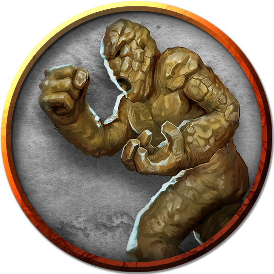

# Golem
Golems are made from humble materials — clay, flesh and bones, iron, or stone — but they possess astonishing power and durability. A golem has no ambitions, needs no sustenance, feels no pain, and knows no remorse. An unstoppable juggernaut, it exists to follow its creator’s orders, and it protects or attacks as that creator demands.

> Jump to: [Clay](#clay-golem) | [Flesh](#flesh-golem) | [Iron](#iron-golem) | [Stone](#stone-golem)

The creation of golems was once a widely-known art, but today, remains closely-held knowledge by those few who understand it.

***Spirits bound to Material Form.*** The construction of a golem begins with the building of its body, requiring great command of the craft of sculpting, stonecutting, ironworking, or surgery. Sometimes a golem’s creator is the master of the art, but often the individual who desires a golem must enlist master artisans to do the work.

After constructing the body, the golem’s creator infuses it with either a fraction of the creator's own will. Doing so makes the golem entirely an automaton. Sometimes, however, a creator imbues the golem with a [spirit](../Religions/Spirits.md)--perhaps a bit of essence from the Elemental Plane of Earth, perhaps a fraction of the spirit of a bubbling lava pit, even sometimes an ancestral spirit. In these cases, the spirit might retain some of its independence of its earlier existence, and be more than just an automaton, but capable of independent thought and action--which in itself may be curse as much as blessing.

***Ageless Guardians.*** Golems can guard sacred sites, tombs, and treasure vaults long after the deaths of their creators, carrying out their appointed tasks for all eternity while brushing off physical damage and ignoring all but the most potent spells.

A golems can be created with a special amulet or other item (typically an [*ornament*](../Magic/Items/index.md#residual-items)) that allows the possessor of the item to control the golem. Golems whose creators are long dead can thus be harnessed to serve a new master. Golems fashioned eons ago are often separated widely from their controlling *ornaments*, and treasure seekers often wander bazaars and junk shops, carefully examining the "worthless" trinkets for that spark that suggests a mystical link.

***Blind Obedience.*** When its creator or possessor is on hand to command it, a golem performs flawlessly. If the golem is left without instructions or is incapacitated, it continues to follow its last orders to the best of its ability. When it can’t fulfill its orders, a golem might react violently — or stand and do nothing. A golem that has been given conflicting orders sometimes alternates between them.

A golem infused by it's creator's will can’t think or act for itself; though it understands its commands perfectly, it has no grasp of language beyond that understanding, and can’t be reasoned with or tricked with words. However, if the golem was infused by a spirit, if that spirit is of strong enough will and retains enough of itself during the binding process, it can sometimes (DM's discretion) act of its own accord, though it can never directly disobey the orders of its original creator (or any who are attuned to the *ornament* that controls it).

***Constructed Nature.*** A golem doesn’t require air, food, drink, or sleep.

---

## Clay Golem

Sculpted from clay, this bulky golem stands head and shoulders taller than most Medium-sized creatures. It is humanoid shaped, but its proportions are off.

Clay golems are often divinely endowed with purpose by priests of great faith. However, clay is a weak vessel for life force. (Clay golems infused with will usually last no longer than a decade at most.) For this reason, most golem creators choose to infuse spirit rather than will. If the spirit-infused golem is damaged, the spirit can break free of the creator's control. Such a golem runs amok, smashing everything around it until it is destroyed or completely repaired.

>### Clay Golem
>*Large construct, unaligned*
>___
>- **Armor Class** 14 (natural armor)
>- **Hit Points** 133 (14d10 + 56)
>- **Speed** 20 ft.
>___
>|**STR**|**DEX**|**CON**|**INT**|**WIS**|**CHA**|
>|:---:|:---:|:---:|:---:|:---:|:---:|
>|20 (+5)|9 (−1)|18 (+4)|3 (−4)|8 (−1)|1 (−5)|
>
>___
>- **Proficiency Bonus** 
>- **Saving Throws** 
>- **Damage Vulnerabilities** 
>- **Damage Resistances** 
>- **Damage Immunities** acid, poison, psychic; bludgeoning, piercing, and slashing from nonmagical attacks that aren’t adamantine
>- **Condition Immunities** charmed, exhaustion, frightened, paralyzed, petrified, poisoned
>- **Skills** 
>- **Senses** darkvision 60 ft., passive Perception 9
>- **Languages** understands the languages of its creator but can’t speak
>- **Challenge** 9 (5,000 XP)
>___
>**Acid Absorption.** Whenever the golem is subjected to acid damage, it takes no damage and instead regains a number of hit points equal to the acid damage dealt.
>
>***Berserk.*** Whenever the golem starts its turn with 60 hit points or fewer, roll a d6. On a 6, the golem goes berserk. On each of its turns while berserk, the golem attacks the nearest creature it can see. If no creature is near enough to move to and attack, the golem attacks an object, with preference for an object smaller than itself. Once the golem goes berserk, it continues to do so until it is destroyed or regains all its hit points.
>
>***Immutable Form.*** The golem is immune to any spell or effect that would alter its form.
>
>***Magic Resistance.*** The golem has advantage on saving throws against spells and other magical effects.
>
>***Magic Weapons.*** The golem’s weapon attacks are magical.
>
>#### Actions
>***Multiattack.*** The golem makes two slam attacks.
>
>***Slam.*** Melee Weapon Attack: +8 to hit, reach 5 ft., one target. Hit: 16 (2d10 + 5) bludgeoning damage. If the target is a creature, it must succeed on a DC 15 Constitution saving throw or have its hit point maximum reduced by an amount equal to the damage taken. The target dies if this attack reduces its hit point maximum to 0. The reduction lasts until removed by the greater restoration spell or other magic.
>
>***Haste (Recharge 5–6).*** Until the end of its next turn, the golem magically gains a +2 bonus to its AC, has advantage on Dexterity saving throws, and can use its slam attack as a bonus action.

---

## Flesh Golem

---

## Iron Golem

---

## Stone Golem

