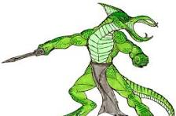

# Half-Illithids

This aberration is the result of ceremorphosis, in which an illithid tadpole burrows into its victim's brain. The host's personality is erased, allowing the illithid to meld with the lower brain and claim the body.

> Jump to: [Half-Illithid Lizardfolk](#half-illithid-lizardfolk)

## Half-Illithid Lizardfolk
While illithids favor human hosts, lizardfolk make useful slaves and guards if the mind flayer's lair is near jungle or swamp.

### Environment
Jungle, Swamp

### Token

>### Half-Illithid Lizardfolk 
>*Medium aberration, neutral evil*
>___
>- **Armor Class** 14 (natural armor)
>- **Hit Points** 27 (5d8 + 5)
>- **Speed** 30 ft., swim 30 ft.
>___
>|**STR**|**DEX**|**CON**|**INT**|**WIS**|**CHA**|
>|:---:|:---:|:---:|:---:|:---:|:---:|
>|14 (+2)|10 (+0)|13 (+1)|14 (+2)|12 (+1)|8 (-1)|
>
>___
>- **Proficiency Bonus** +2
>- **Saving Throws** Con +7,Int +8,Wis +7,Cha +7
>- **Damage Vulnerabilities** 
>- **Damage Resistances** 
>- **Damage Immunities** 
>- **Condition Immunities**
>- **Skills** Perception +3, Stealth +4, Survival +5
>- **Senses** darkvision 60 ft., passive Perception 13
>- **Languages** Draconic
>- **Challenge** 2 (450 XP)
>___
>***Hold Breath.*** The lizardfolk can hold its breath for 15 minutes.
>
>***Magic Resistance.*** The lizardfolk has advantage on saving throws against spells and other magical effects.
>
>#### Actions
>***Multiattack.*** The lizardfolk makes two attacks: one with its dagger and one with its tentacles.
>
>***Dagger.*** *Melee or Ranged Weapon Attack:* +4 to hit, reach 5 ft. or range 20/60 ft., one target. Hit: 4 (1d4 + 2) piercing damage.
>
>***Tentacles.*** *Melee Weapon Attack:* +4 to hit, reach 5 ft., one target. Hit: 7 (1d10 + 2) psychic damage. If the target is Medium or smaller, it is grappled (escape DC 12) and must succeed on a DC 12 Intelligence saving throw or be stunned until the grapple ends.
>
>***Extract Brain.*** Melee Weapon Attack: +4 to hit, reach 5 ft., one incapacitated humanoid grappled by the lizardfolk. Hit: The target takes 11 (2d10) piercing damage. If this damage reduces the target to 0 hit points, the lizardfolk kills the target by extracting and devouring its brain.
>
>***Mind Blast (Recharge 5-6).*** The lizardfolk magically emits psychic energy in a 30-foot cone. Each creature in that area must succeed on a DC 12 Intelligence saving throw or take 9 (2d8) psychic damage and be stunned for 1 minute. A creature can repeat the saving throw at the end of each of its turns, ending the effect on itself on a success.
