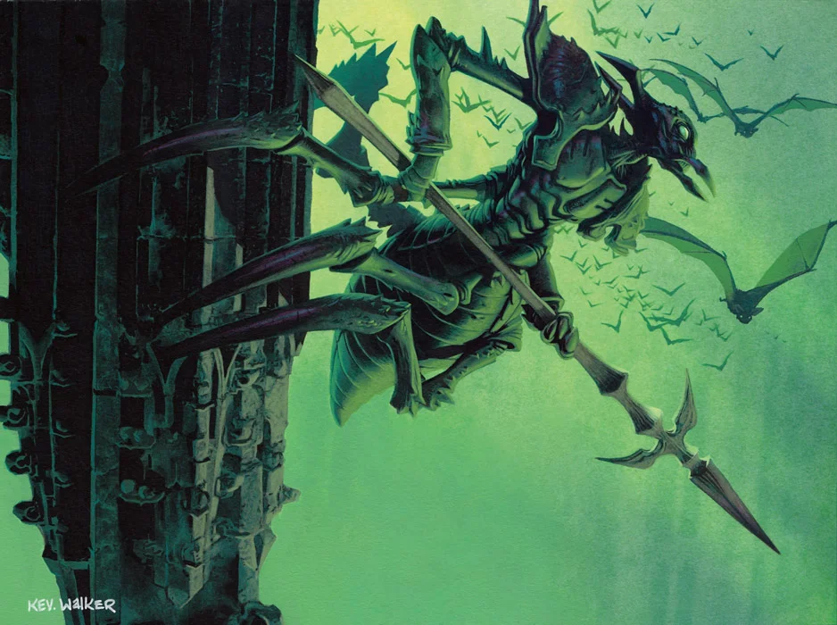
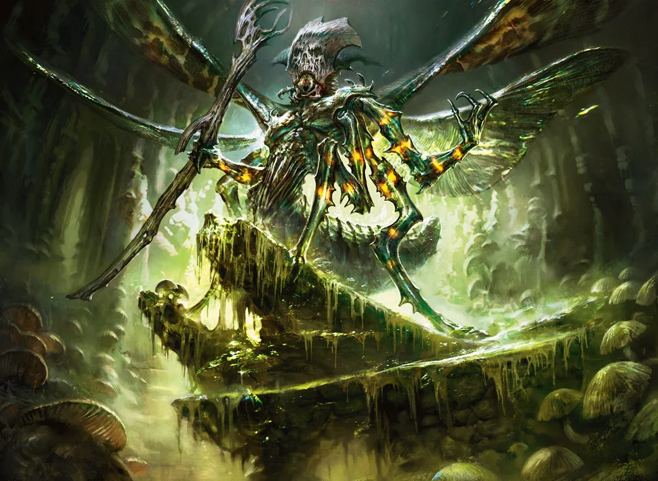

# Kraul

The kraul are an ascendant power group within the Golgari Swarm, long content to linger at the margins of the undercity but now increasingly making their buzzing voices heard in subterranean halls and caverns. These six-legged, insectile beings are hard-headed and literal-minded, with little grasp of metaphor or nuance.

> Jump to: [Kraul Warrior](Krauls.md#kraul-warrior) | [Winged Kraul Warrior](Krauls.md#winged-kraul-warrior) | [Kraul Death Priest](Krauls.md#kraul-death-priest)

---

## Kraul Warrior
Kraul society is organized into well-defined roles and castes. The vast majority of the kraul occupy various tiers of soldiery, from commanders and elite troops down to the lowliest infantry.

### Environment
Ruins, Underdark

### Token

>### Kraul Warrior
>*Medium Humanoid (Kraul), neutral evil*
>___
>- **Armor Class** 18 (natural armor)
>- **Hit Points** 27 (5d8 + 5)
>- **Speed** 30 ft., Climb 30 ft.
>___
>|STR|DEX|CON|INT|WIS|CHA|
>|:---:|:---:|:---:|:---:|:---:|:---:|
>|15 (+2)|12 (+1)|13 (+1)|10 (+0)|11 (+0)|8 (-1)|
>___
>- **Senses** Darkvision 60 ft., passive Perception 10
>- **Languages** Kraul, understands Common but can't speak it
>- **Challenge** 1/2 (XP 100; PB +2)
>- **Proficiency Bonus** +2
>___
>***Hive Mind.*** The kraul is immune to the charmed and frightened conditions while within 30 feet of at least one other kraul.  
>
>***Pack Tactics.*** The kraul has advantage on an attack roll against a creature if at least one of the kraul's allies is within 5 feet of the creature and the ally isn't incapacitated.  
>
>***Spider Climb.*** The kraul can climb difficult surfaces, including upside down on ceilings, without needing to make an ability check.  
>
>### Actions
>***Spear.*** *Melee Weapon Attack:* +4 to hit, reach 5 ft., one target. *Hit:* 5 (1d6 + 2) piercing damage.
>
>***Spear (Two-Handed).*** *Melee Weapon Attack:* +4 to hit, reach 5 ft., one target. *Hit:* 6 (1d8 + 2) piercing damage if used with two hands to make a melee attack.
>
>***Spear (Thrown).*** *Ranged Weapon Attack:* +3 to hit, range 20/60 ft., one target. *Hit:* 5 (1d6 + 2) piercing damage.
>

---

## Winged Kraul Warrior
Some kraul warriors have a flying speed of 40 feet, as a result of possessing gossamer wings. Their wings give them a higher station among the kraul soldiers. Winged kraul warriors serve the guild as scouts and shock troops.

### Environment
Ruins, Underdark

### Token

>### Winged Kraul Warrior
>*Medium Humanoid (Kraul), neutral evil*
>___
>- **Armor Class** 18 (natural armor)
>- **Hit Points** 27 (5d8 + 5)
>- **Speed** 30 ft., Climb 30 ft., fly 40 ft.
>___
>|**STR**|**DEX**|**CON**|**INT**|**WIS**|**CHA**|
>|:---:|:---:|:---:|:---:|:---:|:---:|
>|15 (+2)|12 (+1)|13 (+1)|10 (+0)|11 (+0)|8 (-1)|
>___
>- **Senses** Darkvision 60 ft., passive Perception 10
>- **Languages** Kraul, understands Common but can't speak it
>- **Challenge** 1/2 (XP 100; PB +2)
>- **Proficiency Bonus** +2
>___
>***Hive Mind.*** The kraul is immune to the charmed and frightened conditions while within 30 feet of at least one other kraul.  
>
>***Pack Tactics.*** The kraul has advantage on an attack roll against a creature if at least one of the kraul's allies is within 5 feet of the creature and the ally isn't incapacitated.  
>
>***Spider Climb.*** The kraul can climb difficult surfaces, including upside down on ceilings, without needing to make an ability check.  
>
>### Actions
>***Spear.*** *Melee Weapon Attack:* +4 to hit, reach 5 ft., one target. *Hit:* 5 (1d6 + 2) piercing damage.
>
>***Spear (Two-Handed).*** *Melee Weapon Attack:* +4 to hit, reach 5 ft., one target. *Hit:* 6 (1d8 + 2) piercing damage if used with two hands to make a melee attack.
>
>***Spear (Thrown).*** *Ranged Weapon Attack:* +3 to hit, range 20/60 ft., one target. *Hit:* 5 (1d6 + 2) piercing damage.
>

---

## Kraul Death Priest

The death priests occupy the highest roles in kraul society. They lead the buzzing chants of the kraul rites. Their inscrutable clicks and buzzing can summon crippling necromantic magic, and the presence of death seems to fortify them. They draw power from the defeat of their enemies and channel it to their followers, ensuring the continuation of the cycle.

The current leader of the kraul is a death priest named Mazirek.

### Environment
Ruins, Underdark

### Token

>### Kraul Death Priest
>*Medium Humanoid (Kraul), neutral evil*
>___
>- **Armor Class** 18 (natural armor)
>- **Hit Points** 65 (10d8 + 20)
>- **Speed** 30 ft., Climb 30 ft., Fly 40 ft.
>___
>|**STR**|**DEX**|**CON**|**INT**|**WIS**|**CHA**|
>|:---:|:---:|:---:|:---:|:---:|:---:|
>|16 (+3)|12 (+1)|14 (+2)|12 (+1)|15 (+2)|10 (+0)|
>___
>- **Saving Throws** Con +4, Wis +4
>- **Skills** Insight +4, Nature +3, Religion +3
>- **Senses** Darkvision 60 ft., passive Perception 12
>- **Languages** Common, Kraul
>- **Challenge** 4 (XP 1,100; PB +2)
>- **Proficiency Bonus** +2
>___
>***Feed on Death.*** When a creature within 30 feet of the kraul drops to 0 hit points, the kraul or another creature of its choice within 30 feet of it gains 5 (1d10) temporary hit points, provided the kraul isn't incapacitated.  
>
>***Hive Mind.*** The kraul is immune to the charmed and frightened conditions while within 30 feet of at least one other kraul.  
>
>***Pack Tactics.*** The kraul has advantage on an attack roll against a creature if at least one of the kraul's allies is within 5 feet of the creature and the ally isn't incapacitated.  
>
>***Spider Climb.*** The kraul can climb difficult surfaces, including upside down on ceilings, without needing to make an ability check.  
>
>### Actions
>***Multiattack.*** The kraul makes one attack with its quarterstaff and casts one of its spells with a casting time of 1 action.  
>
>***Quarterstaff.*** *Melee Weapon Attack:*  +5 to hit, reach 5 ft., one target. *Hit:* 6 (1d6 + 3) bludgeoning damage, or 7 (1d8 + 3) bludgeoning damage if used with two hands.
>
>***Innate Spellcasting.*** The kraul's innate spellcasting ability is Wisdom (spell save DC 12, +4 to hit with spell attacks). The kraul can innately cast the following spells, requiring no material components:  
>
>* *At will*: *chill touch*, *poison spray*  
>* *3/day each*: *ray of enfeeblement*, *ray of sickness*  
>* *1/day each*: *animate dead*, *blight*, *vampiric touch*  
>
