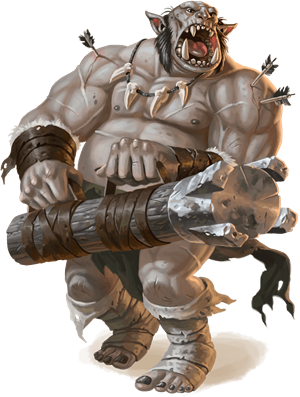
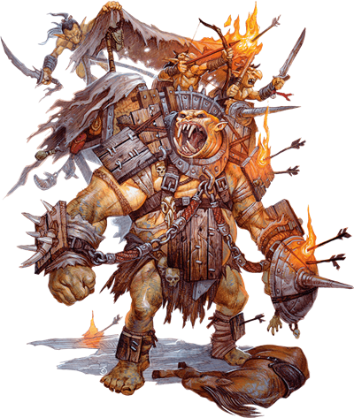

# Ogre
Ogres are as lazy of mind as they are strong of body. They live by raiding, scavenging, and killing for food and pleasure. The average adult specimen stands between 9 and 10 feet tall and weighs close to a thousand pounds.

Ogres are infamously dim-witted, but with enough time and patience, some of them can be trained to carry out specialized missions in battle. The names they are given — the battering ram, the bolt launcher, the chain brute, and the howdah — reflect their particular functions. These jobs are simple, but they’re tailored to take advantage of an ogre’s strengths.

> Jump to: [Ogre](#ogre) [Ogre Magi](#ogre-magi) [Cleric of Gruumsh](#cleric-of-gruumsh) [Battering Ram](#battering-ram) [Bolt Launcher](#bolt-launcher) [Chain Brute](#chain-brute) [Howdah](#howdah)

> See also: [Ogrillon](Ogrillon.md)

**Furious Tempers.** Ogres are notorious for their quick tempers, which flare at the smallest perceived offense. Insults and name-calling can rouse an ogre’s wrath in an instant — as can stealing from it, bumping, jabbing, or prodding it, laughing, making faces, or simply looking at it the wrong way. When its rage is incited, an ogre lashes out in a frustrated tantrum until it runs out of objects or creatures to smash.

**Gruesome Gluttons.** Ogres eat almost anything, but they especially enjoy the taste of dwarves, halflings, and elves. When they can, they combine dinner with pleasure, chasing scurrying victims around before eating them raw. If enough of its victim remains after the ogrehas gorged itself, it might make a loincloth from its quarry’s skin and a necklace from its leftover bones. This macabre crafting is the height of ogre culture.

**Greedy Collectors.** An ogre’s eyes glitter with avarice when it sees the possessions of others. Ogres carry rough sacks on their raids, which they fill with fabulous “treasure” taken from their victims. This might include a collection of battered helmets, a moldy wheel of cheese, a rough patch of animal fur fastened like a cloak, or a squealing, mud-spattered pig. Ogres also delight in the gleam of gold and silver, and they will fight one another over small handfuls of coins. Smarter creatures can earn an ogre’s trust by offering it gold or a weapon forged for a creature of its size.

**Legendary Stupidity.** Few ogres can count to ten, even with their fingers in front of them. Most speak only a rudimentary form of Giant and know a smattering of Common words. Ogres believe what they are told and are easy to fool or confuse, but they break things they don’t understand. Silver-tongued tricksters who test their talents on these savages typically end up eating their eloquent words — and then being eaten in turn.

**Primitive Wanderers.** Ogres clothe themselves in animal pelts and uproot trees for use as crude tools and weapons. They create stone-tipped javelins for hunting. When they establish lairs, they settle near the rural edges of civilized lands, taking advantage of poorly protected livestock, undefended larders, and unwary farmers.

An ogre sleeps in caves, animal dens, or under trees until it finds a cabin or isolated farmhouse, whereupon it kills the inhabitants and lairs there. Whenever it is bored or hungry, an ogre ventures out from its lair, attacking anything that crosses its path. Only after an ogre has depleted an area of food does it move on.

**Ogre Gangs.** Ogres sometimes band together in small, nomadic groups, but they lack a true sense of tribalism. When bands of ogres meet, one might attempt to capture the members of the other group to increase its numbers. However, ogre bands are just as likely to trade members freely, especially if the welcoming band is temporarily flush with food and weapons.

Whenever possible, ogres gang up with other monsters to bully or prey on creatures weaker than themselves. They associate freely with goblinoids, [orcs](Orc.md), and [trolls](Troll.md), and practically worship [giants](Giant.md). In the giants’ complex social structure (known as the *ordning*), ogres rank beneath the lowest giants in status. As a result, an ogre will do nearly anything a giant asks.

## Ogre
*Large giant, chaotic evil*

**Armor Class** 12 (Hide armor)

**Hit Points** 59 (7d10 + 21)

**Speed** 40 ft.

**STR**|**DEX**|**CON**|**INT**|**WIS**|**CHA**
-------|-------|-------|-------|-------|-------
19 (+4)|8 (-1) |16 (+3)|5 (-3) |7 (-2) |7 (-2)

**Senses** Darkvision 60 ft., Passive Perception 8

**Languages** Common, Giant

**Challenge** 2 (450 XP)

#### Actions
**Greatclub.** *Melee Weapon Attack*: +6 to hit, reach 5 ft., one target. Hit: 13 (2d8 + 4) bludgeoning damage.

**Javelin.** *Melee or Ranged Weapon Attack*: +6 to hit, reach 5 ft. or range 30/120 ft., one target. Hit: 11 (2d6 + 4) piercing damage.

#### Description

## Ogre Magi

## Ogre (Cleric of Gruumsh)

## Ogre (Way of the Elements)

## Battering Ram
*Large giant, chaotic evil*

**Armor Class** 14 (ring mail)

**Hit Points** 59 (7d10 + 21)

**Speed** 40 ft.

**STR**|**DEX**|**CON**|**INT**|**WIS**|**CHA**
-------|-------|-------|-------|-------|-------
19(+4) |8(−1)  |16(+3) |5(−3)  | 7(−2) |7(−2)

**Senses** darkvision 60 ft., passive Perception 8

**Languages** Common, Giant

**Challenge** 4 (1,100 XP)

**Siege Monster.** The ogre deals double damage to objects and structures.

#### Actions
**Bash.** Melee Weapon Attack: +6 to hit, reach 5 ft., one target. Hit: 15 (2d10 + 4) bludgeoning damage, and the ogre can push the target 5 feet away if the target is Huge or smaller.

**Block the Path.** Until the start of the ogre’s next turn, attack rolls against the ogre have disadvantage, it has advantage on the attack roll it makes for an opportunity attack, and that attack deals an extra 16 (3d10) bludgeoning damage on a hit. Also, each enemy that tries to move out of the ogre’s reach without teleporting must succeed on a DC 14 Strength saving throw or have its speed reduced to 0 until the start of the ogre’s next turn.

#### Description

An ogre battering ram carries an enormous club used primarily for bashing doors into kindling, but which also works well for smashing foes. These ogres are drilled in two simple tasks: rushing forward to shatter enemy fortifications, and using their weapons to force an advancing enemy to halt.

## Bolt Launcher
*Large giant, chaotic evil*

**Armor Class** 13 (hide armor)

**Hit Points** 59 (7d10 + 21)

**Speed** 40 ft.

**STR**|**DEX**|**CON**|**INT**|**WIS**|**CHA**
-------|-------|-------|-------|-------|-------
19(+4) |12(+1) |16(+3) |5(−3)  |7(−2)  |7(−2)

**Senses** darkvision 60 ft., passive Perception 8

**Languages** Common, Giant

**Challenge** 2 (450 XP)

#### Actions
**Fist.** Melee Weapon Attack: +6 to hit, reach 5 ft., one target. Hit: 9 (2d4 + 4) bludgeoning damage.

**Bolt Launcher.** Ranged Weapon Attack: +3 to hit, range 120/480 ft., one target. Hit: 17 (3d10 + 1) piercing damage.

#### Description
A bolt launcher carries a gigantic crossbow — a weapon so large it’s essentially an ogre-held ballista. An ogre bolt launcher can load this immense weapon and loose its deadly missile as quickly as a dwarf handles a crossbow. The bolts are so large that few ogres can carry more than a half-dozen at a time, but bolt launchers have been known to uproot small trees or tear beams out of buildings and launch those when their ammunition runs low.

## Chain Brute
*Large giant, chaotic evil*

**Armor Class** 12 (hide armor)

**Hit Points** 59 (7d10 + 21)

**Speed** 40 ft.

**STR**|**DEX**|**CON**|**INT**|**WIS**|**CHA**
-------|-------|-------|-------|-------|-------
19(+4) |8(−1)  |16(+3) |  5(−3)|7(−2)  |7(−2)

**Senses** darkvision 60 ft., passive Perception 8

**Languages** Common, Giant

**Challenge** 3 (700 XP)

#### Actions
**Fist.** Melee Weapon Attack: +6 to hit, reach ft., one target. Hit: 9 (2d4 + 4) bludgeoning damage.

**Chain Sweep.** The ogre swings its chain, and every creature within 10 feet of it must make a DC 14 Dexterity saving throw. On a failed saving throw, a creature takes 8 (1d8 + 4) bludgeoning damage and is knocked prone. On a successful save, the creature takes half as much damage and isn’t knocked prone.

**Chain Smash (Recharge 6).** Melee Weapon Attack: +6 to hit, reach 10 ft., one target. Hit: 13 (2d8 + 4) bludgeoning damage, and the target must succeed on a DC 14 Constitution saving throw or be knocked unconscious for 1 minute. The unconscious target repeats the saving throw if it takes damage and at the end of each of its turns, ending the effect on itself on a success.

#### Description
An ogre chain brute wields a great spiked chain. It swings this chain with both hands in a wide circle around itself to knock foes off their feet. Alternatively, it can swing the chain in a crushing overhead smash that’s nearly impossible to block or deflect.

## Howdah
*Large giant, chaotic evil*

**Armor Class** 13 (breastplate)

**Hit Points** 59 (7d10 + 21)

**Speed** 40 ft.

**STR**|**DEX**|**CON**|**INT**|**WIS**|**CHA**
-------|-------|-------|-------|-------|-------
19(+4) |8(−1)  |16(+3) |5(−3)  |7(−2)  |7(−2)

**Senses** darkvision 60 ft., passive Perception 8

**Languages** Common, Giant

**Challenge** 2 (450 XP)

**Howdah.** The ogre carries a compact fort on its back. Up to four Small creatures can ride in the fort without squeezing. To make a melee attack against a target within 5 feet of the ogre, they must use spears or weapons with reach. Creatures in the fort have three-quarters cover against attacks and effects from outside it. If the ogre dies, creatures in the fort are placed in unoccupied spaces within 5 feet of the ogre.

#### Actions
**Mace.** Melee Weapon Attack: +6 to hit, reach 5 ft., one target. Hit: 11 (2d6 + 4) bludgeoning damage.

#### Description
 The most unusual of the specialized ogres, the howdah carries a palisaded wooden fort on its back. The fort is big enough to serve as a fighting platform for up to four small humanoids. Ogre howdahs are most often seen bearing goblins equipped with bows and spears into battle, but they could just as easily transport kobolds, deep gnomes, or other humanoids of similar size.

