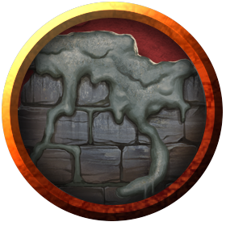

# Ooze
Oozes thrive in the dark, shunning areas of bright light and extreme temperatures. They flow through the damp underground, feeding on any creature or object that can be dissolved, slinking along the ground, dripping from walls and ceilings, spreading across the edges of underground pools, and squeezing through cracks. The first warning an adventurer receives of an ooze’s presence is often the searing pain of its acidic touch.

> Jump to: [Black Pudding](#black-pudding) | [Gelatinous Cube](#gelatinous-cube) | [Gray Ooze](#gray-ooze) | [Ochre Jelly](#ochre-jelly) | [Psychic Gray Ooze](#psychic-gray-ooze)

Oozes are drawn to movement and warmth. Organic material nourishes them, and when prey is scarce they feed on grime, fungus, and offal. Veteran explorers know that an immaculately clean passageway is a likely sign that an ooze lairs nearby.

Slow Death. An ooze kills its prey slowly. Some varieties, such as black puddings and gelatinous cubes, engulf creatures to prevent escape. The only upside of this torturous death is that a victim’s comrades can come to the rescue before it is too late.

Since not every ooze digests every type of substance, some have coins, metal gear, bones, and other debris suspended within their quivering bodies. A slain ooze can be a rich source of treasure for its killers.

Unwitting Servants. Although an ooze lacks the intelligence to ally itself with other creatures, others that understand an ooze’s need to feed might lure it into a location where it can be of use to them. Clever monsters keep oozes around to defend passageways or consume refuse. Likewise, an ooze can be enticed into a pit trap, where its captors feed it often enough to prevent it from coming after them. Crafty creatures place torches and flaming braziers in strategic areas to dissuade an ooze from leaving a particular tunnel or room.

Spawn of Juiblex. According to the Demonomicon of Iggwilv and other sources, oozes are scattered fragments or offspring of the demon lord Juiblex. Whether this is true or not, the Faceless Lord is one of the few beings that can control oozes and imbue them with a modicum of intelligence. Most of the time, oozes have no sense of tactics or self-preservation. They are direct and predictable, attacking and eating without cunning. Under the control of Juiblex, they exhibit glimmers of sentience and malevolent intent.

Ooze Nature. An ooze doesn’t require sleep.

---

## Black Pudding
A black pudding resembles a heaving mound of sticky black sludge. In dim passageways, the pudding appears to be little more than a blot of shadow.

Flesh, wood, metal, and bone dissolve when the pudding ebbs over them. Stone remains behind, wiped clean.

>### Black Pudding
>*Large ooze, unaligned*
>___
>- **Armor Class** 7
>- **Hit Points** 85 (10d10 + 30)
>- **Speed** 20 ft., climb 20 ft.
>___
>|**STR**|**DEX**|**CON**|**INT**|**WIS**|**CHA**|
>|:---:|:---:|:---:|:---:|:---:|:---:|
>|16 (+3)|5 (-3)|16 (+3)|1 (-5)|6 (-2)|1 (-5)|
>
>___
>- **Proficiency Bonus** +0
>- **Saving Throws** 
>- **Damage Vulnerabilities** 
>- **Damage Resistances** 
>- **Damage Immunities** acid,cold,lightning,slashing
>- **Condition Immunities** blinded,charmed,deafened,exhaustion,frightened,prone
>- **Skills** 
>- **Senses** blindsight 60 ft. (blind beyond this radius),passive Perception 8
>- **Languages** —
>- **Challenge** 4
>___
>***Amorphous.*** The pudding can move through a space as narrow as 1 inch wide without squeezing.
>
>***Corrosive Form.*** A creature that touches the pudding or hits it with a melee attack while within 5 feet of it takes 4 (1d8) acid damage. Any nonmagical weapon made of metal or wood that hits the pudding corrodes. After dealing damage, the weapon takes a permanent and cumulative −1 penalty to damage rolls. If its penalty drops to −5, the weapon is destroyed. Nonmagical ammunition made of metal or wood that hits the pudding is destroyed after dealing damage.
>
>The pudding can eat through 2-inch-thick, nonmagical wood or metal in 1 round.
>
>***Spider Climb.*** The pudding can climb difficult surfaces, including upside down on ceilings, without needing to make an ability check.
>
>#### Actions
>***Pseudopod.*** Melee Weapon Attack: +5 to hit, reach 5 ft., one target. Hit: 6 (1d6 + 3) bludgeoning damage plus 18 (4d8) acid damage. In addition, nonmagical armor worn by the target is partly dissolved and takes a permanent and cumulative −1 penalty to the AC it offers. The armor is destroyed if the penalty reduces its AC to 10.
>
>#### Legendary Actions
>Reactions
>
>***Split.*** When a pudding that is Medium or larger is subjected to lightning or slashing damage, it splits into two new puddings if it has at least 10 hit points. Each new pudding has hit points equal to half the original pudding’s, rounded down. New puddings are one size smaller than the original pudding.
>
>#### Token
>

---

## Gelatinous Cube
Gelatinous cubes scour dungeon passages in silent, predictable patterns, leaving perfectly clean paths in their wake. They consume living tissue while leaving bones and other materials undissolved.

A gelatinous cube is all but transparent, making it hard to spot until it attacks. A cube that is well fed can be easier to spot, since its victims’ bones, coins, and other objects can be seen suspended inside the creature.

>### Gelatinous Cube
>*Large ooze, unaligned*
>___
>- **Armor Class** 6
>- **Hit Points** 84 (8d10 + 40)
>- **Speed** 15 ft.
>___
>|**STR**|**DEX**|**CON**|**INT**|**WIS**|**CHA**|
>|:---:|:---:|:---:|:---:|:---:|:---:|
>|14 (+2)|3 (-4)|20 (+5)|1 (-5)|6 (-2)|1 (-5)|
>
>___
>- **Proficiency Bonus** +0
>- **Saving Throws** 
>- **Damage Vulnerabilities** 
>- **Damage Resistances** 
>- **Damage Immunities** 
>- **Condition Immunities** blinded,charmed,deafened,exhaustion,frightened,prone
>- **Skills** 
>- **Senses** blindsight 60 ft. (blind beyond this radius),passive Perception 8
>- **Languages** —
>- **Challenge** 2
>___
>***Ooze Cube.*** The cube takes up its entire space. Other creatures can enter the space, but a creature that does so is subjected to the cube’s Engulf and has disadvantage on the saving throw.
>
>Creatures inside the cube can be seen but have total cover.
>
>A creature within 5 feet of the cube can take an action to pull a creature or object out of the cube. Doing so requires a successful DC 12 Strength check, and the creature making the attempt takes 10 (3d6) acid damage.
>
>The cube can hold only one Large creature or up to four Medium or smaller creatures inside it at a time.
>
>***Transparent.*** Even when the cube is in plain sight, it takes a successful DC 15 Wisdom (Perception) check to spot a cube that has neither moved nor attacked. A creature that tries to enter the cube’s space while unaware of the cube is surprised by the cube.
>
>#### Actions
>***Pseudopod.*** Melee Weapon Attack: +4 to hit, reach 5 ft., one creature. Hit: 10 (3d6) acid damage.
>
>***Engulf.*** The cube moves up to its speed. While doing so, it can enter Large or smaller creatures’ spaces. Whenever the cube enters a creature’s space, the creature must make a DC 12 Dexterity saving throw.
>
>On a successful save, the creature can choose to be pushed 5 feet back or to the side of the cube. A creature that chooses not to be pushed suffers the consequences of a failed saving throw.
>
>On a failed save, the cube enters the creature’s space, and the creature takes 10 (3d6) acid damage and is engulfed. The engulfed creature can’t breathe, is restrained, and takes 21 (6d6) acid damage at the start of each of the cube’s turns. When the cube moves, the engulfed creature moves with it.
>
>An engulfed creature can try to escape by taking an action to make a DC 12 Strength check. On a success, the creature escapes and enters a space of its choice within 5 feet of the cube.
>
>#### Token
>

---

## Gray Ooze
A gray ooze is stone turned to liquid by chaos. When it moves, it slithers like a liquid snake, rising to strike.

>### Gray Ooze
>*Medium ooze, unaligned*
>___
>- **Armor Class** 8
>- **Hit Points** 22 (3d8 + 9)
>- **Speed** 10 ft., climb 10 ft.
>___
>|**STR**|**DEX**|**CON**|**INT**|**WIS**|**CHA**|
>|:---:|:---:|:---:|:---:|:---:|:---:|
>|12 (+1)|6 (-2)|16 (+3)|1 (-5)|6 (-2)|2 (-4)|
>
>___
>- **Proficiency Bonus** +0
>- **Saving Throws** 
>- **Damage Vulnerabilities** 
>- **Damage Resistances** acid,cold,fire
>- **Damage Immunities** 
>- **Condition Immunities** blinded,charmed,deafened,exhaustion,frightened,prone
>- **Skills** Stealth +2
>- **Senses** blindsight 60 ft. (blind beyond this radius),passive Perception 8
>- **Languages** —
>- **Challenge** 1/2
>___
>***Amorphous.*** The ooze can move through a space as narrow as 1 inch wide without squeezing.
>
>***Corrode Metal.*** Any nonmagical weapon made of metal that hits the ooze corrodes. After dealing damage, the weapon takes a permanent and cumulative −1 penalty to damage rolls. If its penalty drops to −5, the weapon is destroyed. Nonmagical ammunition made of metal that hits the ooze is destroyed after dealing damage.
>
>The ooze can eat through 2-inch-thick, nonmagical metal in 1 round.
>
>***False Appearance.*** While the ooze remains motionless, it is indistinguishable from an oily pool or wet rock.
>
>#### Actions
>***Pseudopod.*** Melee Weapon Attack: +3 to hit, reach 5 ft., one target. Hit: 4 (1d6 + 1) bludgeoning damage plus 7 (2d6) acid damage, and if the target is wearing nonmagical metal armor, its armor is partly corroded and takes a permanent and cumulative −1 penalty to the AC it offers. The armor is destroyed if the penalty reduces its AC to 10.
>
>#### Token
>

---

## Ochre Jelly
Ochre jellies are yellowish blobs that can slide under doors and through narrow cracks in pursuit of creatures to devour. They have enough bestial cunning to avoid large groups of enemies.

An ochre jelly follows at a safe distance as it pursues its meal. Its digestive enzymes dissolve flesh quickly but have no effect on other substances such as bone, wood, and metal.

>### Ochre Jelly
>*Large ooze, unaligned*
>___
>- **Armor Class** 8
>- **Hit Points** 45 (6d10 + 12)
>- **Speed** 10 ft., climb 10 ft.
>___
>|**STR**|**DEX**|**CON**|**INT**|**WIS**|**CHA**|
>|:---:|:---:|:---:|:---:|:---:|:---:|
>|15 (+2)|6 (-2)|14 (+2)|2 (-4)|6 (-2)|1 (-5)|
>
>___
>- **Proficiency Bonus** +0
>- **Saving Throws** 
>- **Damage Vulnerabilities** 
>- **Damage Resistances** acid
>- **Damage Immunities** lightning,slashing
>- **Condition Immunities** blinded,charmed,deafened,exhaustion,frightened,prone
>- **Skills** 
>- **Senses** blindsight 60 ft. (blind beyond this radius),passive Perception 8
>- **Languages** —
>- **Challenge** 2
>___
>***Amorphous.*** The jelly can move through a space as narrow as 1 inch wide without squeezing.
>
>***Spider Climb.*** The jelly can climb difficult surfaces, including upside down on ceilings, without needing to make an ability check.
>
>#### Actions
>***Pseudopod.*** Melee Weapon Attack: +4 to hit, reach 5 ft., one target. Hit: 9 (2d6 + 2) bludgeoning damage plus 3 (1d6) acid damage.
>
>#### Reactions
>
>***Split.*** When a jelly that is Medium or larger is subjected to lightning or slashing damage, it splits into two new jellies if it has at least 10 hit points. Each new jelly has hit points equal to half the original jelly’s, rounded down. New jellies are one size smaller than the original jelly.
>
>#### Token
>
>

---

## Psychic Gray Ooze
A gray ooze that lives a long time can evolve to become more intelligent and develop limited psionic ability. Such occurrences are more common in gray oozes that live near psionic creatures such as [mind flayers](MindFlayers.md), suggesting that the ooze can sense and mimic psionic ability.

A psionic gray ooze has an Intelligence score of 6 (−2), as well as the following additional action.

>### Psychic Gray Ooze
>*Medium ooze, unaligned*
>___
>- **Armor Class** 8
>- **Hit Points** 22 (3d8 + 9)
>- **Speed** 10 ft., climb 10 ft.
>___
>|**STR**|**DEX**|**CON**|**INT**|**WIS**|**CHA**|
>|:---:|:---:|:---:|:---:|:---:|:---:|
>|12 (+1)|6 (-2)|16 (+3)|6 (-2)|6 (-2)|2 (-4)|
>
>___
>- **Proficiency Bonus** +0
>- **Saving Throws** 
>- **Damage Vulnerabilities** 
>- **Damage Resistances** acid,cold,fire
>- **Damage Immunities** 
>- **Condition Immunities** blinded,charmed,deafened,exhaustion,frightened,prone
>- **Skills** Stealth +2
>- **Senses** blindsight 60 ft. (blind beyond this radius),passive Perception 8
>- **Languages** —
>- **Challenge** 1/2
>___
>***Amorphous.*** The ooze can move through a space as narrow as 1 inch wide without squeezing.
>
>***Corrode Metal.*** Any nonmagical weapon made of metal that hits the ooze corrodes. After dealing damage, the weapon takes a permanent and cumulative −1 penalty to damage rolls. If its penalty drops to −5, the weapon is destroyed. Nonmagical ammunition made of metal that hits the ooze is destroyed after dealing damage.
>
>The ooze can eat through 2-inch-thick, nonmagical metal in 1 round.
>
>***False Appearance.*** While the ooze remains motionless, it is indistinguishable from an oily pool or wet rock.
>
>#### Actions
>***Pseudopod.*** Melee Weapon Attack: +3 to hit, reach 5 ft., one target. Hit: 4 (1d6 + 1) bludgeoning damage plus 7 (2d6) acid damage, and if the target is wearing nonmagical metal armor, its armor is partly corroded and takes a permanent and cumulative −1 penalty to the AC it offers. The armor is destroyed if the penalty reduces its AC to 10.
>
>***Psychic Crush (Recharge 5–6).*** The ooze targets one creature that it can sense within 60 feet of it. The target must make a DC 10 Intelligence saving throw, taking 10 (3d6) psychic damage on a failed save, or half as much damage on a successful one.
>
>#### Token
>
>