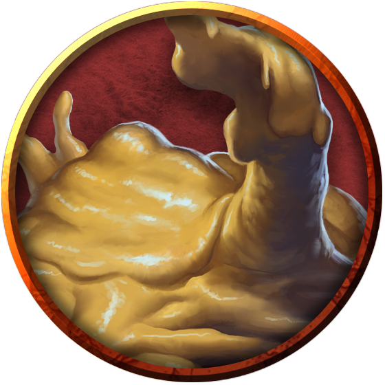

# Oozes
Oozes thrive in the dark, shunning areas of bright light and extreme temperatures. They flow through the damp underground, feeding on any creature or object that can be dissolved, slinking along the ground, dripping from walls and ceilings, spreading across the edges of underground pools, and squeezing through cracks. The first warning an adventurer receives of an ooze's presence is often the searing pain of its acidic touch.

> Jump to: [Black Pudding](Oozes.md#black-pudding) | [Gelatinous Cube](Oozes.md#gelatinous-cube) | [Gray Ooze](Oozes.md#gray-ooze) | [Ochre Jelly](Oozes.md#ochre-jelly) | [Psychic Gray Ooze](Oozes.md#psychic-gray-ooze) | [Slithering Tracker](Oozes.md#slithering-tracker) | [Molten Ooze](Oozes.md#molten-ooze)

Oozes are drawn to movement and warmth. Organic material nourishes them, and when prey is scarce they feed on grime, fungus, and offal. Veteran explorers know that an immaculately clean passageway is a likely sign that an ooze lairs nearby.

***Slow Death.*** An ooze kills its prey slowly. Some varieties, such as black puddings and gelatinous cubes, engulf creatures to prevent escape. The only upside of this torturous death is that a victim's comrades can come to the rescue before it is too late.

Since not every ooze digests every type of substance, some have coins, metal gear, bones, and other debris suspended within their quivering bodies. A slain ooze can be a rich source of treasure for its killers.

***Unwitting Servants.*** Although an ooze lacks the intelligence to ally itself with other creatures, others that understand an ooze's need to feed might lure it into a location where it can be of use to them. Clever monsters keep oozes around to defend passageways or consume refuse. Likewise, an ooze can be enticed into a pit trap, where its captors feed it often enough to prevent it from coming after them. Crafty creatures place torches and flaming braziers in strategic areas to dissuade an ooze from leaving a particular tunnel or room.

***Spawn of Juiblex.*** According to the Demonomicon of Iggwilv and other sources, oozes are scattered fragments or offspring of the demon lord Juiblex. Whether this is true or not, the Faceless Lord is one of the few beings that can control oozes and imbue them with a modicum of intelligence. Most of the time, oozes have no sense of tactics or self-preservation. They are direct and predictable, attacking and eating without cunning. Under the control of Juiblex, they exhibit glimmers of sentience and malevolent intent.

***Ooze Nature.*** An ooze doesn't require sleep.

---

## Black Pudding
A black pudding resembles a heaving mound of sticky black sludge. In dim passageways, the pudding appears to be little more than a blot of shadow.

Flesh, wood, metal, and bone dissolve when the pudding ebbs over them. Stone remains behind, wiped clean.

### Environment
(FIXME)

### Token

>### Black Pudding
>*Large ooze, unaligned*
>___
>- **Armor Class** 7
>- **Hit Points** 85 (10d10 + 30)
>- **Speed** 20 ft., climb 20 ft.
>___
>|**STR**|**DEX**|**CON**|**INT**|**WIS**|**CHA**|
>|:---:|:---:|:---:|:---:|:---:|:---:|
>|16 (+3)|5 (-3)|16 (+3)|1 (-5)|6 (-2)|1 (-5)|
>
>___
>- **Proficiency Bonus** +2
>- **Saving Throws** 
>- **Damage Vulnerabilities** 
>- **Damage Resistances** 
>- **Damage Immunities** acid,cold,lightning,slashing
>- **Condition Immunities** blinded,charmed,deafened,exhaustion,frightened,prone
>- **Skills** 
>- **Senses** blindsight 60 ft. (blind beyond this radius),passive Perception 8
>- **Languages** —
>- **Challenge** 4
>___
>***Amorphous.*** The pudding can move through a space as narrow as 1 inch wide without squeezing.
>
>***Corrosive Form.*** A creature that touches the pudding or hits it with a melee attack while within 5 feet of it takes 4 (1d8) acid damage. Any nonmagical weapon made of metal or wood that hits the pudding corrodes. After dealing damage, the weapon takes a permanent and cumulative −1 penalty to damage rolls. If its penalty drops to −5, the weapon is destroyed. Nonmagical ammunition made of metal or wood that hits the pudding is destroyed after dealing damage.
>
>The pudding can eat through 2-inch-thick, nonmagical wood or metal in 1 round.
>
>***Spider Climb.*** The pudding can climb difficult surfaces, including upside down on ceilings, without needing to make an ability check.
>
>#### Actions
>***Pseudopod.*** Melee Weapon Attack: +5 to hit, reach 5 ft., one target. Hit: 6 (1d6 + 3) bludgeoning damage plus 18 (4d8) acid damage. In addition, nonmagical armor worn by the target is partly dissolved and takes a permanent and cumulative −1 penalty to the AC it offers. The armor is destroyed if the penalty reduces its AC to 10.
>
>#### Legendary Actions
>Reactions
>
>***Split.*** When a pudding that is Medium or larger is subjected to lightning or slashing damage, it splits into two new puddings if it has at least 10 hit points. Each new pudding has hit points equal to half the original pudding's, rounded down. New puddings are one size smaller than the original pudding.
>
>## Token
>
>
>

---

## Gelatinous Cube
Gelatinous cubes scour dungeon passages in silent, predictable patterns, leaving perfectly clean paths in their wake. They consume living tissue while leaving bones and other materials undissolved.

A gelatinous cube is all but transparent, making it hard to spot until it attacks. A cube that is well fed can be easier to spot, since its victims' bones, coins, and other objects can be seen suspended inside the creature.

### Environment
(FIXME)

### Token

>### Gelatinous Cube
>*Large ooze, unaligned*
>___
>- **Armor Class** 6
>- **Hit Points** 84 (8d10 + 40)
>- **Speed** 15 ft.
>___
>|**STR**|**DEX**|**CON**|**INT**|**WIS**|**CHA**|
>|:---:|:---:|:---:|:---:|:---:|:---:|
>|14 (+2)|3 (-4)|20 (+5)|1 (-5)|6 (-2)|1 (-5)|
>
>___
>- **Proficiency Bonus** +2
>- **Saving Throws** 
>- **Damage Vulnerabilities** 
>- **Damage Resistances** 
>- **Damage Immunities** 
>- **Condition Immunities** blinded,charmed,deafened,exhaustion,frightened,prone
>- **Skills** 
>- **Senses** blindsight 60 ft. (blind beyond this radius),passive Perception 8
>- **Languages** —
>- **Challenge** 2
>___
>***Ooze Cube.*** The cube takes up its entire space. Other creatures can enter the space, but a creature that does so is subjected to the cube's Engulf and has disadvantage on the saving throw.
>
>Creatures inside the cube can be seen but have total cover.
>
>A creature within 5 feet of the cube can take an action to pull a creature or object out of the cube. Doing so requires a successful DC 12 Strength check, and the creature making the attempt takes 10 (3d6) acid damage.
>
>The cube can hold only one Large creature or up to four Medium or smaller creatures inside it at a time.
>
>***Transparent.*** Even when the cube is in plain sight, it takes a successful DC 15 Wisdom (Perception) check to spot a cube that has neither moved nor attacked. A creature that tries to enter the cube's space while unaware of the cube is surprised by the cube.
>
>#### Actions
>***Pseudopod.*** Melee Weapon Attack: +4 to hit, reach 5 ft., one creature. Hit: 10 (3d6) acid damage.
>
>***Engulf.*** The cube moves up to its speed. While doing so, it can enter Large or smaller creatures' spaces. Whenever the cube enters a creature's space, the creature must make a DC 12 Dexterity saving throw.
>
>On a successful save, the creature can choose to be pushed 5 feet back or to the side of the cube. A creature that chooses not to be pushed suffers the consequences of a failed saving throw.
>
>On a failed save, the cube enters the creature's space, and the creature takes 10 (3d6) acid damage and is engulfed. The engulfed creature can't breathe, is restrained, and takes 21 (6d6) acid damage at the start of each of the cube's turns. When the cube moves, the engulfed creature moves with it.
>
>An engulfed creature can try to escape by taking an action to make a DC 12 Strength check. On a success, the creature escapes and enters a space of its choice within 5 feet of the cube.
>
>## Token
>
>
>

---

## Gray Ooze
A gray ooze is stone turned to liquid by chaos. When it moves, it slithers like a liquid snake, rising to strike.

### Environment
(FIXME)

### Token

>### Gray Ooze
>*Medium ooze, unaligned*
>___
>- **Armor Class** 8
>- **Hit Points** 22 (3d8 + 9)
>- **Speed** 10 ft., climb 10 ft.
>___
>|**STR**|**DEX**|**CON**|**INT**|**WIS**|**CHA**|
>|:---:|:---:|:---:|:---:|:---:|:---:|
>|12 (+1)|6 (-2)|16 (+3)|1 (-5)|6 (-2)|2 (-4)|
>
>___
>- **Proficiency Bonus** +2
>- **Saving Throws** 
>- **Damage Vulnerabilities** 
>- **Damage Resistances** acid,cold,fire
>- **Damage Immunities** 
>- **Condition Immunities** blinded,charmed,deafened,exhaustion,frightened,prone
>- **Skills** Stealth +2
>- **Senses** blindsight 60 ft. (blind beyond this radius),passive Perception 8
>- **Languages** —
>- **Challenge** 1/2
>___
>***Amorphous.*** The ooze can move through a space as narrow as 1 inch wide without squeezing.
>
>***Corrode Metal.*** Any nonmagical weapon made of metal that hits the ooze corrodes. After dealing damage, the weapon takes a permanent and cumulative −1 penalty to damage rolls. If its penalty drops to −5, the weapon is destroyed. Nonmagical ammunition made of metal that hits the ooze is destroyed after dealing damage.
>
>The ooze can eat through 2-inch-thick, nonmagical metal in 1 round.
>
>***False Appearance.*** While the ooze remains motionless, it is indistinguishable from an oily pool or wet rock.
>
>#### Actions
>***Pseudopod.*** Melee Weapon Attack: +3 to hit, reach 5 ft., one target. Hit: 4 (1d6 + 1) bludgeoning damage plus 7 (2d6) acid damage, and if the target is wearing nonmagical metal armor, its armor is partly corroded and takes a permanent and cumulative −1 penalty to the AC it offers. The armor is destroyed if the penalty reduces its AC to 10.
>
>## Token
>
>
>

---

## Huge Gray Ooze
A gray ooze is stone turned to liquid by chaos. When it moves, it slithers like a liquid snake, rising to strike.

### Environment
(FIXME)

### Token

>### Huge Gray Ooze
>*Huge ooze, unaligned*
>___
>- **Armor Class** 8
>- **Hit Points** 152 (16d12 + 48)
>- **Speed** 10 ft., climb 10 ft.
>___
>|**STR**|**DEX**|**CON**|**INT**|**WIS**|**CHA**|
>|:---:|:---:|:---:|:---:|:---:|:---:|
>|18 (+4)|6 (-2)|16 (+3)|1 (-5)|6 (-2)|2 (-4)|
>
>___
>- **Proficiency Bonus** +3
>- **Saving Throws** 
>- **Damage Vulnerabilities** 
>- **Damage Resistances** 
>- **Damage Immunities** acid,cold,fire
>- **Condition Immunities** blinded,charmed,deafened,exhaustion,frightened,prone
>- **Skills** Stealth +2
>- **Senses** blindsight 60 ft. (blind beyond this radius),passive Perception 8
>- **Languages** —
>- **Challenge** 8
>___
>***Amorphous.*** The ooze can move through a space as narrow as 1 inch wide without squeezing.
>
>***Corrode Metal.*** Any nonmagical weapon made of metal that hits the ooze corrodes. After dealing damage, the weapon takes a permanent and cumulative −1 penalty to damage rolls. If its penalty drops to −5, the weapon is destroyed. Nonmagical ammunition made of metal that hits the ooze is destroyed after dealing damage.
>
>The ooze can eat through 2-inch-thick, nonmagical metal in 1 round.
>
>***False Appearance.*** While the ooze remains motionless, it is indistinguishable from an oily pool or wet rock.
>
>#### Actions
>***Multiattack.*** As an action, it can make two attack with its pseudopods.
>
>***Pseudopod.*** Melee Weapon Attack: +7 to hit, reach 5 ft., one target. Hit: 21 (6d6) acid damage, or 42 (12d6) acid damage while the ooze is enlarged. If the target is wearing nonmagical metal armor, its armor is partly corroded and takes a permanent and cumulative -1 penalty to the AC it offers. The armor is destroyed if the penalty reduces its AC to 10.
>
>***Enlarge (Recharges after a Short or Long Rest).*** For 1 minute, the ooze magically increases in size. While enlarged, the ooze is Gargantuan, doubles its damage dice with its pseudopod attack, and makes Strength checks and Strength saving throws with advantage.
>
>***Invisibility (Recharges after a Short or Long Rest).*** The ooze magically turns invisible for up to 1 hour until it attacks, it uses its Enlarge, or its concentration is broken (as if concentrating on a spell).
>
>## Token
>
>
>

---

## Ochre Jelly
Ochre jellies are yellowish blobs that can slide under doors and through narrow cracks in pursuit of creatures to devour. They have enough bestial cunning to avoid large groups of enemies.

An ochre jelly follows at a safe distance as it pursues its meal. Its digestive enzymes dissolve flesh quickly but have no effect on other substances such as bone, wood, and metal.

### Environment
(FIXME)

### Token

>### Ochre Jelly
>*Large ooze, unaligned*
>___
>- **Armor Class** 8
>- **Hit Points** 45 (6d10 + 12)
>- **Speed** 10 ft., climb 10 ft.
>___
>|**STR**|**DEX**|**CON**|**INT**|**WIS**|**CHA**|
>|:---:|:---:|:---:|:---:|:---:|:---:|
>|15 (+2)|6 (-2)|14 (+2)|2 (-4)|6 (-2)|1 (-5)|
>
>___
>- **Proficiency Bonus** +2
>- **Saving Throws** 
>- **Damage Vulnerabilities** 
>- **Damage Resistances** acid
>- **Damage Immunities** lightning,slashing
>- **Condition Immunities** blinded,charmed,deafened,exhaustion,frightened,prone
>- **Skills** 
>- **Senses** blindsight 60 ft. (blind beyond this radius),passive Perception 8
>- **Languages** —
>- **Challenge** 2
>___
>***Amorphous.*** The jelly can move through a space as narrow as 1 inch wide without squeezing.
>
>***Spider Climb.*** The jelly can climb difficult surfaces, including upside down on ceilings, without needing to make an ability check.
>
>#### Actions
>***Pseudopod.*** Melee Weapon Attack: +4 to hit, reach 5 ft., one target. Hit: 9 (2d6 + 2) bludgeoning damage plus 3 (1d6) acid damage.
>
>#### Reactions
>***Split.*** When a jelly that is Medium or larger is subjected to lightning or slashing damage, it splits into two new jellies if it has at least 10 hit points. Each new jelly has hit points equal to half the original jelly's, rounded down. New jellies are one size smaller than the original jelly.
>
>## Token
>
>
>

---

## Psychic Gray Ooze
A gray ooze that lives a long time can evolve to become more intelligent and develop limited psionic ability. Such occurrences are more common in gray oozes that live near psionic creatures such as [mind flayers](MindFlayers.md), suggesting that the ooze can sense and mimic psionic ability.

A psionic gray ooze has an Intelligence score of 6 (−2), as well as the following additional action.

### Environment
(FIXME)

### Token

>### Psychic Gray Ooze
>*Medium ooze, unaligned*
>___
>- **Armor Class** 8
>- **Hit Points** 22 (3d8 + 9)
>- **Speed** 10 ft., climb 10 ft.
>___
>|**STR**|**DEX**|**CON**|**INT**|**WIS**|**CHA**|
>|:---:|:---:|:---:|:---:|:---:|:---:|
>|12 (+1)|6 (-2)|16 (+3)|6 (-2)|6 (-2)|2 (-4)|
>
>___
>- **Proficiency Bonus** +2
>- **Saving Throws** 
>- **Damage Vulnerabilities** 
>- **Damage Resistances** acid,cold,fire
>- **Damage Immunities** 
>- **Condition Immunities** blinded,charmed,deafened,exhaustion,frightened,prone
>- **Skills** Stealth +2
>- **Senses** blindsight 60 ft. (blind beyond this radius),passive Perception 8
>- **Languages** —
>- **Challenge** 1/2
>___
>***Amorphous.*** The ooze can move through a space as narrow as 1 inch wide without squeezing.
>
>***Corrode Metal.*** Any nonmagical weapon made of metal that hits the ooze corrodes. After dealing damage, the weapon takes a permanent and cumulative −1 penalty to damage rolls. If its penalty drops to −5, the weapon is destroyed. Nonmagical ammunition made of metal that hits the ooze is destroyed after dealing damage.
>
>The ooze can eat through 2-inch-thick, nonmagical metal in 1 round.
>
>***False Appearance.*** While the ooze remains motionless, it is indistinguishable from an oily pool or wet rock.
>
>#### Actions
>***Pseudopod.*** Melee Weapon Attack: +3 to hit, reach 5 ft., one target. Hit: 4 (1d6 + 1) bludgeoning damage plus 7 (2d6) acid damage, and if the target is wearing nonmagical metal armor, its armor is partly corroded and takes a permanent and cumulative −1 penalty to the AC it offers. The armor is destroyed if the penalty reduces its AC to 10.
>
>***Psychic Crush (Recharge 5–6).*** The ooze targets one creature that it can sense within 60 feet of it. The target must make a DC 10 Intelligence saving throw, taking 10 (3d6) psychic damage on a failed save, or half as much damage on a successful one.
>
>## Token
>
>
>

---

## Large Psychic Gray Ooze
A gray ooze that lives a long time can evolve to become more intelligent and develop limited psionic ability. Such occurrences are more common in gray oozes that live near psionic creatures such as [mind flayers](MindFlayers.md), suggesting that the ooze can sense and mimic psionic ability. Some are well-fed and grow to frightening sizes.

A psionic gray ooze has an Intelligence score of 6 (−2), as well as the following additional action.

### Environment
(FIXME)

### Token

>### Large Psychic Gray Ooze
>*Large ooze, unaligned*
>___
>- **Armor Class** 8
>- **Hit Points** 68 (8d10 + 24)
>- **Speed** 10 ft., climb 10 ft.
>___
>|**STR**|**DEX**|**CON**|**INT**|**WIS**|**CHA**|
>|:---:|:---:|:---:|:---:|:---:|:---:|
>|15 (+2)|6 (-2)|16 (+3)|6 (-2)|6 (-2)|2 (-4)|
>
>___
>- **Proficiency Bonus** +3
>- **Saving Throws** 
>- **Damage Vulnerabilities** 
>- **Damage Resistances** acid,cold,fire
>- **Damage Immunities** 
>- **Condition Immunities** blinded,charmed,deafened,exhaustion,frightened,prone
>- **Skills** Stealth +2
>- **Senses** blindsight 60 ft. (blind beyond this radius),passive Perception 8
>- **Languages** —
>- **Challenge** 2
>___
>***Amorphous.*** The ooze can move through a space as narrow as 1 inch wide without squeezing.
>
>***Corrode Metal.*** Any nonmagical weapon made of metal that hits the ooze corrodes. After dealing damage, the weapon takes a permanent and cumulative −1 penalty to damage rolls. If its penalty drops to −5, the weapon is destroyed. Nonmagical ammunition made of metal that hits the ooze is destroyed after dealing damage.
>
>The ooze can eat through 2-inch-thick, nonmagical metal in 1 round.
>
>***False Appearance.*** While the ooze remains motionless, it is indistinguishable from an oily pool or wet rock.
>
>#### Actions
>***Multiattack.*** The ooze can use both its Pseudopod and its Psychic Crush attack as part of its Attack action.
>
>***Pseudopod.*** Melee Weapon Attack: +4 to hit, reach 5 ft., one target. Hit: 8 (2d6 + 2) bludgeoning damage plus 14 (4d6) acid damage, and if the target is wearing nonmagical metal armor, its armor is partly corroded and takes a permanent and cumulative −1 penalty to the AC it offers. The armor is destroyed if the penalty reduces its AC to 10.
>
>***Psychic Crush (Recharge 5–6).*** The ooze targets one creature that it can sense within 60 feet of it. The target must make a DC 14 Intelligence saving throw, taking 20 (6d6) psychic damage on a failed save, or half as much damage on a successful one.
>
>## Token
>
>
>

---

## Slithering Tracker
The quest for revenge sometimes leads one to undergo a ritual whereby they transform into a body of semiliquid sentience known as a slithering tracker. Innocuous and insidious at the same time, a tracker flows into places where a normal creature can't go and brings its own brand of watery death down upon its quarry.

***Vengeance at Any Cost.*** The ritual for creating a slithering tracker is known to hags, liches, and priests who worship gods of vengeance. It can only be performed on a willing creature that hungers for revenge. The ritual sucks all the moisture from the person's body, killing it. Yet the mind lives on in the puddle of liquid that issues forth from the remains, and so too does the subject's insatiable need for retribution.

***Stealthy Assassins.*** A slithering tracker tastes the ground it courses over, seeking any trace of its prey. To kill, a slithering tracker rises up and enshrouds a creature, attempting to drown the prey while also draining it of blood. A slithering tracker that has killed in this fashion becomes much easier to locate for a time, since its liquid form becomes tinged with blood and its body leaves a visible trail of the stuff behind it.

***Descent into Madness.*** Achieving revenge against its target doesn't end a slithering tracker's existence, nor its hunger for blood. Some slithering trackers remain aware of their purpose and extend their quest for vengeance to others, such as anyone who supported or befriended the original target. Most of the time, though, a tracker's mind can't cope with being trapped in liquid form, unable to communicate, and driven by the desire for blood: after a tracker fulfills its duty, insanity takes over the creature, and it attacks indiscriminately until it is destroyed.

### Environment
Extraplanar, Conjured/Summoned

### Token

>### Slithering Tracker
>*Medium Ooze, Typically Chaotic Evil*
>___
>- **Armor Class** 14
>- **Hit Points** 39 (6d8 + 12)
>- **Speed** 30 ft., climb 30 ft., swim 30 ft.
>___
>|**STR**|**DEX**|**CON**|**INT**|**WIS**|**CHA**|
>|:---:|:---:|:---:|:---:|:---:|:---:|
>|16 (+3)|19 (+4)|15 (+2)|10 (+0)|14 (+2)|11 (+0)|
>
>___
>- **Proficiency Bonus** +2
>- **Saving Throws** 
>- **Damage Vulnerabilities** cold,fire
>- **Damage Resistances** bludgeoning,piercing,and slashing from nonmagical attacks
>- **Damage Immunities** 
>- **Condition Immunities** blinded,deafened,exhaustion,grappled,paralyzed,petrified,prone,restrained,unconscious
>- **Skills** Stealth +8,Survival +6
>- **Senses** blindsight 120 ft.,passive Perception 12
>- **Languages** understands languages it knew in its previous form but can't speak
>- **Challenge** 3
>___
>***False Appearance.*** If the slithering tracker is motionless at the start of combat, it has advantage on its initiative roll. Moreover, if a creature hasn't observed the slithering tracker move or act, that creature must succeed on a DC 18 Intelligence (Investigation) check to discern that the slithering tracker isn't a puddle.
>
>***Liquid Form.*** The slithering tracker can enter an enemy's space and stop there. It can also move through a space as narrow as 1 inch wide without squeezing.
>
>***Spider Climb.*** The slithering tracker can climb difficult surfaces, including upside down on ceilings, without needing to make an ability check.
>
>#### Actions
>***Slam.*** Melee Weapon Attack: +5 to hit, reach 5 ft., one target. Hit: 8 (1d10 + 3) bludgeoning damage.
>
>***Life Leech.*** One Large or smaller creature that the slithering tracker can see within 5 feet of it must succeed on a DC 13 Dexterity saving throw or be grappled (escape DC 13). Until this grapple ends, the target is restrained and unable to breathe unless it can breathe water. In addition, the grappled target takes 16 (3d10) necrotic damage at the start of each of its turns. The slithering tracker can grapple only one target at a time.
>
>While grappling the target, the slithering tracker takes only half any damage dealt to it (rounded down), and the target takes the other half.
>
>#### Bonus Actions
>***Watery Stealth.*** If underwater, the slithering tracker takes the Hide action, and it makes the Dexterity (Stealth) check with advantage.
>

---

## Molten Ooze
Oozes are simple-minded, amorphous creatures that live only to consume. Some oozes take on elemental traits, such as the heated kind known as a molten ooze. It is mottled with red and black and speckled with orange flecks, and is easily mistaken for lava itself. Its body is dense, viscous, and resilient against harm. These oozes are extremely dangerous for novice adventurers.

When a molten ooze moves, it rolls like a slow, fiery bubble, or flows like a slithering trickle of lava. Any organic material it moves over is dissolved, and any remains are seared to ash, which the ooze will also consume. It leaves stone and metal unharmed.

Molten oozes typically dwell within volcanoes or fiery caverns beneath the earth, although some lurk in alleys and abandoned buildings in the City of Brass, the efreeti capital in the Elemental Plane of Fire. Some efreeti even keep these oozes as pets, using them to dispose of waste and to clean surfaces in their palaces. In a pinch, the oozes can even serve as defenders against enemies, but anyone who keeps an ooze as a pet knows that the ooze doesn't distinguish friend from food, especially in the chaos of a frenzied battle.

### Environment
Extraplanar, Mountain, Volcano, Conjured/Summoned

### Token

>### Molten Ooze
>*Medium ooze, unaligned*
>___
>- **Armor Class** 6
>- **Hit Points** 110 (13d8 + 52)
>- **Speed** 20 ft., climb 20 ft.
>___
>|**STR**|**DEX**|**CON**|**INT**|**WIS**|**CHA**|
>|:---:|:---:|:---:|:---:|:---:|:---:|
>|14 (+2)|3 (-4)|19 (+4)|1 (-5)|6 (-2)|1 (-5)|
>
>___
>- **Proficiency Bonus** +2
>- **Saving Throws** 
>- **Damage Vulnerabilities** 
>- **Damage Resistances** 
>- **Damage Immunities** acid, fire, lightning, slashing
>- **Condition Immunities** blinded, charmed, deafened, exhaustion, frightened, prone
>- **Skills** 
>- **Senses** blindsight 60 ft. (blind beyond this radius),passive Perception 8
>- **Languages** --
>- **Challenge** 7
>___
>***Amorphous.*** The ooze can move through a space as narrow as l inch wide without squeezing.
>
>***False Appearance.*** While the ooze remains motionless, it is indistinguishable from a pool of lava or a molten rock.
>
***Molten Form.*** A creature that touches the ooze or hits it with a melee attack while within 5 feet of it takes 3 (1d6) acid damage plus 5 (1d10) fire damage. At the start of the ooze's turn, it also deals this damage to each creature that it is grappling.
>
>***Spider Climb.*** The molten ooze can climb difficult surfaces, including upside down on ceilings, without needing to make an ability check.
>
>#### Actions
>***Pseudopod.*** *Melee Weapon Attack:* +5 to hit, reach 5 ft., one target. Hit: 5 (1d6 + 2) bludgeoning damage plus 7
(2d6) acid damage and 9 (2d8) fire damage, and if the target is a creature, it is grappled (escape DC 14). While grappled in this way, the target is also restrained. Until this grapple ends, the ooze can't attack another target. If the target is a creature or a flammable object, it is also set ablaze. Until a creature takes an action to douse the fire, the creature takes 5 (1d10) fire damage at the end of each of its turns.
>

---

## Winter Ooze
Oozes are simple-minded, amorphous creatures that live only to consume. Some oozes take on elemental traits, such as the frozen kind known as a winter ooze. It is often a murky white or clear, speckled with off-white flecks, and is easily mistaken for a pool of cold water or a formation of ice. Its body is dense, viscous, and resilient against harm. These oozes are extremely dangerous for novice adventurers.

When a molten ooze moves, it rolls like a slow, icy ball, or flows like a slithering trickle of slush. Any organic material it moves over is dissolved, and any remains are frozen and shattered, which the ooze will also consume. It leaves stone and metal unharmed.

Frozen oozes typically dwell within glaciers or frozen caverns in arctic conditions, although some lurk in alleys and abandoned buildings in the City of Ice, the capital in the Elemental Plane of Ice. For some who keep the frozen oozes as pets, the oozes can even serve as defenders against enemies, but anyone who keeps an ooze as a pet knows that the ooze doesn't distinguish friend from food, especially in the chaos of a frenzied battle.

### Environment
Extraplanar, Mountain, Arctic, Conjured/Summoned

### Token

>### Winter Ooze
>*Medium ooze, unaligned*
>___
>- **Armor Class** 6
>- **Hit Points** 110 (13d8 + 52)
>- **Speed** 20 ft., climb 20 ft.
>___
>|**STR**|**DEX**|**CON**|**INT**|**WIS**|**CHA**|
>|:---:|:---:|:---:|:---:|:---:|:---:|
>|14 (+2)|3 (-4)|19 (+4)|1 (-5)|6 (-2)|1 (-5)|
>
>___
>- **Proficiency Bonus** +2
>- **Saving Throws** 
>- **Damage Vulnerabilities** 
>- **Damage Resistances** 
>- **Damage Immunities** acid, cold, lightning, slashing
>- **Condition Immunities** blinded, charmed, deafened, exhaustion, frightened, prone
>- **Skills** 
>- **Senses** blindsight 60 ft. (blind beyond this radius),passive Perception 8
>- **Languages** --
>- **Challenge** 7
>___
>***Amorphous.*** The ooze can move through a space as narrow as l inch wide without squeezing.
>
>***False Appearance.*** While the ooze remains motionless, it is indistinguishable from a cold pool of water or ice feature.
>
***Frozen Form.*** A creature that touches the ooze or hits it with a melee attack while within 5 feet of it takes 3 (1d6) acid damage plus 5 (1d10) cold damage. At the start of the ooze's turn, it also deals this damage to each creature that it is grappling.
>
>***Spider Climb.*** The winter ooze can climb difficult surfaces, including upside down on ceilings, without needing to make an ability check.
>
>#### Actions
>***Pseudopod.*** *Melee Weapon Attack:* +5 to hit, reach 5 ft., one target. Hit: 5 (1d6 + 2) bludgeoning damage plus 7
(2d6) acid damage and 9 (2d8) cold damage, and if the target is a creature, it is grappled (escape DC 14). While grappled in this way, the target is also restrained. Until this grapple ends, the ooze can't attack another target. If the target is a creature or a object, it takes 5 (1d10) cold damage at the end of each of its turns.
>
