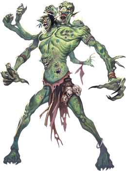
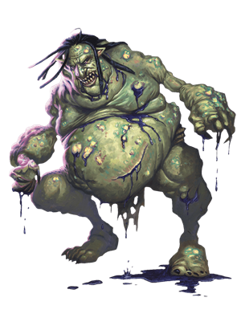

# Trolls
Born with horrific appetites, trolls eat anything they can catch and devour. They have no society to speak of, but they do sometimes serve as mercenaries, particularly among the Hordes. (Those that do often have one or more ranks as an NPC, almost always as a fighter or barbarian, making them doubly deadly.) As payment, trolls demand food and treasure. Trolls are difficult to control, however, doing as they please even when working with more powerful creatures.

> Jump to: [Troll](#troll) | [Aquatic Troll](#aquatic-troll) | [Dire Troll](#dire-troll) | [Rot Troll](#rot-troll) | [Spirit Troll](#spirit-troll) | [Venom Troll](#venom-troll)

***Regeneration.*** Smashing a troll's bones and slashing through its rubbery hide only makes it angry. A troll's wounds close quickly. If the monster loses an arm, a leg, or even its head, those dismembered parts can sometimes act with a life of their own. A troll can even reattach severed body parts, untroubled by its momentary disability. Only acid and fire can arrest the regenerative properties of a troll's flesh. The trolls, enraged, will attack individuals making acid and fire attacks against them above all other prey.

***Troll Freaks.*** Their regenerative capabilities make trolls especially susceptible to mutation. Although uncommon, such transformations can result from what the troll has done or what has been done to it. A decapitated troll might grow two heads from the stump of its neck, while a troll that eats a fey creature might gain one or more of that creature's traits. As a result, some trolls will have the Loathsome Limbs trait.

>***Loathsome Limbs.*** Whenever the troll takes at least 15 slashing damage at one time, roll a d20 to determine what else happens to it:
>
>- 1–10: Nothing else happens.
>- 11–14: One leg is severed from the troll if it has any legs left.
>- 15–18: One arm is severed from the troll if it has any arms left.
>- 19–20: The troll is decapitated, but the troll dies only if it can't regenerate. If it dies, so does the severed head.
>
>If the troll finishes a short or long rest without reattaching a severed limb or head, the part regrows. At that point, the severed part dies. Until then, a severed part acts on the troll's initiative and has its own action and movement. A severed part has AC 13, 10 hit points, and the troll's Regeneration trait.
>
>A severed leg is unable to attack and has a speed of 5 feet.
>
>A severed arm has a speed of 5 feet and can make one claw attack on its turn, with disadvantage on the attack roll unless the troll can see the arm and its target. Each time the troll loses an arm, it loses a claw attack.
>
>If its head is severed, the troll loses its bite attack and its body is blinded unless the head can see it. The severed head has a speed of 0 feet and the troll's Keen Smell trait. It can make a bite attack but only against a target in its space.
>
>The troll's speed is halved if it's missing a leg. If it loses both legs, it falls prone. If it has both arms, it can crawl. With only one arm, it can still crawl, but its speed is halved. With no arms or legs, its speed is 0, and it can't benefit from bonuses to speed.

Trolls that are nearly obliterated but survive and regenerate from mere scraps of flesh can display bizarre mutations. One of these warped trolls is especially likely to arise if the creature regenerates in the presence of magical emanations, planar energy, disease, or death on a vast scale, or if its body was damaged by elemental forces. These mutated forms can also be produced and shaped by the ritual magic of evil spellcasters.

***Vaprak the Destroyer.*** Although trolls are hardly devout and seldom ponder spiritual questions, they do fear and venerate the entity known as Vaprak the Destroyer. As with many lesser deities, Vaprak's true nature is something of a mystery, but it is always portrayed as a horrid, misshapen, greenish creature strongly resembling a troll. It's given to fits of mindless destruction and is constantly paranoid about the plots and ambitions of other deities.

Among trolls, Vaprak is believed to devour those on the brink of death, but only if the troll is already cooked or digested (slain by fire or acid). Otherwise, the god spits the soul back into the world to regenerate a new body, no matter how little of its previous form remained. Thus, only trolls slain by acid or fire remain dead, because only those are consumed by Vaprak.

Among non-trolls, Vaprak is believed to be an aspect of [Gruumsh One-Eye](../Religions/Pantheon/Gruumsh.md), though suggesting such out loud to either a troll or an orc is usually quite the insult.

---

## Troll

>### Troll
>*Large giant, chaotic evil*
>___
>- **Armor Class** 15 (natural armor)
>- **Hit Points** 84 (8d10 + 40)
>- **Speed** 30 ft.
>___
>|**STR**|**DEX**|**CON**|**INT**|**WIS**|**CHA**|
>|:---:|:---:|:---:|:---:|:---:|:---:|
>|18(+4) |13(+1) |20(+5) | 7(−2) | 9(−1) | 7(−2)|
>
>___
>- **Proficiency Bonus** 
>- **Saving Throws** 
>- **Damage Vulnerabilities** 
>- **Damage Resistances** 
>- **Damage Immunities** 
>- **Condition Immunities** 
>- **Skills** Perception +2
>- **Senses** darkvision 60 ft., passive Perception 12
>- **Languages** Giant
>- **Challenge** 5 (1,800 XP)
>___
>***Keen Smell.*** The troll has advantage on Wisdom (Perception) checks that rely on smell.
>
>***Regeneration.*** The troll regains 10 hit points at the start of its turn. If the troll takes acid or fire damage, this trait doesn't function at the start of the troll's next turn. The troll dies only if it starts its turn with 0 hit points and doesn't regenerate.
>
>#### Actions
>***Multiattack.*** The troll makes three attacks: one with its bite and two with its claws.
>
>***Bite.*** Melee Weapon Attack: +7 to hit, reach 5 ft., one target. Hit: 7 (1d6 + 4) piercing damage.
>
***Claw.*** Melee Weapon Attack: +7 to hit, reach 5 ft., one target. Hit: 11 (2d6 + 4) slashing damage.

---

## Aquatic Troll (Scrag)
Scrags are trolls that have adapted to life in the water. 

>### Aquatic Troll
>*Large giant, chaotic evil*
>___
>- **Armor Class** 15 (natural armor)
>- **Hit Points** 84 (8d10 + 40)
>- **Speed** 30 ft., swim 30 ft.
>___
>|**STR**|**DEX**|**CON**|**INT**|**WIS**|**CHA**|
>|:---:|:---:|:---:|:---:|:---:|:---:|
>|18 (+4)|13 (+1)|20 (+5)|7 (-2) | 9 (-1)| 7 (-2)|
>
>___
>- **Proficiency Bonus** 
>- **Saving Throws** 
>- **Damage Vulnerabilities** 
>- **Damage Resistances** 
>- **Damage Immunities** 
>- **Condition Immunities** 
>- **Skills** Perception +2
>- **Senses** darkvision 60 ft., passive Perception 12
>- **Languages** Aquan
>- **Challenge** 5 (1800 XP)
>___
>***Amphibious.*** The troll can breathe both in water and air.
>
>***Keen Smell.*** The troll has advantage on Wisdom (Perception) checks that rely on smell.
>
>***Regeneration.*** The troll regains 10 hit points at the start of its turn if any part of it is immersed in water (either salt or fresh, whichever it calls home). If the troll takes lightning damage, this trait doesn't function at the start of the troll's next turn. The troll dies only if it starts its turn with 0 hit points and doesn't regenerate.
>
>#### Actions
>***Multiattack.*** The troll makes three attacks: one with its bite and two with its claws.
>
>***Bite.*** Melee Weapon Attack: +7 to hit, reach 5 ft., one target. Hit: 7 (1d6 + 4) piercing damage.
>
>***Claw.*** Melee Weapon Attack: +7 to hit, reach 5 ft., one target. Hit: 11 (2d6 + 4) slashing damage.

---

## Dire Troll
 

Trolls kill and eat almost anything — including, in rare cases, other trolls. This cannibalism has the effect of causing the troll to grow to an unusually large size. These dire trolls crave more and more troll flesh to fuel their continued growth.

Dire trolls also increase their size by grafting flesh and organs onto themselves. When a slab of quivering troll flesh is bound against a fresh wound on the dire troll, its regenerative capacity incorporates the new mass into its own musculature. Even more horrifying are the multiple arms, eyes, claws, and other organs that a dire troll tears from its victims and grafts onto itself. Over time, these creatures can accumulate many limbs.

>### Dire Troll
>*Huge giant, chaotic evil*
>___
>- **Armor Class** 15 (natural armor)
>- **Hit Points** 172 (15d12 + 75)
>- **Speed** 40 ft.
>___
>|**STR**|**DEX**|**CON**|**INT**|**WIS**|**CHA**|
>|:---:|:---:|:---:|:---:|:---:|:---:|
>|22(+6) |15(+2) |21(+5) |9(−1)  |11(+0) |5(−3)|
>
>___
>- **Proficiency Bonus** 
>- **Saving Throws** Wis +5, Cha +2
>- **Damage Vulnerabilities** 
>- **Damage Resistances** bludgeoning, piercing, and slashing from nonmagical attacks
>- **Damage Immunities** 
>- **Condition Immunities** frightened, poisoned
>- **Skills** Perception +5
>- **Senses** darkvision 60 ft., passive Perception 15
>- **Languages** Giant
>- **Challenge** 13 (10,000 XP)
>___
>***Keen Senses.*** The troll has advantage on Wisdom (Perception) checks that rely on smell or sight.
>
>***Regeneration.*** The troll regains 10 hit points at the start of its turn. If the troll takes acid or fire damage, it regains only 5 hit points at the start of its next turn. The troll dies only if it is hit by an attack that deals 10 or more acid or fire damage while the troll has 0 hit points.
>
>#### Actions
>***Multiattack.*** The troll makes five attacks: one with its bite and four with its claws.
>
>***Bite.*** Melee Weapon Attack: +11 to hit, reach 10 ft., one target. Hit: 10 (1d8 + 6) piercing damage plus 5 (1d10) poison damage.
>
>***Claws.*** Melee Weapon Attack: +11 to hit, reach 10 ft., one target. Hit: 16 (3d6 + 6) slashing damage.
>
>***Whirlwind of Claws (Recharge 5–6).*** Each creature within 10 feet of the troll must make a DC 19 Dexterity saving throw, taking 44 (8d10) slashing damage on a failed save, or half as much damage on a successful one.

---

## Rot Troll

A troll that is infused with waves of necrotic energy as it regenerates can develop a symbiotic relationship with that deathly power. The troll's body withers, and its flesh falls away from the body as quickly as it forms. Eventually a rot troll becomes unable to regenerate, though it still heals normally. The creature courses with necrotic energy that flows out of its withered form. Simply standing near a rot troll exposes other creatures to its lethal emanations.

>### Rot Troll
>*Large giant, chaotic evil*
>___
>- **Armor Class** 16 (natural armor)
>- **Hit Points** 138 (12d10 + 72)
>- **Speed** 30 ft.
>___
>|**STR**|**DEX**|**CON**|**INT**|**WIS**|**CHA**|
>|:---:|:---:|:---:|:---:|:---:|:---:|
>|18(+4) |13(+1) |22(+6) | 5(−3) | 8(−1) | 4(−3)|
>
>___
>- **Proficiency Bonus** 
>- **Saving Throws** 
>- **Damage Vulnerabilities** 
>- **Damage Resistances** 
>- **Damage Immunities** necrotic
>- **Condition Immunities** 
>- **Skills** Perception +3
>- **Senses** darkvision 60 ft., passive Perception 13
>- **Languages** Giant
>- **Challenge** 9 (5,000 XP)
>___
>***Rancid Degeneration.*** At the end of each of the troll's turns, each creature within 5 feet of it takes 11 (2d10) necrotic damage, unless the troll has taken acid or fire damage since the end of its last turn.
>
>#### Actions
>***Multiattack.*** The troll makes three attacks: one with its bite and two with its claws.
>
>***Bite.*** Melee Weapon Attack: +8 to hit, reach 5 ft., one target. Hit: 7 (1d6 + 4) piercing damage plus 16 (3d10) necrotic damage.
>
>***Claws.*** Melee Weapon Attack: +8 to hit, reach 5 ft., one target. Hit: 11 (2d6 + 4) slashing damage plus 5 (1d10) necrotic damage.

---

## Spirit Troll

A troll blasted with psychic energy can take a nonphysical form when it regenerates. Its psyche survives, but the body of a spirit troll is as insubstantial as shadow. The troll might be unaware of the transition — it still moves and attacks with teeth and claws as it always did — but now it strikes at its victim's mind.

>### Spirit Troll
>*Large giant, chaotic evil*
>___
>- **Armor Class** 17 (natural armor)
>- **Hit Points** 97 (15d10 + 15)
>- **Speed** 30 ft.
>___
>|**STR**|**DEX**|**CON**|**INT**|**WIS**|**CHA**|
>|:---:|:---:|:---:|:---:|:---:|:---:|
>|1(−5)|17(+3)|13(+1)|8(−1)|9(−1)|16(+3)|
>
>___
>- **Proficiency Bonus** 
>- **Saving Throws** 
>- **Damage Vulnerabilities** 
>- **Damage Resistances** acid, cold, fire, lightning, thunder
>- **Damage Immunities** bludgeoning, piercing, and slashing from nonmagical attacks
>- **Condition Immunities** exhaustion, grappled, paralyzed, petrified, prone, restrained, unconscious
>- **Skills** Perception +3
>- **Senses** darkvision 60 ft., passive Perception 13
>- **Languages** Giant
>- **Challenge** 11 (7,200 XP)
>___
>***Incorporeal Movement.*** The troll can move through other creatures and objects as if they were difficult terrain. It takes 5 (1d10) force damage if it ends its turn inside an object.
>
>***Regeneration.*** The troll regains 10 hit points at the start of each of its turns. If the troll takes psychic or force damage, this trait doesn't function at the start of the troll's next turn. The troll dies only if it starts its turn with 0 hit points and doesn't regenerate.
>
>#### Actions
>***Multiattack.*** The troll makes three attacks: one with its Bite and two with its Claws.
>
>***Bite.*** Melee Weapon Attack: +7 to hit, reach 5 ft., one creature. Hit: 19 (3d10 + 3) psychic damage, and the target must succeed on a DC 15 Wisdom saving throw or be stunned for 1 minute. The stunned target can repeat the saving throw at the end of each of its turns, ending the effect on itself on a success.
>
>***Claws.*** Melee Weapon Attack: +7 to hit, reach 5 ft., one creature. Hit: 14 (2d10 + 3) psychic damage.

---

## Venom Troll

A troll ravaged by massive doses of poison will sometimes transform into a venom troll. Lingering poison infuses its blood and tissue, and poison leaks from its pores to coat its fangs and claws. These creatures are especially dangerous in close combat, because poison drips off their flesh and sprays out from every wound they receive.

>### Venom Troll
>*Large giant, chaotic evil*
>___
>- **Armor Class** 15 (natural armor)
>- **Hit Points** 94 (9d10 + 45)
>- **Speed** 30 ft.
>___
>|**STR**|**DEX**|**CON**|**INT**|**WIS**|**CHA**|
>|:---:|:---:|:---:|:---:|:---:|:---:|
>|18(+4) | 13(+1)| 20(+5)| 7(−2) | 9(−1) | 7(-2)|
>
>___
>- **Proficiency Bonus** 
>- **Saving Throws** 
>- **Damage Vulnerabilities** 
>- **Damage Resistances** 
>- **Damage Immunities** poison
>- **Condition Immunities** poisoned
>- **Skills** Perception +2
>- **Senses** darkvision 60 ft., passive Perception 12
>- **Languages** Giant
>- **Challenge** 7 (2,900 XP)
>___
>***Keen Smell.*** The troll has advantage on Wisdom (Perception) checks that rely on smell.
>
>***Poison Splash.*** When the troll takes damage of any type but psychic, each creature within 5 feet of the troll takes 9 (2d8) poison damage.
>
>***Regeneration.*** The troll regains 10 hit points at the start of each of its turns. If the troll takes acid or fire damage, this trait doesn't function at the start of the troll's next turn. The troll dies only if it starts its turn with 0 hit points and doesn't regenerate.
>
>#### Actions
>***Multiattack.*** The troll makes three attacks: one with its bite and two with its claws.
>
>***Bite.*** Melee Weapon Attack: +7 to hit, reach 5 ft., one target. Hit: 7 (1d6 + 4) piercing damage plus 4 (1d8) poison damage, and the creature is poisoned until the start of the troll's next turn.
>
>***Claws.*** Melee Weapon Attack: +7 to hit, reach 5 ft., one target. Hit: 11 (2d6 + 4) slashing damage plus 4 (1d8) poison damage.
>
>***Venom Spray (Recharge 6).*** The troll slices itself with a claw, releasing a spray of poison in a 15-foot cube. The troll takes 7 (2d6) slashing damage (this damage can't be reduced in any way). Each creature in the area must make a DC 16 Constitution saving throw. On a failed save, a creature takes 18 (4d8) poison damage and is poisoned for 1 minute. On a successful save, the creature takes half as much damage and isn't poisoned. A poisoned creature can repeat the saving throw at the end of each of its turns, ending the effect on itself on a success.
