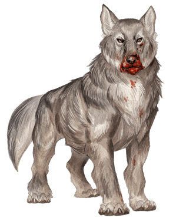
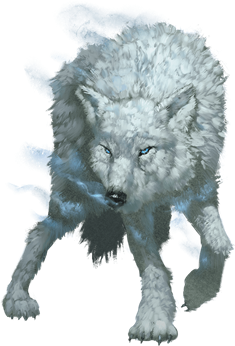
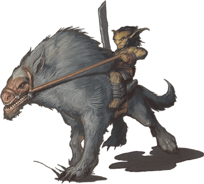

# Wolf
Primal and often savage cousins of the [Dog](Dog.md), wolves often run in packs, and will demonstrate a fearsome loyalty to their packmates.

> Jump to: [Wolf](#wolf-1) | [Dire Wolf](#dire-wolf) | [Winter Wolf](#winter-wolf) | [Worg](#worg)

---

## Dire Wolf

>### Dire Wolf
>*Large beast, unaligned*
>___
>- **Armor Class** 14 (natural armor)
>- **Hit Points** 37 (5d10 + 10)
>- **Speed** 50 ft.
>___
>|**STR**|**DEX**|**CON**|**INT**|**WIS**|**CHA**|
>|:---:|:---:|:---:|:---:|:---:|:---:|
>|17 (+3)|15 (+2)|15 (+2)|3 (-4)|12 (+1)|7 (-2)|
>
>___
>- **Proficiency Bonus** +0
>- **Saving Throws** 
>- **Damage Vulnerabilities** 
>- **Damage Resistances** 
>- **Damage Immunities** 
>- **Condition Immunities** 
>- **Skills** Perception +3,Stealth +4
>- **Senses** passive Perception 13
>- **Languages** —
>- **Challenge** 1
>___
>***Keen Hearing and Smell.*** The wolf has advantage on Wisdom (Perception) checks that rely on hearing or smell.
>
>***Pack Tactics.*** The wolf has advantage on an attack roll against a creature if at least one of the wolf’s allies is within 5 feet of the creature and the ally isn’t incapacitated.
>
>#### Actions
>***Bite.*** Melee Weapon Attack: +5 to hit, reach 5 ft., one target. Hit: 10 (2d6 + 3) piercing damage. If the target is a creature, it must succeed on a DC 13 Strength saving throw or be knocked prone.
>

---

## Wolf

>### Wolf
>*Medium beast, unaligned*
>___
>- **Armor Class** 13 (natural armor)
>- **Hit Points** 11 (2d8 + 2)
>- **Speed** 40 ft.
>___
>|**STR**|**DEX**|**CON**|**INT**|**WIS**|**CHA**|
>|:---:|:---:|:---:|:---:|:---:|:---:|
>|12 (+1)|15 (+2)|12 (+1)|3 (-4)|12 (+1)|6 (-2)|
>
>___
>- **Proficiency Bonus** +0
>- **Saving Throws** 
>- **Damage Vulnerabilities** 
>- **Damage Resistances** 
>- **Damage Immunities** 
>- **Condition Immunities** 
>- **Skills** Perception +3,Stealth +4
>- **Senses** passive Perception 13
>- **Languages** —
>- **Challenge** 1/4
>___
>***Keen Hearing and Smell.*** The wolf has advantage on Wisdom (Perception) checks that rely on hearing or smell.
>
>***Pack Tactics.*** The wolf has advantage on attack rolls against a creature if at least one of the wolf’s allies is within 5 feet of the creature and the ally isn’t incapacitated.
>
>#### Actions
>***Bite.*** Melee Weapon Attack: +4 to hit, reach 5 ft., one target. Hit: 7 (2d4 + 2) piercing damage. If the target is a creature, it must succeed on a DC 11 Strength saving throw or be knocked prone.
>

---

## Winter Wolf

The arctic-dwelling winter wolf is as large as a dire wolf but has snow-white fur and pale blue eyes. Frost giants use these evil creatures as guards and hunting companions, putting the wolves’ deadly breath weapon to use against their foes. Winter wolves communicate with one another using growls and barks, but they speak Common and Giant well enough to follow simple conversations.

>### Winter Wolf
>*Large monstrosity, neutral evil*
>___
>- **Armor Class** 13 (natural armor)
>- **Hit Points** 75 (10d10 + 20)
>- **Speed** 50 ft.
>___
>|**STR**|**DEX**|**CON**|**INT**|**WIS**|**CHA**|
>|:---:|:---:|:---:|:---:|:---:|:---:|
>|18 (+4)|13 (+1)|14 (+2)|7 (-2)|12 (+1)|8 (-1)|
>
>___
>- **Proficiency Bonus** +0
>- **Saving Throws** 
>- **Damage Vulnerabilities** 
>- **Damage Resistances** 
>- **Damage Immunities** cold
>- **Condition Immunities** 
>- **Skills** Perception +5,Stealth +3
>- **Senses** passive Perception 15
>- **Languages** Common,Giant,Winter Wolf
>- **Challenge** 3
>___
>***Keen Hearing and Smell.*** The wolf has advantage on Wisdom (Perception) checks that rely on hearing or smell.
>
>***Pack Tactics.*** The wolf has advantage on an attack roll against a creature if at least one of the wolf’s allies is within 5 feet of the creature and the ally isn’t incapacitated.
>
>***Snow Camouflage.*** The wolf has advantage on Dexterity (Stealth) checks made to hide in snowy terrain.
>
>#### Actions
>***Bite.*** Melee Weapon Attack: +6 to hit, reach 5 ft., one target. Hit: 11 (2d6 + 4) piercing damage. If the target is a creature, it must succeed on a DC 14 Strength saving throw or be knocked prone.
>
>***Cold Breath (Recharge 5–6).*** The wolf exhales a blast of freezing wind in a 15-foot cone. Each creature in that area must make a DC 12 Dexterity saving throw, taking 18 (4d8) cold damage on a failed save, or half as much damage on a successful one.
>

---

## Worg

A worg is an evil predator that delights in hunting and devouring creatures weaker than itself. Cunning and malevolent, worgs roam across the remote wilderness or are raised by goblins and hobgoblins. Those creatures use worgs as mounts, but a worg will turn on its rider if it feels mistreated or malnourished. Worgs speak in their own language and Goblin, and a few learn to speak Common as well.

>### Worg
>*Large monstrosity, neutral evil*
>___
>- **Armor Class** 13 (natural armor)
>- **Hit Points** 26 (4d10 + 4)
>- **Speed** 50 ft.
>___
>|**STR**|**DEX**|**CON**|**INT**|**WIS**|**CHA**|
>|:---:|:---:|:---:|:---:|:---:|:---:|
>|16 (+3)|13 (+1)|13 (+1)|7 (-2)|11 (+0)|8 (-1)|
>
>___
>- **Proficiency Bonus** +0
>- **Saving Throws** 
>- **Damage Vulnerabilities** 
>- **Damage Resistances** 
>- **Damage Immunities** 
>- **Condition Immunities** 
>- **Skills** Perception +4
>- **Senses** darkvision 60 ft.,passive Perception 14
>- **Languages** Goblin,Worg
>- **Challenge** 1/2
>___
>***Keen Hearing and Smell.*** The worg has advantage on Wisdom (Perception) checks that rely on hearing or smell.
>
>#### Actions
>***Bite.*** Melee Weapon Attack: +5 to hit, reach 5 ft., one target. Hit: 10 (2d6 + 3) piercing damage. If the target is a creature, it must succeed on a DC 13 Strength saving throw or be knocked prone.
>
