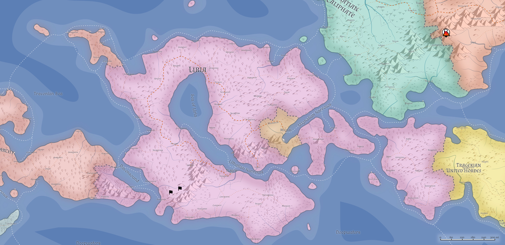

# Liria: Ancestral Human home

### The Ravenlands
Grasslands and swamp that sit on either side of the southwestern-most part of the Daw mountain range, and home to a variety of tribes that eke out a wild sustenance from the broad plains. It is often a rite of passage for those born on the Eastern Ravenlands to journey to visit their cousins in the West Ravenlands, and vice versa, and it is not uncommon to see whole tribes make a migration from one to the other. Fortunately numerous passes through the Daws are easy to find, and a long history of trade between the dwarves of the Lirian Daws ranges and the Ravenland Tribes serves each side well.

Much of Liria's cattle and other livestock are raised and herded by the Ravenland Tribes, and although there is some friction between the Ravenlanders and the farmers near [Cademintal](../Cities/Cademintal.md), [Cloudrest](../Cities/Cloudrest.md), and [Elholrand](../Cities/Elholrand.md) over lands, plenty of room also extends to the east for farm growth.
