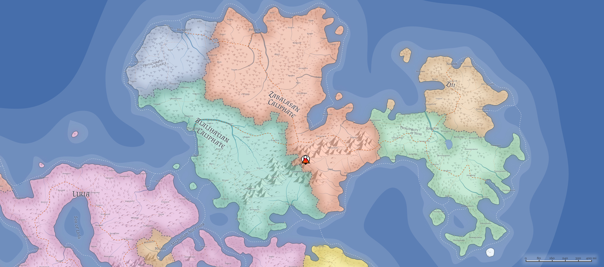

# Yithia: The East

Yithia, the continent to the east of [Al'Uma](./AlUma.md), is the home of the nations of [Yithi](../Nations/Yithi.md) and [Zhi](../Nations/Zhi.md). Although scholars argue about whether Yithia is, in fact, its own continent, the geography is just different enough (flat compared to the Al'Uma's rolling hills, with the weather more mild than the Al'Uman storms) to merit the possibility, and Zhi scholars insist that Yithia is, in fact, a separate land mass that merged with Al'Uma countless centuries ago. Regardless of the truth of the matter, the Yithians consider themselves "separate and apart" from the rest of the world, geographically speaking, and the rest of the world really has enough issues to bother arguing.

The end of the [Daw mountain range](./DawMountains.md) tapers off as the continent of Yithia begins, leaving most of Yithia flat, with little changes in elevation, and grasslands as far as the eye can see. Owing to the large landmass with little by way of geographic boundaries, cities tend to be more spread out, the most extreme example of this being [Fenpreloval](../Cities/Fenpreloval.md), the "Marketplace of the East", which straddles the Yithian Road for several miles before it branches north (the [Zhian Route](./Roads.md)) and southeast: almost every building is one or two stories tall at most, with a sprawling network of back alleys, side roads, and numerous street-market bazaars forming the majority of the city's permanent structure.

Yithian forests tend to be spread out as well, with the border between forest and grassland extremely subtle--one can be walking along a Yithian road for several miles before realizing that trees now surround the road where only grassland was once visible. Forests often do not block visibility entirely, and it is common to spot others traveling on the roads several miles before being within shouting distance.

Many grazing animals roam the grasslands of Yithia freely--many are captured and rounded up by the various nomadic tribes/clans that still wander the grassland, but many more move about in their own nomadic patterns.

Nymbarcojh Lake is a massive (40 miles east-west by 60 miles north-south) lake in the center of Yithi, near [Kraston](../Cities/Kraston.md), Yithi's capital city. Connecting to the Great Northern Ocean via the massive Sirhie River, the Lake is a rich and vital source of fish for the region, and sees a small amount of commercial shipping/boat traffic up and down the Sirhie, through Kraston.

Roads maintained by Yithi's Prince's Council connect many, if not all, of the Yithian cities, and are generally well-maintained and -patrolled. Bandits are, of course, always a possibility, as are various wild creatures that roam the grasslands and forests that prey on Yithian livestock (wild or tame). Wolfpacks, lion packs (and dire versions of each) are particularly common within the grasslands, along with packs of manticore, owlbears, and the odd hydra lurking in the swamps and marshlands. Black dragons, commonly found in swamps, often find themselves competing with green dragons in forests, and so on. The [Marshals](../Organizations/MilitantOrders/Marshals.md) will often team up with the [Draconic Order](../Organizations/DraconicOrder/DraconicOrder.md) when a chromatic dragon is found, but too often the dragons are clever enough to avoid detection, and many have long-standing [Wyrmcultists](../Organizations/CultOfTheWyrm.md) embedded within Yithian tribes and cities to have fair warning of any attempt to capture or destroy them.

The further one journeys north in Yithia, crossing the border into Zhi, the hotter and wetter the climate becomes, trading grassland for marsh. Travel off the roads can sometimes be hazardous, as seemingly-solid grassland can in fact turn out to be water-dwelling grass that gives way to the foot-or-more-deep water beneath. Roads are particularly welcome here, and the Zhians put significant effort into keeping roads well-maintained and -patrolled. Rivers criss-cross the Zhian lands, and often local guides claim to be able to navigate shallow, pole-driven craft from city to city without ever leaving what appears to be land. (One particular legend claims a local from Llicuston took--and won--a bet that he could pole his raft all the way to Lhamalithazak on the coast without his feet ever leaving the raft--and beat the horse-drawn wagons traveling the road, to boot.) By the time travelers reach [Nacoal](../Cities/Nacoal.md), Zhi's capital city, they are usually surprised by the relative cool temperatures of the city, which was built on the northern shores specifically to allow for its ocean breezes, as well as its distance from the rest of the world.

