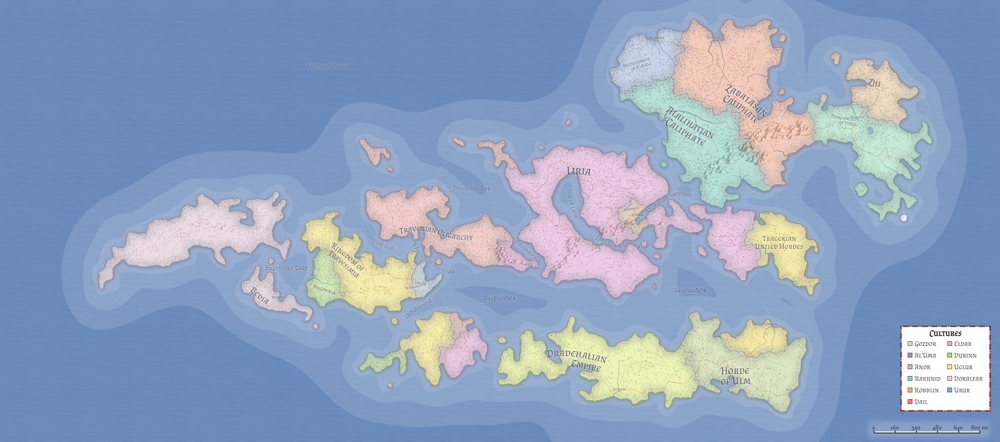

# Geography
Azgaarnoth is the name given to the collection of continents that lie in a quarter of the globe south of the equator.

*(For an interactive version of the map, [click](https://azgaar.github.io/Fantasy-Map-Generator/?maplink=https://azgaarnoth.tedneward.com/Azgaarnoth.map))*

Celestially, Azgaarnoth is approximately 95 million miles from its sun, which burns slightly hotter than Earth's Sol. Few, if any, Azgaarnothians spend much time staring up at the stars, and if there are any sister planets in Azgaarnoth's solar system, their names have long been lost. Little to no importance is attached to constellations or stellar movement.

The first glance at Azgaarnoth's geography shows the huge watermass that occupies much of the map. Large bodies of water surround Azgaarnoth's continents. Azgaarnoth's tides are a complicated mess, owing to the fact that they are under the influence of no less than [four lunar satellites](Moons.md). A few scholars have claimed to have worked out the celestial mechanics of the moons and their influence on the tides, and published charts detailing high- and low-tide information, but most sailors have either come to rely on arcane/divine means of determining tidal data, or "go with their gut".

> ### Game Notes
> This approach allows (and in some ways encourages) the Game Master to be entirely erratic (some might say random) with the tidal schedules, rather than being required or expected to be held to some kind of routine schedule. (DMs, you're welcome.)

Water isolates Azgaarnoth from the rest of the globe. The Great Northern Ocean is legendary for its storms, and the [Deepwaters](Deepwaters.md) stretch to perilous depths. Some waters are battlegrounds; the [Sea of Liria](SeaOfLiria.md)'s sea floor is littered with the wrecks of many ships in the ongoing wars between Liria and her breakaway peoples. Smaller bodies of water, like the [Lishalsound](Lishalsound.md) and the [Ravensound](Ravensound.md), serve as useful trade means. In short, Azgaarnothians sail, but any attempts at journeying north, west, or east beyond the sight of Azgaarnothian lands have disappeared into the distance with no return, response, or explanation. (Southwards lies the South Pole, a frozen ice sheet that contains no life.) 

Some scholars posit that these are the only lands on the planet, while others suggest that other continents are present but uninhabitable. Still others whisper of strange races and distant empires, but nothing even remotely resembling evidence has ever been produced. Some scholars theorize that dragons fled Azgaarnoth over the milennia to parts elsewhere on the globe, but until these other continents are found, nothing can be said for certain.

## Land masses
Most of the land masses are flat, with a few mountain ranges (most notably the [Daws mountain range](DawsMountains.md)) that climb to merely 5,000ft at their highest. The highest point in Azgaarnoth is [Mount Bezulb](MtBezulb.md), at just over 5,000' above sea level, and is an active volcano that has continuously erupted since recorded memory began. Periodically, randomly (or seemingly so), Mt Bezulb will erupt more forcefully, and a period of tectonic disturbance radiates throughout Azgaarnoth, but as of this writing these periods of unstability occur only every few centuries.

Thanks also to the mass of water surrounding and permeating Azgaarnoth lands, weather is unpredictable across most of the continents. Where lands are flat, slow and steady rains are common year-round, though more common in winter and less in summer. Temperatures range from hotter in the north to colder in the south (the equator being just beyond the northern edge of the map), but overall Azgaarnoth is remarkably temperate and mild. Where the lands meet oceans, swamp and marshlands are common, with wide swaths of grassland further inland. Forests are common, though thousands of years of civilization have taken its toll on some of them.

The major land masses of Azgaarnoth include [Liria](Liria.md), [Al'Uma](AlUma.md), [Dradehalia](Dradehalia.md), [Bedia](Bedia.md), [Chidia](Chidia.md), [Tragekia](Tragekia.md), [Travenia](Travenia.md), [Travesimia](Travesimia.md), and [Yithia](Yithia.md).

## Roads
The history of Azgaarnoth is over 10 millennia old, and much of the continent--with the exception of the large landmass called "Northern Bedia", in the far northwest--is crisscrossed with roads, or at least, what were once roads. Cities once connected by large, well-traveled, well-maintained highways have seen those roads fall into disrepair, many of them, and many towns and villages cling to a single dirt track that connects them with other towns and villages nearby. Many roads are paved, but with broken pavingstones every so often, making it less comfortable on wagons than merchants would prefer. In many cases, it seems easier and cheaper to ship by boat than by wagon.

