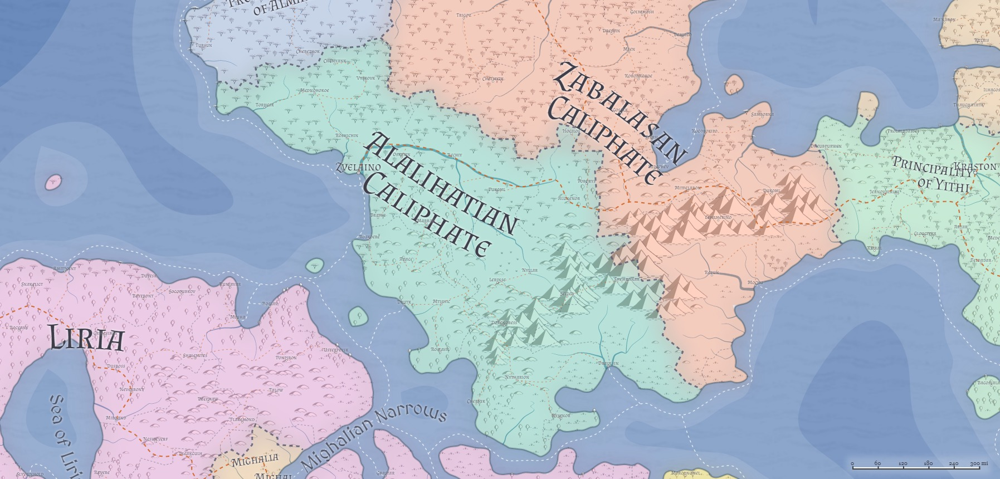

# Alalihat / Caliphate of Alalihat
* **Government**: Caliphate
* **Capital**: [Zvelaino](../Cities/Zvelaino.md)
* **Population**: 

## Geography

(Arabic grasslands/plains)

## Government
**TODO**, Caliph of Alalihat, Defender of the Faith

Alalihat is a caliphate...

## Political Structure

## Population
Alalihat's population, like that of the other two nations on the Al'Uman continent, is split between those who dwell within the cities, and those who continue the nomadic traditions of their ancestors. 

## Culture

## Relations
**[Almalz](Almalz.md)**: Peace. Almalz is filled with cousins and relatives of the Zabalasan tribes, and officially is the sacred Caliphate that guards the relics of the Prophet and his Disciple. Zabalasans and Alalihatians will stab each other mercilessly outside of Almalz, but within, maintain a tense and careful peace. (Of course, this in no way stops espionage and spycraft, and many's the murder in the Almalzian city that goes officially uninvestigated.)

**[Bagonbia](Bagonbia.md)**: Neutral; indifferent. A distant trading partner, but little to no official contact beyond that.

**[Bedia](Bedia.md)**: Neutral; indifferent. A distant trading partner, but little to no official contact beyond that.

**[Dradehalia](Dradehalia.md)**: Cautious. 

**[Liria](Liria.md)**: Cautious; skirmishes. Alalihat's adherence to the words of the Prophet create tensions between Liria and Alalihat, since Alilhatians believe Liria "screwed it up" by not adopting the Prophet's theology sooner. As a result, most Alalihatians believe Lirians to be ignorant at best, deliberately deceitful at worst. The two nations have been at war in the past, but not recently, and the war with the infidels to the east consumes more of the common Alalihatian's interest and passion than battles with the ignorant west.

**[Mighalia](Mighalia.md)**:

**[Tragekia](Tragekia.md)**:

**[Travenia](Travenia.md)**:

**[Travesimia](Travesimia.md)**:

**[Ulm](Ulm.md)**:

**[Whaveminsia](Whaveminsia.md)**:

**[Yithi](Yithi.md)**: 

**[Zabalasa](Zabalasa.md)**:

**[Zhi](Zhi.md)**:

## Tribes of Alalihat

### House of the Bear
The 3,000 members of the House of Dubb are primarily herders, though they do have a brisk business harvesting aromatic gums from the Realms of the Bleeding Trees near the mountains. It is said their sheik would rather be leading an army than a nomad tribe, and he spends a good deal of his time "adventuring," which leaves most administrative duties on the shoulders of tribal elders.

### House of the Bull
A dwindling tribe of 1,500 in the southern ranges of Alalihat, the House of Thawr has long been losing young people to easy employment in the cities. What began as retaliatory raids against the city now have escalated into a perpetual, if low-intensity, war. Pinned between the cities and House Bakr to the north, House Thawr's sheik holds fast to a vision of a cleansing wind that will vanquish his enemies.

### Clan of the Pony
The majority of House Bakr lives in the city of **TODO**--a fairly recent development highly criticized by the tribal elders. Those 500 or so who remain in the grasslands are fiercely conservative and believe in protecting and maintaining their customs above all else. Both the Rais (leader) of those remaining in the grasslands and his son have experienced terrible visions of a dire fate for those in the city.

