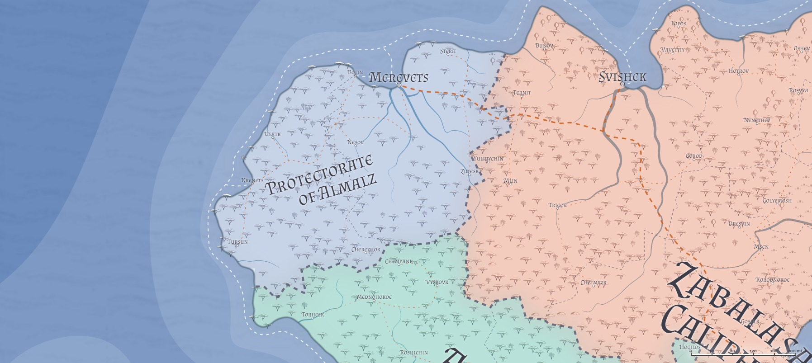

# Almalz / Protectorate of Almalz
___
- **Government**: Caliphate
- **Capital**: [Merevets](../Cities/Merevets.md)
- **Population**: 2 million (~30% human, ~30% firstborn, ~25% Created, ~15% other; 15% urban)
- **Area**: 170,000 sq mi
---

## Geography

## Government
**TODO**, Caliph of Almalz, Defender of the Faith

Almalz is a caliphate...

## Political Structure
Almalz is made up of two provinces (one each from Alalihat and Zabalasa):

* Mushu County: the donation from Zabalasa, it includes the capital city [Merevets]()
* Al Jib County: 

## Population

## Culture

## Relations
[Alalihat](../Nations/Alalihat.md):

[Almalz](../Nations/Almalz.md):

[Bagonbia](../Nations/Bagonbia.md): Neutral.

[Bedia](../Nations/Bedia.md):

[Dradehalia](../Nations/Dradehalia.md):

[Liria](../Nations/Liria.md): Cautious. Almalzish are generally more patient and open-minded to the Lirian perspective and history than their Al'Uman cousins, but are still dedicated to the Al'Uman ideal that the Fall was the fault of humanity. To the average Almalzish, Lirians are deluded, and therefore to be pitied for their ignorance (willful or otherwise).

[Mighalia](../Nations/Mighalia.md):

[Tragekia](../Nations/Tragekia.md):

[Travenia](../Nations/Travenia.md):

[Travesimia](../Nations/Travesimia.md):

[Ulm](../Nations/Ulm.md):

[Whaveminsia](../Nations/Whaveminsia.md):

[Yithi](../Nations/Yithi.md): 

[Zabalasa](../Nations/Zabalasa.md):

[Zhi](../Nations/Zhi.md):

## Tribes of Almalz

