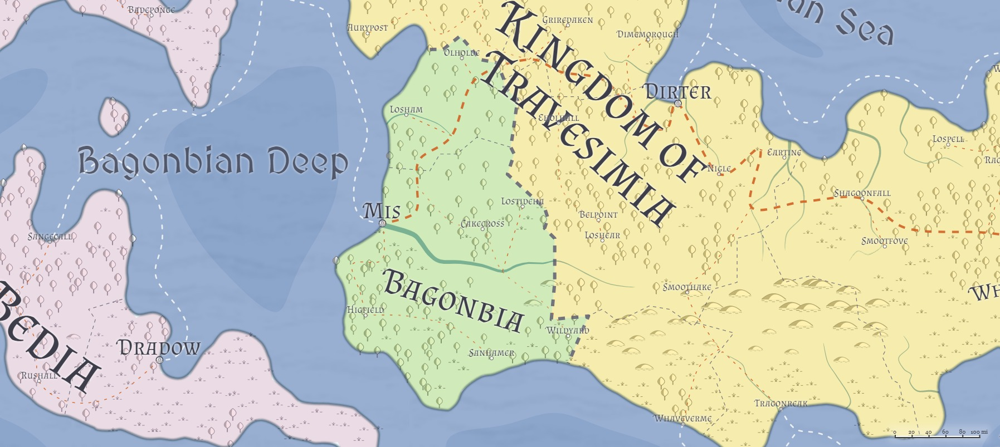

# Bagonbia / The Kingdom of Bagonbia
___
- **Government**: Kingdom
- **Capital**: [Mis](../Cities/Mis.md)
- **Population**: 2 million (~35% human, ~35% firstborn, ~15% Created, ~15% Hordish)
- **Area**: 100,000 sq mi
---
* **Population**: 

## Geography

## Government
**TODO**, King of Bagonbia

## Political Structure

## Population

## Culture

## Relations
**[Alalihat](../Nations/Alalihat.md)**:

**[Almalz](../Nations/Almalz.md)**:

**[Bagonbia](../Nations/Bagonbia.md)**: Neutral.

**[Bedia](../Nations/Bedia.md)**:

**[Dradehalia](../Nations/Dradehalia.md)**:

**[Liria](../Nations/Liria.md)**: Cautious. Almalzish are generally more patient and open-minded to the Lirian perspective and history than their Al'Uman cousins, but are still dedicated to the Al'Uman ideal that the Fall was the fault of humanity. To the average Almalzish, Lirians are deluded, and therefore to be pitied for their ignorance (willful or otherwise).

**[Mighalia](../Nations/Mighalia.md)**:

**[Tragekia](../Nations/Tragekia.md)**:

**[Travenia](../Nations/Travenia.md)**:

**[Travesimia](../Nations/Travesimia.md)**:

**[Ulm](../Nations/Ulm.md)**:

**[Whaveminsia](../Nations/Whaveminsia.md)**:

**[Yithi](../Nations/Yithi.md)**: 

**[Zabalasa](../Nations/Zabalasa.md)**:

**[Zhi](../Nations/Zhi.md)**:

