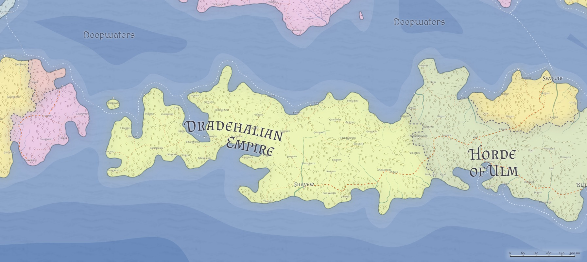

# Dradehalia / Dradehalian Empire / "Dread Empure"
___
- **Government**: Empire
- **Capital**: 
- **Population**: 4 million (~40% human, ~40% Firstborn, ~20% Created, ~1% Hordish; 10% urban)
- **Area**: ~500,000 sq miles
---

## Geography

## Government

## Political Structure

## Population

## Culture

## Relations
[Alalihat](../Nations/Alalihat.md):
[Almalz](../Nations/Almalz.md):
[Bagonbia](../Nations/Bagonbia.md): Neutral.
[Bedia](../Nations/Bedia.md):
[Dradehalia](../Nations/Dradehalia.md):
[Liria](../Nations/Liria.md):
[Mighalia](../Nations/Mighalia.md):
[Tragekia](../Nations/Tragekia.md):
[Travenia](../Nations/Travenia.md):
[Travesimia](../Nations/Travesimia.md):
[Ulm](../Nations/Ulm.md):
[Whaveminsia](../Nations/Whaveminsia.md):
[Yithi](../Nations/Yithi.md): 
[Zabalasa](../Nations/Zabalasa.md):
[Zhi](../Nations/Zhi.md):
