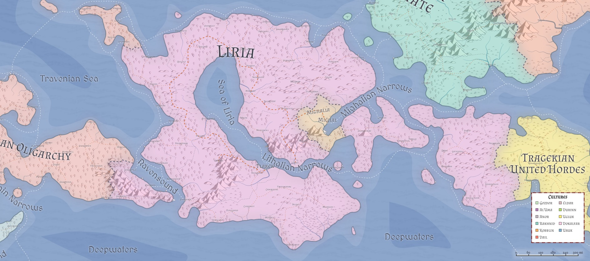

# Liria
* **Government**: Confederation/Empire
* **Capital**: [Flakew](../Cities/Flakew.md)
* **Population**: 6+ million (~40% human, ~40% firstborn, ~15% Created, ~5% other)

Dominant nation in Azgaarnoth. Originally Liria spanned all of the west and south, with the Hordes alone confronting them in the east (near where the [Principality of Yithi](Yithi.md) lies now). Liria is an "old" nation, and many of her cities have ruins of previous generations of city buildings lying beneath them, having been razed somewhere in their history and then rebuilt.

Liria is also a nation that is collapsing at the seams, with a very weak central government bordering almost on the absent. Beyond organizing military compaigns against her various opponents, the governing council in Liria (nominally led by the Emperor) leaves most of the cities and provinces in the hands of her governors, who over the last milennia have established their own royal lines and history. It is not uncommon, in fact, for the ruler over a Lirian city fancy themselves a King, whose distant allegiance is to the Emperor in [Flakew](/Cities/Flakew.md). This really makes Liria more of a confederation than an empire, but tradition looms large in the mind of the Lirian nobility, and when the Emperor issues an edict, all of the "kings" respond.

(It should be noted that not all governors have equal delusions of grandeur, and style themselves only as "dukes" or "counts". For the most part, however, all are of equal rank within the Lirian system of government, and the more distant they are from Flakew, the more independent they act. It is this very tendency, in fact, that has led so many of their historical peers to secede from the nation as a whole.)

If Liria could ever see a strong leader emerge onto its Imperial Throne, it is likely that the nation could be re-forged into a single entity, and Liria might be able to recapture much of its former glory. Beset with all of the battles on all of its fronts, however, Liria struggles to make gains, and as such sits on the edge of either chaos or resurgence.

## Population

## Geography

## Relations
[**Alalihat**](../Nations/Alalihat.md): Strained. Lirians in general don't think a great deal about Alalihatian theology, and find their insistence on matters of ancient history to be tiring and irrelevant. The average Lirian would rather focus on the modern problem, rather than pining after the past.

[**Almalz**](../Nations/Almalz.md): Cautious. Lirians see the Almalzish as the stable voice in the Al'Uman triad, and even then that voice cannot always be trusted to really have the world's best interests at heart (as opposed to Al'Uman interests).

[**Bagonbia**](../Nations/Bagonbia.md): Neutral. Liria is often willing to help Bagonbia if doing so will take Travenia down a notch or distract them from their aims, but this relationship is entirely opportunistic.

[**Bedia**](../Nations/Bedia.md): Neutral. Most Lirians know of Bedia as a small and insignficant nation to the west, and most would be shocked to know how much land is actually under the Bedian flag. For many Lirians, Bedia's remote nature and wildnerness makes it a land of opportunity for reinvention and escape.

[**Dradehalia**](../Nations/Dradehalia.md): Conflict. Liria is not quite ready for open war against the Dread Empire, but it wouldn't take much to trigger one. Most Lirians see the Dread Emperor as a major source of the problems that plague Liria, and would not be opposed to a punitive military action against him.

[**Mighalia**](../Nations/Mighalia.md): Favorable. The Free City is often considered something of a haven for Lirians, who regard it with equal parts caution and wonder at all of the exotic stories that come from there. Most Lirians see Mighalia as just another Lirian city, albeit under a different name.

[**Tragekia**](../Nations/Tragekia.md): Cautious. Historically, Liria has been in open conflict with the Hordes, but over the last few centuries has slowly managed to eke out some semblance of "talk-before-fight" with the United Hordes, and the trend seems to be mutual.

[**Travenia**](../Nations/Travenia.md): Cautious. The rebellion of the west has never been forgotten by the Lirians, and many do not trust those who would think only of themselves when a more united front might have real impact in bringing the world back from chaos. By now, however, most Lirians want to see peace in the west, and find all the shifting diplomatic sands to be exhausting.

[**Travesimia**](../Nations/Travesimia.md): Cautious. When Lirians do actually think about them, most believe that the rebellions-within-rebellions-within-rebellions need to come to an end, particularly in the face of the threat from the south from the Dread Emperor.

[**Ulm**](../Nations/Ulm.md): Suspicious. The open conflict between the United Hordes and the Ulmhorde has the Lirians skeptical of any Ulmish overtures, and has thus far rejected any sort of ambassader claiming to be from Ulm. However, the Lirian Emperor fully realizes that ignoring an opportunity to create more havoc for the Dread Emperor is an opportunity not to be missed, and has recently began to open some conversations with Ulm.

[**Whaveminsia**](../Nations/Whaveminsia.md): Cautious. As with most things western, Liria finds the constant shifting of alliances with the western nations (and their constituent parts) to be exhausting, but necessary.

[**Yithi**](../Nations/Yithi.md): Cautious. Lirians are suspicious of anything coming from the Hordes, but the Yithi seem to be serious about casting off their ancient roots and being a good member of the world's society. Liria is also finding a great deal of common ground with the Principality in their mutual distrust of the Dread Emperor.

[**Zabalasa**](../Nations/Zabalasa.md): Strained. Lirians in general don't think a great deal about Zalabasan theology, and find their insistence on matters of ancient history to be tiring and irrelevant. The average Lirian would rather focus on the modern problem, rather than pining after the past. That said, Lirians are slightly warmer to Zalabasans than Alalihatians, and if forced to choose, Liria will side with their more distant Al'Uman neighbor.

[**Zhi**](../Nations/Zhi.md): Distant. Liria isn't quite sure where Yithi leaves off and Zhi picks up, but so long as Zhi seems to remain ready to follow the direction set by Yithi, Liria doesn't really care to know the difference.

