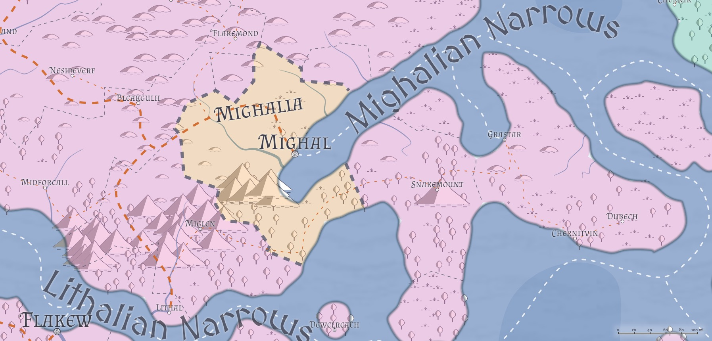

# Mighalia / The Free City of Mighal
* **Government**: Oligarchy (Ruling Council)
* **Capital**: [Mighal](/Cities/Mighal.md)
* **Population**: ~500,000 (~25% human, ~25% firstborn, ~25% Created, ~20% Horde, ~5% other)

Five centuries ago, the ruling ducal family of the city of Mighal began to contemplate something that would've seemed unthinkable to their Lirian loyalist ancestors: separation from the Empire of Liria. Beset by raids from the Caliphate across the water, with no help forthcoming from Flakew, the Dukes of Mighal began to realize that if they considered their first responsibility to their people (which they did), and the people were not going to rank first in the eyes of the Empire (which it certainly seemed like they didn't), then perhaps the best course of action for the people of Mighal was to chart their own path--one not contrary to the interests of Liria, as ancient loyalties can only be stretched so far, but one that put the people of Mighal first and foremost.

Thus it was that quiet preparations were begun: Cautious feelers sent out to various groups of interest, offering prime resources (contracts, freedoms, even locations within the city that heretofore had been out of reach of certain groups) in exchange for the support the city would need when--not if--it declared itself free. The Imperial Court could sense the move coming--it was all but an open declaration just a few years prior to the actual one--but could offer nothing in return for the continued loyalty of Mighal.

In 6902, Cornelius Crestwin, Duke of Mighal, sensing that the moment was right, finally put pen to paper and wrote the Declaration of Mighalia, declaring Mighal and the immediate surrounding lands to be an open city, under no national sovreignty save its own, owing no fealty to any national banner. The Imerpal Court offered up token resistance--most of that diplomatic, threatening embargo and isolation before engaging in diplomatic "negotiations" (most of which involved the return of certain artifacts held by the Dukes of Mighal that the Court felt symbolic enough to be necessary to retain) to recognize the new city-state. By the end of 6910, Mighalia's Open Court was held for the first time, and the Ruling Council of Mighalia, a governing body of which the Duke would be a "first among equals" was formed.

In the centuries since, Mighalia has become something of a wonder to the rest of the world, a city in which old assumptions are cast aside, and national loyalties take a back seat to city life. Here, Hordish races mingle with Created and Firstborn openly, and the Council openly welcomes ambassadors and visitors from all realms--even in some cases turning a blind eye to activities the Ducal cousins in Liria (or even Traenia or Travesimia or Tragekia) would prefer they didn't.

## Population
The half-million population of the city of Mighal is about as egalitarian as anywhere on the planet, with roughly an even mix of human, Created, Firstborn, and Horde. If ever there was a city that represented a true "melting pot" of the races, Mighal is it. Another half-million fill out the rest of the nation of Mighalia, and most of the surrounding towns, villages, and hamlets are far more integrated than most of their Lirian equivalents. While racial tensions are sometimes still prevalent, most Mighalians believe themselves to be "beyond" such things.

## Geography

Mighalia--the city of Mighal and an area roughly 100 miles radius around it--sits at the southwestern end of the Mighalian Narrows, at the eastern end of the Lirian Highway and near the mouth of the Autumband River. Swampy marsh to the north makes Mighal difficult to approach overland, and the Miglenian mountain range to the southwest leaves the Highway the only viable land route to Mighal, and one that's relatively easily defended.

The city itself is vast, and most of the land north of the Miglenian range is a collection of farms organized into hamlets, villages, towns, and even the odd small city. Like the rest of the Lirian Plains from which northern Mighalia was pulled from, the ground is often gently rolling hills and open plainslands, with ample moisture from rains and rivers providing plenty of fertile ground to grow a variety of crops or livestock.

The Mighalians recently (in 7192) purchased mostly-undeveloped land to the south of the Miglenian range, taking up about a third of the land between Miglen and Snakemount. This strip, mostly forested with some wetlands where the Mighalian Narrows come to an end, is largely uninhabited, and the Duke has recently begun a campaign to encourage its domestication. Thus far it has not met with great success, particularly since a rumor surrounds the land that the Duke has plans to dig (whether by magic or muscle) a canal across the isthmus, to connect the Mighalian Narrows to the Lithalian Narrows, eliminating a significant stretch of sea travel for those seeking to travel west by water. Locals considering the relocation plan wonder what the Duke would do with those farms and towns that lie in the supposed Canal's path, and worry that no sooner would they plant their crops than they would be forced to move out again. As a result, few have taken the Duke up on his plan, and the southern forests of Mighalia are lightly populated, if at all. 

## Government
While nominally Mighalia is a property of the Duke of Mighal's, the Declaration established a semi-democratic oligarchy in the Ruling Council. (The Duke agreed to curtail his own power as part of the negotiations with various organized groups prior to the Declaration's publication.) As a result, the Ruling Council rules the city of Mighal, and with it, the surrounding territory of Mighalia.

The Ruling Council is made up of roughly a half-dozen individuals; the Duke of Mighal is the only permanent fixture on the Council, and the Duke's power is to dissolve the Council and call for a reformation of the Council. The Council, in turn, must approve any edict the Duke seeks to pass, and it is common for edicts to come from other Councilmembers, even if all go out under the Ducal seal. Historically, the Council is made up of representatives of the various power groups within Mighal: the Mage Guilds, the Merchant Guilds, the Mercenary Companies, the Kaevarian Church (or other religious groups, though the Church has provided the last three religious representatives), and so on. During times of domestic concern, the Council has admitted the Captain of the Mighal Guard to its ranks, and/or the Admiral of the Mighal Navy, depending on the crisis.

The Duke, like his ruling fathers before him, is reluctant to dissolve the Council unless there is a truly intractable problem in front of him; he sees it as a step only necessary to take when the Council has become deadlocked. As a result, the Council has only been dissolved four times in his twenty-two years of sitting the Mighalian Ducal seat. Espionage and intrigue, however, swirl around the Council like flies in a barn, and the games that result out of that are often intricate, elaborate, and deadly.

Ostensibly, all edicts issued by the Ruling Council are the Duke's, and thus all citizens are subject to the declarations and rulings by the Duke; practically, the various groups see their obligations to their representative on the Council. This exacerbates the intrigue, as mercenaries, merchants, magi, religous groups, and City Watch all see themselves more or less exempt from many of the edicts handed down by the Council to some degree or another, until proven otherwise in Council Court. This leaves certain groups (such as the Draconic Order) without formal representation within the city, and thus at a disadvantage (although the Order frequently finds itself able to persaude the Duke himself without difficulty) to other groups within the city. This also means that the path to power within the City is clear: obtain a Council seat. Because Council seats can only be obtained when the Council is dissolved, this has led many unrepresented groups to a rather drastic plan: foster a crisis so significant it requires dissolution of the Council, propose the plan to save the city from that crisis in exchange for a Council seat, and then save the city. Thus far, this plan has never actually succeeded--but still the idea lingers on.

## Relations
[Alalihat](/Nations/Alalihat.md): Neutral. Prior to Mighal's Declaration, the Alalihatians were a frequent scourge over the seas, raiding and plundering merchant traffic and even daring (on six separate occasions) to sack the city from the sea, leaving many in Mighal to despise the Caliphate. However, since the city's opening, Alalihat has seen more advantage in cultivating a neutral (and therefore open) port on the western side of the Narrows, and has taken extreme steps to ensure that no ship flying the Mighalian flag falls under the sword of a Caliphate raider. As such, though bitter waters run deep, Mighal's populace has grown to regard Alalihatians with distrust rather than revenge.

[Almalz](/Nations/Almalz.md): Favorable. The Protectorate was one of the first to recognize Mighal's goals, and quietly offered significant support--much of it financial--to secure its future. In fact, Almalzian diplomats brokered the first peace between Alalihat and Mighal, convincing their southern brothers that it was strategically more advantageous to have an ally on the Lirian continent than a source of plunder--and that foresight has paid off, as Lirian Naval vessels are frequently forced to break off pursuit of Alalihatian raiders when they enter Mighalian waters.

[Bagonbia](/Nations/Bagonbia.md): Apathetic. The Bagonbians have several representatives within the city, but for the most part Mighal sees no strong advantage or disadvantage to deeper ties with a nation all the way across the world away from them.

[Bedia](/Nations/Bedia.md): Apathetic. The Bedians have several representatives within the city, but for the most part Mighal sees no strong advantage or disadvantage to deeper ties with a nation all the way across the world away from them.

[Dradehalia](/Nations/Dradehalia.md): Concerned. Dradehalians are welcome within Mighalian borders, their ships are welcome within the port, and their persons within Mighalian inns and taverns, but no one who deals with a Dradehalian ever feels entirely comfortable turning their back on them completely. Suspicion of individual Dradehalians runs high, and while the Duke would never openly insult or accuse the Dread Emperor of foul play or skullduggery, frequently when Mighalian citizens of prominent stature go missing or change their mind suddenly toward Dradehalian interests, "dread forces" are assumed to be in play.

[Liria](/Nations/Liria.md): Friendly. Liria is Mighal's past, and the Dukes of Mighal have numerous cousins and other relatives within the Lirian nobility. Liria would not hesitate to bring its errant city back under its banner if the opportunity presented itself, but only if such reclamation could happen with minimal damage to the city or her population. Relations are well enough that Mighal was recently able to purchase from the Lirians a 200-mile-wide strip of land at the southern end of the Mighalian Narrows, halfway between Snakemount and Miglen, and rumors suggest that the Ruling Council are considering a massive project--to dig a canal from the Mighalian Narrows to the Lithalian Narrows, allowing for easier freedom of seaborne traffic to points southern and western, including easier access to Travesimia and Travenia, among others.

[Tragekia](/Nations/Tragekia.md): Friendly. As much as Tragekians find Mighal an excellent place in which to become accustomed to "western" (non-Hordish) ways, Mighalians find Tragekians an excellent source of contacts to the world of the Hordes. Many believe that if the Hordes are ever to get along peacefully with the Firstborn and the Created, it will be because of their intermingling and interaction in Mighal.

[Travenia](/Nations/Travenia.md): Friendly. Travenia has a few distant relatives with the Ducal Family in Mighalia, and this puts them in a position of friendship with the Ruling Council, but beyond some generalized agreement about the state of world affairs, Mighal has little concern for affairs in Travenia.

[Travesimia](/Nations/Travesimia.md): Friendly. Travesimia has married a few sons and daughters into the Ducal Family in Mighalia, and this puts them in a position of friendship with the Ruling Council, but beyond some generalized agreement about the state of world affairs, Mighal has little concern for affairs in Travesimia.

[Ulm](/Nations/Ulm.md): Suspicious. As much as the Mighalians are coming to trust and respect the Hordes of Tragekia, they are growing ever more suspicious of the Hordes of Ulm. Ulmhorde ships are a constant thread in the Deepwaters, and despite two centuries' worth of attempts to broker a peace between Ulm and Mighal, nothing has changed. Mighalians are not yet ready to close the city to Ulmhordes traffic--but the fact that the city is even discussing the idea indicates just how bad the relationship has become.

[Whaveminsia](/Nations/Whaveminsia.md): Friendly. Like her neighbors to the north and west, Whaveminsia has sent a few sons and daughters to join the extended noble families of Mighal, and Whaveminsian nobility often vacation in Mighal--but nothing beyond that really ties the two lands together.

[Yithi](/Nations/Yithi.md): Friendly. The Yithians were first to sail into the city's harbor the day the Declaration was pronounced, openly affirming the new city's freedoms and offering their support. As such, Mighalians were cautiously welcoming of the Yithi diplomats, and when it was quickly followed by Yithi mercenary company delegations (and several Yithi Marshals to help establish local law and order), relationships cemented well. Yithi nobles frequently visit Mighal, and if their customs are strange and their apperances stranger, their manners are impeccable and their coin spends well. (It doesn't hurt that [Sea Reavers](/Organizations/MercCompanies/SeaReavers.md) often not only come to Mighal to exchange plunder for stores, but have also been known to rescue Mighalian merchants beset by Al'Uman raiders to boot.)

[Zabalasa](/Nations/Zabalasa.md): Cautious. Zabalasans are as welcome as any others are, so long as they mind their manners and do not let their religious fervor lead them to seek to "convert" anyone within city boundaries. Zabalasan/Alalihatian feuds are completely unacceptable within city borders, however, and more often than not such feuds have resulted in sentences of exile for the parties involved. (Zabalasans often point out that such sentences are more lenient to the Alalihatians than the Zabalasans, but such sentiments are to be expected from those who simply cannot keep their knives to themselves.)

[Zhi](/Nations/Zhi.md): Friendly. Most Mighalians find it difficult to tell the difference between a Yithian and a Zhian, particularly since they often move about together. But like the Yithi, Zhi visitors are well-mannered and lavish with their coin, and if their attitudes about the world seem a little out of the ordinary or downright strange, the Yithi and Zhi also serve as an important counterbalance to Mighal's immediate Al'Uman neighbors to the east, and Mighalians definitely appreciate the implicit balance there that helps Mighal secure its place in the world.
