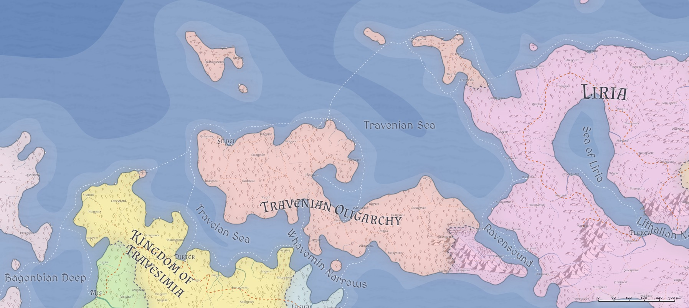

# Travenia / The Travenian Oligarchy
___
- **Government**: Oligarchy (Council of Houses)
- **Capital**: [Silbel](../Cities/Silbel.md)
- **Population**: 6.5 million (~40% human, ~40% firstborn, ~15% Created, ~5% other)
- **Area**: 375,000 sq mi
---

## Geography

## Government

## Political Structure

## Population

## Culture

## Relations
[Alalihat](../Nations/Alalihat.md):

[Almalz](../Nations/Almalz.md):

[Bagonbia](../Nations/Bagonbia.md): Neutral.

[Bedia](../Nations/Bedia.md):

[Dradehalia](../Nations/Dradehalia.md):

[Liria](../Nations/Liria.md):

[Mighalia](../Nations/Mighalia.md):

[Tragekia](../Nations/Tragekia.md):

[Travenia](../Nations/Travenia.md):

[Travesimia](../Nations/Travesimia.md):

[Ulm](../Nations/Ulm.md):

[Whaveminsia](../Nations/Whaveminsia.md):

[Yithi](../Nations/Yithi.md): 

[Zabalasa](../Nations/Zabalasa.md):

[Zhi](../Nations/Zhi.md):
