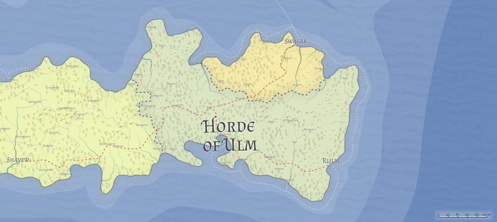

# Ulm / The Horde of Ulm / The Ulmhorde
* **Government**: Tribal Dictatorship
* **Capital**: [Klilim](../Cities/Klilim.md)
* **Population**: 5+ million (~80% Hordish, ~10% human, ~5% Created, ~5% Firstborn)

## Geography

## Relations
[Alalihat](../Nations/Alalihat.md):
[Almalz](../Nations/Almalz.md):
[Bagonbia](../Nations/Bagonbia.md): Neutral.
[Bedia](../Nations/Bedia.md):
[Dradehalia](../Nations/Dradehalia.md):
[Liria](../Nations/Liria.md):
[Mighalia](../Nations/Mighalia.md):
[Tragekia](../Nations/Tragekia.md):
[Travenia](../Nations/Travenia.md):
[Travesimia](../Nations/Travesimia.md):
[Ulm](../Nations/Ulm.md):
[Whaveminsia](../Nations/Whaveminsia.md):
[Yithi](../Nations/Yithi.md): 
[Zabalasa](../Nations/Zabalasa.md):
[Zhi](../Nations/Zhi.md):
