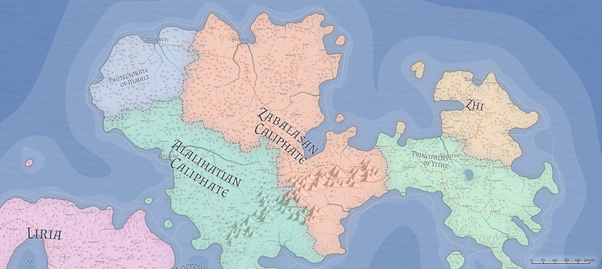

# Zabalasa / Caliphate of Zabalasa
* **Government**: Confederation/Empire
* **Capital**: [Svishek](../Cities/Svishek.md)
* **Population**: 

When the Eldar created the humans, many of them found the vast, open lands of the Northeastern continent to be the perfect place to raise herds and indulge in wanderlust. The hot, well-hydrated climate of the Al'Uman lands appealed to those who found great joy in horsemanship and nomadic life.

When the Hordes began their wars against the Eldar and their children in what is now Yithi, the humans were very much on the front lines of the battle--many of them the horse-bound tribes of the Al'Uma, slashing at the flanks of Hordish armies as battles raged up and down the length of the Daws range. Nomadic life became more of a military necessity than just a cultural or lifestyle choice, and the tribes learned how keeping mobile kept enemies from destroying your livelihood when they burned crops and buildings.

As the wars ground down and the Eldar slipped away, the nomads found a certain rhythm to their life, but little in the way of larger purpose--until the emergence of the [Prophet](../People/Alalihat.md), Alalihat. His teachings brought new understanding and new meaning to the People, and before long his words were sacrosanct--if not law, then certainly with great emphasis.

When his [Disciple](../People/Zabalasa.md) openly questioned the Prophet's teachings, bringing a different view to bear, it bitterly divided the People, and before long what was once a single nation of nomads was divided in twain--and then thrice, when a few generations later a number of clans carved out the nation of [Almalz](Almalz.md) as a holy neutral party. Al'Uman tribe battled Al'Uman tribe across a frantic cultural divide. Before long, it is said, more Al'Uman blood was spilled at Al'Uman hands than any Hordish army.

Over the following long years, the religious wars of the Caliphs came to a begrudging stalemate, as Caliphs from each side of the border came to realize that there was no easy victory to be had. Over time, the open grasslands beckoned tribes to raid--not war--across the fluid and invisible border, and in time Alalihatian and Zabalasan found there to be common cause again in battling the Hordes again, only to discover that some portion of the Hordes had moved south into what is now Tragekia (and then again, in to Dradehalia). Zabalasans in particular look across their eastern border today (into Yithi) and find Hordish races, but much non-Hordish behavior. Some Zabalasan scholars even go so far as to suggest that their eastern neighbors should be treated as allies and friends, violating all that the history of Al'Uma teaches.

Today, the Caliphate of Zabalasa carries on its ancient traditions, its ancient feuds with its distant kin, and dreams of a day when all of Al'Uma is united again, a vast rolling wave of robed horse warriors cresting over the hills to finally crush and eliminate the ancient Hordish enemy. But in the meantime, there are tribes across the border (as well as a few on this side) to raid, Hordish neighbors to their east to battle, herds to tend and sell in the cities, waters to sail, horses to ride, and family to protect and expand.

## Geography

(Arabic grasslands/plains)

## Government
**TODO**, Caliph of Zabalasa, First Sultan, Guardian of the West, Rightful Caliph of Al'Uma

## Political Structure
Zabalasa is broken into several provinces, each of which are governed by a Sultan. The Caliph, for example, also holds the title as Sultan of the province of Damam. The Caliph holds the power to appoint--and retract--governorship (and therefore the Sultanate title) of the province, but theoretically no direct rulership within those provinces. In practice, Caliphs will often rotate Sultans around the different cities, to ensure that no one Sultan grows too comfortable--or too powerful--on their throne. While dynastic inheritance of the Sultanates are not unheard of, it is far more common for a given individual to rule one city while maintaining private residences and lands in an entirely different province (which they consider their home).

* *Damam County*: Home to the cities of [Svishek](), [Gorod](), [Bunov](), [Mlin](), [Ternit](), [Trigov](), and [Yulidychin](), Damam is ruled as a County, despite being one of the richest provinces in the Caliphate, since few of the Sultans find it beneficial to try and govern in the same province in which the Caliph resides.

* *Al Sibarmia Earldom*: 

* *Al Mayitahia Earldom*: Straddling the narrow isthmus of land that connects the northwest of Zabalasa from its southeast (and border with Yithi), this is militarily one of the most important--and hotly contested--provinces in all of Zabalasa. (Alalihat would love nothing more than to push the border all the way to the coastline by taking the cities of [Gosalk](), [Sterh](), and Ludechev. While this wouldn't significantly hurt Zabalasan movements--much already occurs by sea vessel around the northeastern coastline of Zabalasa--it would be a significant moral victory.) As such, this province is often governed by Sultans with deep military experience, and always maintains a higher-than-average miltary presence, second only to that of Mirbah. Much of the military offensive conducted here is with an eye to taking back the cities of [Hogilos]() and [Pororys](), which Alalihat was able to take when it finally concluded its seventy-year siege of [Alunenor]() two centuries ago.  

* *Alalharaqa Earldom*: 

* *Janaradad County*: Nestled tightly in between Al Mayitahia to the northwest, and Mirbah to the southeast, Janaradad is one of the smallest provinces in Zabalasa, yet [Mitfelaron]()'s position on the **TODO** Road puts it in high strategic importance, and yields significant tax and tariff revenue. Much of this revenue is spent maintaining its defenses in [Ludechev]() against incursion from Alalihatian forces operating out of [Pororys](). Fortunately the hills that make up the county landscape are ore-rich, and Janaradad has long had strong treaties with dwarven clans and [Merchant Guilds](../Organizations/MerchantGuilds/index.md) that turn both a tidy profit and high-quality arms and armor 

* *Suwaiqa County*: 

* *Al Thuma County*: 

* *Mirbah Territory*: Primarily made up of territory "liberated" from Yithi, this territory is the only one governed explicitly by a commanding general who also holds the title of Sultan. Mirbah Territory is a frontier space, with little to no settlement except in well-defended (and easily-accessible) places, such as along the Tartonton River (where [Rebun]() and [Mochu]() lie), or in the mountains ([Dukoml]() and [Eshamerino]()), or along the coast ([Samborna]() and [Kogorokipo]()). This is unfortunate, as Mirbah Territory boasts some of the most fertile farmlands on the continent, both north and south of the mountains.

Each of the Sultans maintains a Court in each city, as well as one in Svishek, each Court staffed with officers and proxies for the Sultan, who travels between their cities and Svishek, holding hearings and adminstering to their staff. 

### The Tribes of Zabalasa

## Population

## Culture

## Relations
**[Alalihat](../Nations/Alalihat.md)**: Hostile. They seek to impose their heretical will upon all of Al'Uma, and so long as Zabalasa follows the Disciple, there will never be peace.

**[Almalz](../Nations/Almalz.md)**: Peace. Almalz is filled with cousins and relatives of the Zabalasan tribes, and officially is the sacred Caliphate that guards the relics of the Prophet and his Disciple. Zabalasans and Alalihatians will stab each other mercilessly outside of Almalz, but within, maintain a tense and careful peace. (Of course, this in no way stops espionage and spycraft, and many's the murder in the Almalzian city that goes officially uninvestigated.)

**[Bagonbia](../Nations/Bagonbia.md)**: Neutral. Zabalasa honors some trade between the nations, but little contact beyond that.

**[Bedia](../Nations/Bedia.md)**: Apathetic. Zabalasa has little to no contact with Bedia.

**[Dradehalia](../Nations/Dradehalia.md):** Suspicious. Zabalasa has at times been the target of the Dread Emperor's machinations, so Dradehalians are often viewed with some suspicion. Trade is minimal, yet present.

**[Liria](../Nations/Liria.md)**: Officially hostile; in practice, cautious. A major war between Liria and Zabalasa has not happened in several centuries, so while they officially remain at war, many back-channel communications take place, and Lirians who visit Zabalasa (and vice versa) are allowed (some) freedom of movement.

**[Mighalia](../Nations/Mighalia.md)**: Warm. Zabalasa has many open connections with the nation of the Free City, and much of their back-channel communication with the West flows through Mighal.

**[Tragekia](../Nations/Tragekia.md)**: Suspicious. Tragekia's Hordish nature and history make them difficult to trust, despite the lack of significant warfare between the two nations over the past milennium.

**[Travenia](../Nations/Travenia.md)**:

**[Travesimia](../Nations/Travesimia.md)**:

**[Ulm](../Nations/Ulm.md)**: Open warfare. Most contact occurs at sea, where Zabalasan privateers prey on Ulmhorde ships, and vice versa. Any Ulmhorde found in Zabalasa is arrested and questioned.

**[Whaveminsia](../Nations/Whaveminsia.md)**: Indifferent. There is a little open trade with Whaveminsia, but almost no official contact or communication.

**[Yithi](../Nations/Yithi.md)**: Hostile. The Zabalasans still see the Yithi as the inheritors of the legacy of the Hordes, and the long conflict between the Hordes and Eldar mean, to the Zalabasans, that there is a moral imperative to crush Yithi. Thus, Zalabasa currently stands in open war against Yithi, creating a constant set of tension and open battles along Yithi's western border. Practically, the war is at something of a standstill, as the Zabalasans are not yet comfortable with operating out of the Daw Mountains. In particular, Zabalasa has yet to find a way to crack the three-city fortress line of Dheubpurwen, Jernovalrimi, and Krikal, and the longer the Yithi have to fortify those positions, the less likely the war will progress beyond that line. At sea, Yithi ships generally win out in combats over the Zabalasan vessels, and the [Sea Reavers](../Organizations/MercCompanies/SeaReavers.md), which frustrates the Zabalasans enormously.

**[Zhi](../Nations/Zhi.md)**: Hostile. Zhi is Yithi's close and staunch ally, and therefore Zabalasa finds themselves at war with the Zhians as well as Yithi.

