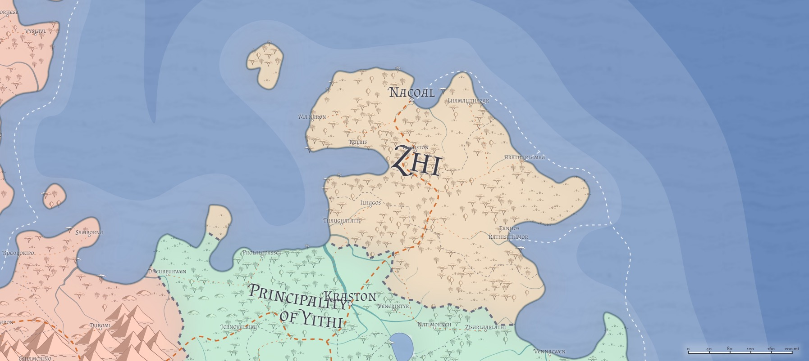

# Zhi / Theocracy of Zhi
* **Government**: Theocracy
* **Capital**: [Nacoal](/Cities/Nacoal.md)
* **Population**: ~1 million (~25% human, ~25% firstborn, ~15% Created, ~35% Hordish)

Zhi is a nation of fascinating energy and culture. Long ago, this territory (and that of [Yithi](Yithi.md), to the south) were the lands of the [Hordes](/Races/Hordes.md), and a territory of brutal tribes bent on conquest of the world. Over millennia, however, repeated stalemates, alternating meaningless victories and defeats, and even the periodic peaceful contact with other races led the more militaristic tribes to sail south to take up their war against [Dradehalia](Dradehalia.md). Led by a charismatic minotaur named Yithi, the tribes that remained chose instead to look for ways to improve themselves and their lives and create a civilization of their own that didn't rely on constnat warfare.

While Yithi sought to bring the remaining tribes in the south under a direct, strong control, many of his more intellectual and spiritual advisors moved north, partly to escape the ongoing conflict, and partly because they felt a calling to find a place where they could study Yithi's message more deeply and holistically. Eventually finding a comfortable site near where [Nacoal](/Cities/Nacoal.md) now rests, these formed the first Council of Seers, and over time, those of the ex-Hordes who felt more drawn to martial pursuits or a more regimented society moved south, to join the tribes of the Principality, while those who felt drawn to higher learning and contemplative life moved north, and slowly populated the (then-)empty lands. Over time, Zhi became a nation thoroughly mixed of farmers, heders, and philosophers, and as Yithi found itself battling Zalabasa to the west and the Hordes to the south, Zhi became a haven and source of foodstuff, spiritual and arcane advice, and other support.

## Population
Without a doubt, Zhi is the most evenly-populated nation in all of Azgaarnoth, if lightly so. Almost a million sentient beings are mostly evenly divided among her three larger provinces (the fourth, Cinhu, being by far the smallest by an order of magnitude), and generally the races intermingle freely and openly--it is extremely rare to find a "elves' quarter" or "halfling shire" anywhere within the borders of Zhi, although it is often that some of the racial styles are populated by a cross-section of races. In fact, in Yeqasha Province the halfling "shire" style of architecture--that of "halfling-holes" in the ground--is quite popular among all the races, as homes buried in ground are quite cool during the hottest parts of the day. Some have even found ways to farm the ground above their home.

## Geography

Surrounded by water on three sides, the lands of Zhi are hot and wet. Swamps, marshlands, and grasslands dominate the geography of Zhi, making rice a staple for the diet of Zhis. Much of her goods are moved either over merchant shipping around the coastline, or over the Great Road that runs from [Nacoal](/Cities/Nacoal.md) to [Kraston](/Cities/Kraston.md).

The geography suits the Zhis, however--their daily regiment will often consist of farming or other menial tasks in the mornings and evenings, when it is cool, retiring indoors to shade and breeze to study or meditate during the hottest parts of the day. Frequent rainstorms during the afternoons will often aid in the contemplation of the universe.

## Culture
Zhi is a nation of philosophers, astronomers, poets, artists, and more. Higher learning is the highest calling among the Zhi, and as a nation they show little reverence for gods or Eldar, but instead choose to commune with the spirits of those who have come before them, or with beings far beyond mortal comprehension. They openly welcome all religious thought, however, because if the mysteries of the universe are beyond mortal comprehension, who is to say that which religion is right, or wrong, or even real?

Today, Zhi is a land of quiet contemplation, with much energy devoted to the unraveling of the secrets of the universe. Monastic orders are found in quite a few places, and monks are frequently found wandering the roads, trading manual labor in the fields in return for a night's room and board, which the villagers are entirely happy to provide. The unbelievably equal mix of races in Zhi means that racial differences are almost entirely unseen; it is not uncommon to see orcs and elves studying the stars together, dwarves and goblins will often toil together over the same book or forge, and halflings will happily feed them all.

Zhi is also home to the small numbers of [yuan-ti](/Races/YuanTi.md) and [kenku](/Races/Kenku.md) within Azgaarnoth, and recently have seen settlements of [lizardfolk](/Races/Lizardfolk.md) and even more open visitations from [tortles](/Races/Tortles.md) and [tritons](/Races/Tritons.md), which make more than a few in the south and the west somewhat nervous at what might be happening there without their knowledge.

## Government
Zhi is a theocracy, governed by a Council of Seers, of whom they periodically select one of their own to stand in as executive for a time of some years (the number is never declared ahead of time). This High Theocrat serves as the deciding vote in any Council discussion, and their decision is final--until the next High Theocrat chooses to listen to a challenge to that decision brought within the Council. To many outsiders, this way of governing seems pointless and redundant, but to the Zhi, any decision important enough must be revisited from time to time, and they find this mode works for them--as it has for the past milennium.

Outside the Council of Seers, each province within Zhi is ruled by an Advisor, and the cities themselves are governed by an appointed Governor. Governors select the Advisor to represent their province, and the Advisor in turn is responsible for elevating a new Governor when an opening appears.

Like Yithi, Zhi has roving magistrates called Marshals, often minotaurs, that roam the land offering a traveling system of justice to the outlying villages. A Marshal's visitation is often a time of quiet celebration, as long-standing civil disputes can be adjudicated, wrongs can be fixed, and pleas can be carried to the provincial capital or even the Council of Seers themselves. Marshals answer only to their own organization, which is operated directly by the Council of Seers, and act as an important check on the power that might be used for corrupt purposes by less-honorable Advisors or Governors. A Marshal's report is given great weight, and many an Advisor or Governor has faced eviction or even conviction based on the word of a Marshal alone.

## Political structure
Zhi is made up of four provinces:
* **Yeqasha** to the north. The cities here are given to much interaction with the sea, and much of the local diet comes from imported rice from Rhial to the south, seafood gathered from the sea (and imported from Cinhu), and locally-tended herds. [Ma'naron](/Cities/Manaron.md), [Kulris](/Cities/Kulris.md), [Narcoal](/Cities/Narcoal.md) are all extensive port cities, and have significant naval presence here, both Zhian navy and [Sea Reaver](/Organizations/MercCompanies/SeaReavers.md) ships. [Llicuston](/Cities/Llicuston.md) is a major trade city, and [Lhamalithazak](/Cities/Lhamalithazak.md) provides much of the additional agriculture consumed throughout the region, particularly spices and herbs.
* **Rhial** through central Zhi. Much of the farming that goes on in Zhi does so in Rhial, and [Arathurlamaa](/Cities/Arathurlamaa.md) is a major rice exporter to almost all of Zhi and Yithi. The "twin cities" of [Tanhos](/Cities/Tanhos.md) and [Rathisithimor](/Cities/Rathisithimor.md) also export foodstuffs, but more vegetables and fruits than rice.
* **Onhaven** to the southwest of Rhial, bordering on Yithi.
* **Cinhu** is made up of two "fragments" of land: the Island of Cinhu off the Zhian northwestern coast, and a small portion of land purchased from the Dheubpurwen tribe of the Yithi. These lands seem to be given over almost entirely to the [yuan-ti](/Races/YuanTi.md) and [lizardfolk](/Races/Lizardfolk.md) 

## Relations
**[Alalihat](Alalihat.md)**:

**[Almalz](Almalz.md)**:

**[Bagonbia](Bagonbia.md)**: Neutral.

**[Bedia](Bedia.md)**: Neutral. Zhi has almost no contact with Bedia.

**[Dradehalia](Dradehalia.md)**: Suspicion.

**[Liria](Liria.md)**:

**[Mighalia](Mighalia.md)**:

**[Tragekia](Tragekia.md)**:

**[Travenia](Travenia.md)**:

**[Travesimia](Travesimia.md)**:

**[Ulm](Ulm.md)**:

**[Whaveminsia](Whaveminsia.md)**:

**[Yithi](Yithi.md)**: 

**[Zabalasa](Zabalasa.md)**:
