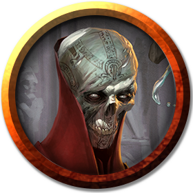

# Lord Cilmaellion Kaal 
*human lich male Wizard (Necromancer) 17, LE*

## History

Cilmaellion Kaal was a young man and a prominent member of [House Kaal](../Organizations/Houses/Kaal.md) when he was brought before his ancient ancestor, [Kali Kaal](KaliKaal.md), who converted him to lichdom, set him to be the public figurehead of the House, and put him on a path to develop necromantic wizardry.

Cilmaelion, however, has little interest in being beholden to his ancient ancestor, and constantly strives to find ways to pry himself out from under the thumb of his master. He will stop at nothing to recover his phylactery (currently in Kali's posession), and even less to destroy the Dark One.

